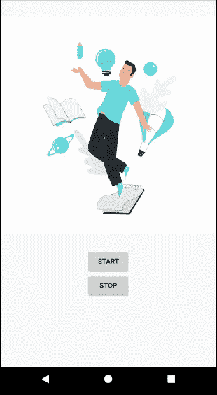
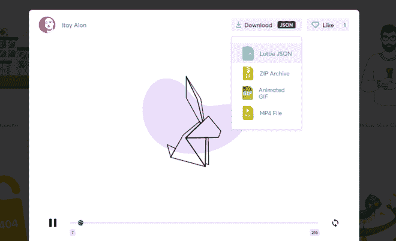

# 如何在安卓中编程控制洛蒂动画？

> 原文:[https://www . geeksforgeeks . org/how-control-Lottie-animatics-programming-in-Android/](https://www.geeksforgeeks.org/how-to-control-lottie-animations-programmatically-in-android/)

[洛蒂](https://lottiefiles.com/)是一个安卓和 iOS 的移动库，可以解析用 Bodymovin 导出为 JSON 的 Adobe After Effects 动画，并在手机上进行原生渲染。洛蒂动画可以自由使用矢量动画文件。许多著名的应用程序都使用这个，如优步、网飞、谷歌、Airbnb、Shopify 等。使用洛蒂，人们可以将动画放入移动(安卓/iOS)应用程序中，甚至可以控制它们。通过这篇文章，我们想和你分享一个用洛蒂在安卓系统中控制 JSON 动画的方法的实现。下面给出了一个 GIF 示例，以了解我们在本文中要做什么。请注意，我们将使用 **Kotlin** 语言来实现这个项目。



> **注意:**在安卓中使用洛蒂动画请参考[如何在安卓应用](https://www.geeksforgeeks.org/how-to-add-lottie-animation-in-an-android-app/)中添加洛蒂动画

### 控制洛蒂动画的步骤

**第一步:创建新项目**

要在安卓工作室创建新项目，请参考[如何在安卓工作室创建/启动新项目](https://www.geeksforgeeks.org/android-how-to-create-start-a-new-project-in-android-studio/?ref=rp)。注意选择**科特林**作为编程语言。

**第二步:将库添加到 build.gradle 文件**

要使用洛蒂实现一个动画，首先，在应用的 [**build.gradle** 文件](https://www.geeksforgeeks.org/android-build-gradle/)中实现一个依赖**实现‘com . Airbnb . Android:洛蒂:$洛蒂外翻’**。2020 年 10 月最新版本为 **3.4.2** ，用该值替换$ lottieVersion。现在，通过单击在对 **build.gradle** 文件进行每次更改后出现的同步选项来同步项目。请记住，build.gradle 总是一个 Groovy 或 Kotlin 文件。

> 实现' com . Airbnb . Android:lotte:3 . 4 . 2 '

**第三步:给项目添加一个洛蒂动画文件**

从 [这里](https://lottiefiles.com/featured) 选择任意动画，下载动画的 JSON 文件。



现在转到**应用程序> res >右键单击>新建>文件夹>原始资源文件夹**并将 JSON 文件复制到此原始文件夹。

**第 4 步:使用 activity_main.xml 文件**

在 **activity_main.xml** 文件中，通过指定参数来声明一个洛蒂对象。还要声明两个[按钮](https://www.geeksforgeeks.org/button-in-kotlin/)，一个启动动画，一个暂停动画。主要参数是:

*   **洛蒂 _rawRes** :接收要显示的 JSON 动画。
*   **lottie_loop** :布尔值，根据提供的布尔值决定动画是否循环。
*   **洛蒂 _ 自动播放**:布尔值，决定动画一初始化就播放。

> 值得注意的是，JSON 动画应该只保存在 res 文件夹下名为 raw 的文件夹中，因为函数是显式调用这个文件路径的。并且 JSON 文件的名称不应包含除“ **_** ”之外的任何特殊字符。

## 可扩展标记语言

```kt
<?xml version="1.0" encoding="utf-8"?>
<RelativeLayout 
    xmlns:android="http://schemas.android.com/apk/res/android"
    xmlns:app="http://schemas.android.com/apk/res-auto"
    xmlns:tools="http://schemas.android.com/tools"
    android:layout_width="match_parent"
    android:layout_height="match_parent"
    tools:context=".MainActivity">

    <com.airbnb.lottie.LottieAnimationView
        android:id="@+id/animationView"
        android:layout_width="wrap_content"
        android:layout_height="wrap_content"
        android:layout_centerHorizontal="true"
        app:lottie_autoPlay="false"
        app:lottie_loop="true"
        app:lottie_rawRes="@raw/animation1" />

    <Button
        android:id="@+id/btnStart"
        android:layout_width="wrap_content"
        android:layout_height="wrap_content"
        android:layout_below="@id/animationView"
        android:layout_centerHorizontal="true"
        android:text="Start" />

    <Button
        android:id="@+id/btnStop"
        android:layout_width="wrap_content"
        android:layout_height="wrap_content"
        android:layout_below="@id/btnStart"
        android:layout_centerHorizontal="true"
        android:text="Stop" />

</RelativeLayout>
```

**步骤 5:使用 MainActivity.kt 文件**

下面是 **MainActivity.kt** 文件的代码。代码中添加了注释，以更详细地理解代码。

## 我的锅

```kt
import android.os.Bundle
import android.widget.Button
import androidx.appcompat.app.AppCompatActivity
import kotlinx.android.synthetic.main.activity_main.*

class MainActivity : AppCompatActivity() {
    override fun onCreate(savedInstanceState: Bundle?) {
        super.onCreate(savedInstanceState)
        setContentView(R.layout.activity_main)

        // Declaring the buttons
        val startBtn = findViewById<Button>(R.id.btnStart)
        val stopBtn = findViewById<Button>(R.id.btnStop)

        // On the click of startBtn
        startBtn.setOnClickListener {
             // is an Animation Listener
            animationView.playAnimation() 
        }

        // On the click of stopBtn
        stopBtn.setOnClickListener {
             // is an Animation Listener
            animationView.pauseAnimation() 
        }
    }
}
```

### 输出:在模拟器上运行

<video class="wp-video-shortcode" id="video-494537-1" width="640" height="360" preload="metadata" controls=""><source type="video/mp4" src="https://media.geeksforgeeks.org/wp-content/uploads/20201001093016/Screen-Recording-2020-09-14-at-21.30.53.mp4?_=1">[https://media.geeksforgeeks.org/wp-content/uploads/20201001093016/Screen-Recording-2020-09-14-at-21.30.53.mp4](https://media.geeksforgeeks.org/wp-content/uploads/20201001093016/Screen-Recording-2020-09-14-at-21.30.53.mp4)</video>