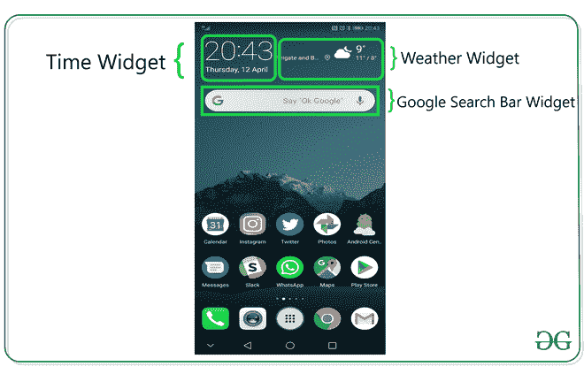
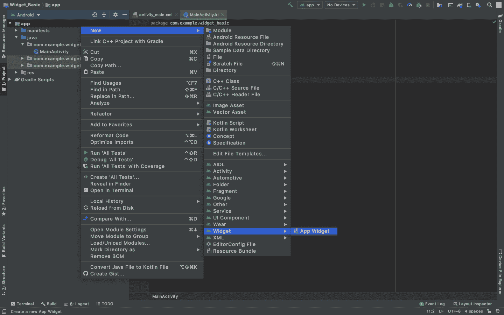
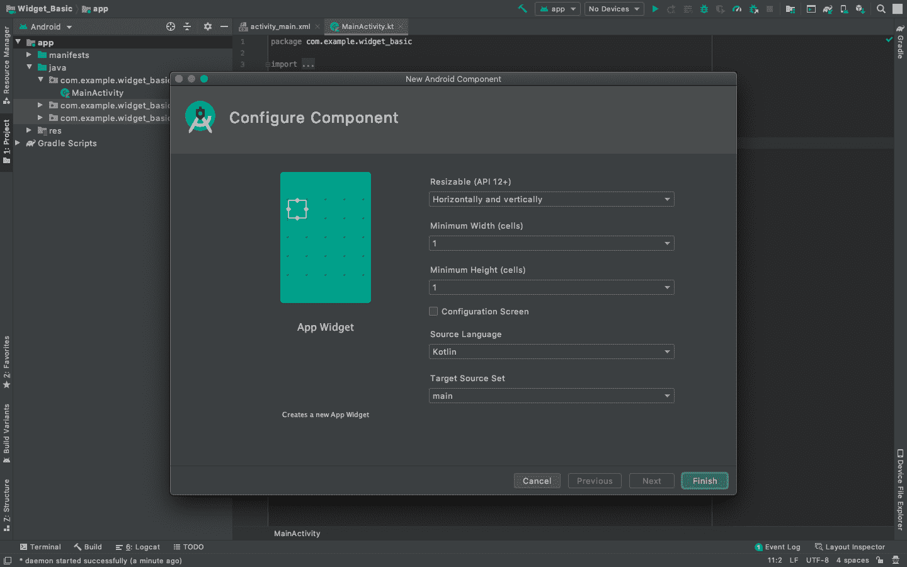
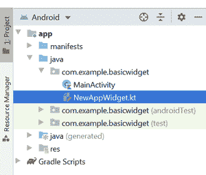
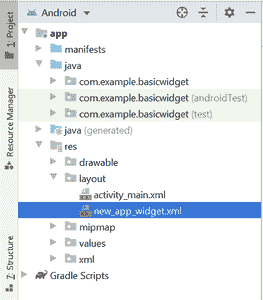
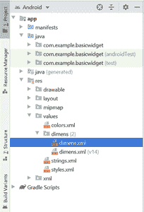
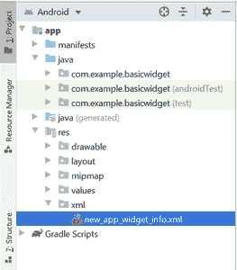

# 如何创建安卓应用的基本小部件？

> 原文:[https://www . geeksforgeeks . org/如何创建安卓应用程序的基本小部件/](https://www.geeksforgeeks.org/how-to-create-a-basic-widget-of-an-android-app/)

**小部件**是应用程序的微版本，包含仅在**主屏幕**或**锁定屏幕**上显示的应用程序的一些功能。例如，我们在主屏幕上看到**天气**、**时间**、**谷歌搜索栏**，在锁定屏幕上看到**面锁**、**指纹锁**，这些都是设备上提供的一些小部件。当您安装或从网络下载应用程序时，小部件会随之而来。一般来说，手机带有制造配置，但用户可以在以后调整这些元素。在本文中，我们演示了如何为安卓应用程序实现一个基本的小部件。



### 创建基本小部件的步骤

**第一步:创建新项目**

在安卓工作室创建新项目请参考 [**【如何在安卓工作室创建/启动新项目】**](https://www.geeksforgeeks.org/android-how-to-create-start-a-new-project-in-android-studio/) 。我们正在为 **Java** 和 **Kotlin** 语言实现它。

**第二步:将 App Widget 添加到项目中**

右键点击 **app** ，将光标移动到**新增的**，找到末尾的“**小工具**”选项，选择。



指定小部件所需的属性，如 **min。宽度**和**高度**，配置文件和首选语言等，然后继续。文件会自动生成。



**第三步:安装并运行代码**

*   在安卓虚拟设备或个人设备上安装并运行代码。
*   打开手机的小部件部分，查找带有应用程序名称的小部件，选择它，将其带到主屏幕。
*   试着改变尺寸，我们就完成了！

**输出:在仿真器上运行**

<video class="wp-video-shortcode" id="video-481091-1" width="640" height="360" preload="metadata" controls=""><source type="video/mp4" src="https://media.geeksforgeeks.org/wp-content/uploads/20210429143915/Create-a-Basic-Widget-of-an-Android-App.mp4?_=1">[https://media.geeksforgeeks.org/wp-content/uploads/20210429143915/Create-a-Basic-Widget-of-an-Android-App.mp4](https://media.geeksforgeeks.org/wp-content/uploads/20210429143915/Create-a-Basic-Widget-of-an-Android-App.mp4)</video>

### 在这个过程中会产生哪些额外的文件？

在这个选择和部署过程中，会生成一些额外的文件，并对现有文件进行微小的更改。生成一个基本的小部件不需要编程，只有当一个应用程序要嵌入到小部件中时才需要编程，这将在本文后面的部分讨论。现在让我们一个接一个地解释新生成的文件以及对现有文件所做的更改。

**1 .NewAppWidget.kt**

它是在哪里产生的？



## 我的锅

```
import android.appwidget.AppWidgetManager 
import android.appwidget.AppWidgetProvider 
import android.content.Context 
import android.widget.RemoteViews 

// Implementation of App Widget functionality. 
class NewAppWidget : AppWidgetProvider() { 
    override fun onUpdate( 
        context: Context, 
        appWidgetManager: AppWidgetManager, 
        appWidgetIds: IntArray 
    ) { 
        // There may be multiple widgets active, so update all of them 
        for (appWidgetId in appWidgetIds) { 
            updateAppWidget(context, appWidgetManager, appWidgetId) 
        } 
    } 

    // Enter relevant functionality for 
    // when the first widget is created 
    override fun onEnabled(context: Context) { 

    } 

    // Enter relevant functionality for 
    // when the last widget is disabled 
    override fun onDisabled(context: Context) { 

    } 
} 

internal fun updateAppWidget( 
    context: Context, 
    appWidgetManager: AppWidgetManager, 
    appWidgetId: Int 
) { 
    val widgetText = context.getString(R.string.appwidget_text) 
    // Construct the RemoteViews object 
    val views = RemoteViews(context.packageName, R.layout.new_app_widget) 
    views.setTextViewText(R.id.appwidget_text, widgetText) 

    // Instruct the widget manager to update the widget 
    appWidgetManager.updateAppWidget(appWidgetId, views) 
}
```

## Java 语言(一种计算机语言，尤用于创建网站)

```
import android.appwidget.AppWidgetManager;
import android.appwidget.AppWidgetProvider;
import android.content.Context;
import android.widget.RemoteViews;

// Implementation of App Widget functionality.
class NewAppWidget extends AppWidgetProvider {
    @Override
    public void onUpdate(Context context, AppWidgetManager appWidgetManager, int[] appWidgetIds)
    {

        // There may be multiple 
          // widgets active, so update
        // all of them
        for (int appWidgetId : appWidgetIds) {updateAppWidget(context, appWidgetManager, appWidgetId);
        }
    }

    // Enter relevant functionality for
    // when the first widget is created
    @Override public void onEnabled(Context context)
    {
        super.onEnabled(context);
    }

    // Enter relevant functionality for
    // when the last widget is disabled
    @Override public void onDisabled(Context context)
    {
        super.onDisabled(context);
    }

    private void
    updateAppWidget(Context context, AppWidgetManager appWidgetManager, int appWidgetId)
    {
        String widgetText = context.getString(R.string.appwidget_text);

        // Construct the RemoteViews object
        RemoteViews views = new RemoteViews(context.getPackageName(), R.layout.new_app_widget);
        views.setTextViewText(R.id.appwidget_text, widgetText);

        // Instruct the widget manager to update the widget
        appWidgetManager.updateAppWidget(appWidgetId, views);
    }
}
```

**2。new_app_widget.xml**

它是在哪里产生的？



## 可扩展标记语言

```
<RelativeLayout
    xmlns:android="http://schemas.android.com/apk/res/android"
    android:layout_width="match_parent"
    android:layout_height="match_parent"
    android:background="#09C"
    android:padding="@dimen/widget_margin"> 

    <TextView
        android:id="@+id/appwidget_text"
        android:layout_width="wrap_content"
        android:layout_height="wrap_content"
        android:layout_centerHorizontal="true"
        android:layout_centerVertical="true"
        android:layout_margin="8dp"
        android:background="#09C"
        android:contentDescription="@string/appwidget_text"
        android:text="@string/appwidget_text"
        android:textColor="#ffffff"
        android:textSize="24sp"
        android:textStyle="bold|italic" /> 

</RelativeLayout>
```

3 . dimens . XML

在哪里生成的？



## 可扩展标记语言

```
<?xml version="1.0" encoding="utf-8"?> 
<resources> 

    <!-- 
    Refer to App Widget Documentation for margin information 
    http://developer.android.com/guide/topics/appwidgets/index.html#CreatingLayout 
    -->
    <dimen name="widget_margin">8dp</dimen> 

</resources>
```

**4。new_app_widget_info.xml**

在哪里生成的？



## 可扩展标记语言

```
<?xml version="1.0" encoding="utf-8"?> 
<appwidget-provider
    xmlns:android="http://schemas.android.com/apk/res/android"
    android:initialKeyguardLayout="@layout/new_app_widget"
    android:initialLayout="@layout/new_app_widget"
    android:minWidth="40dp"
    android:minHeight="40dp"
    android:previewImage="@drawable/example_appwidget_preview"
    android:resizeMode="horizontal|vertical"
    android:updatePeriodMillis="86400000"
    android:widgetCategory="home_screen"> 
</appwidget-provider>
```

**5。对 AndroidManifest.xml 文件所做的更改**

## 可扩展标记语言

```
<?xml version="1.0" encoding="utf-8"?> 
<manifest xmlns:android="http://schemas.android.com/apk/res/android"
    package="org.geeksforgeeks.widget_basic"> 

    <application
        android:allowBackup="true"
        android:icon="@mipmap/ic_launcher"
        android:label="@string/app_name"
        android:roundIcon="@mipmap/ic_launcher_round"
        android:supportsRtl="true"
        android:theme="@style/AppTheme"> 

        <!-- Receiver Element is Added to link the widget files to the Application -->    
        <receiver android:name=".NewAppWidget"> 
            <intent-filter> 
                <action android:name="android.appwidget.action.APPWIDGET_UPDATE" /> 
            </intent-filter> 

            <meta-data
                android:name="android.appwidget.provider"
                android:resource="@xml/new_app_widget_info" /> 
        </receiver> 
        <!-- ----------------------------Until Here------------------------------------>

        <activity android:name=".MainActivity"> 
            <intent-filter> 
                <action android:name="android.intent.action.MAIN" /> 

                <category android:name="android.intent.category.LAUNCHER" /> 
            </intent-filter> 
        </activity> 
    </application> 

</manifest>
```

### 仍然需要编程吗？如果是，代码的哪一部分将被更改？(续)

是的，编程仍然是创建小部件的一个要求。NewAppWidget.kt 是一个 Kotlin 类，它的对应文件 new_app_widget.xml 显示了这个小部件。可以在 update app widget 函数中为应用程序操作声明功能，在 new_app_widget.xml 中为 widget 的显示添加多个元素。因为这两个文件都是内部链接的，所以更改其中一个会导致另一个发生变化。

### 关于实现多个小部件

一个应用程序可以拥有的小部件数量没有限制，但是，建议拥有尽可能少的小部件，因为小部件是动态变化的元素。有更新回调(参考 new_app_widget_info.xml 文件)，updatePeriodMillis 是一个参数，指的是应用程序不断更新 widget，意思是更新 widget 的应用程序线程不断在后台运行，获取部分有限的 RAM。