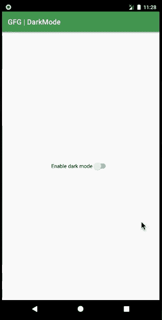

# 如何在 Kotlin 中为定制安卓应用创建黑暗模式？

> 原文:[https://www . geeksforgeeks . org/如何为定制安卓应用创建黑暗模式-in-kotlin/](https://www.geeksforgeeks.org/how-to-create-a-dark-mode-for-a-custom-android-app-in-kotlin/)

黑暗模式是一项功能，允许您将应用程序或整个操作系统的颜色主题切换到黑色或其边缘的东西。除了为疲惫的设计注入活力的乐趣之外，人们可能希望选择它，因为它可以让观看设备屏幕的方式更加舒适和放松。常规模式下的典型像素值介于 200 到 255 之间。以 255°值发射光的每个像素对应于它能发射的最大可能的光，提供更多的功率。类似地，0 值对应于最小量，这对应于不向像素供电。如果一个人使用的智能手机有有机发光二极管显示屏，并启用暗模式，它可能会节省一些电池寿命。因此，对于开发人员来说，在所需的应用程序中添加这样的功能变得至关重要。本文想和大家分享一下利用现有的库在 Android 中实现黑暗模式。黑暗模式是优化用户体验和电池的一个例子。它可以在开发人员希望的任何应用程序上实现。下面给出一个 GIF 示例，了解一下在这篇 文章中我们要做什么。注意 我们要用 **Kotlin** 语言来实现这个项目。



### **接近**

**第一步:创建新项目**

要在安卓工作室创建新项目，请参考[如何在安卓工作室创建/启动新项目](https://www.geeksforgeeks.org/android-how-to-create-start-a-new-project-in-android-studio/)。注意选择**科特林**作为编程语言。

**第 2 步:对 styles.xml 文件的更改**

转到 **res >值>style . XML**文件，并将样式父级更改为“**主题。AppCompat . day night . Darkactionbar**”。以下是**style . XML**文件的完整代码。

## 可扩展标记语言

```
<resources>
    <!-- Base application theme. -->
    <style name="AppTheme" parent="Theme.AppCompat.DayNight.DarkActionBar">
        <!-- Customize your theme here. -->
        <item name="colorPrimary">@color/colorPrimary</item>
        <item name="colorPrimaryDark">@color/colorPrimaryDark</item>
        <item name="colorAccent">@color/colorAccent</item>
    </style>

</resources>
```

**步骤 3:使用 activity_main.xml 文件**

现在转到代表应用程序用户界面的 **activity_main.xml** 文件，创建一个**开关**。该开关应在黑暗模式和正常模式之间切换。下面是**activity _ main . XML**文件的代码。

## 可扩展标记语言

```
<?xml version="1.0" encoding="utf-8"?>
<RelativeLayout 
    xmlns:android="http://schemas.android.com/apk/res/android"
    xmlns:tools="http://schemas.android.com/tools"
    android:layout_width="match_parent"
    android:layout_height="match_parent"
    tools:context=".MainActivity">

    <!--Create a switch-->
    <Switch
        android:id="@+id/switch1"
        android:layout_width="wrap_content"
        android:layout_height="wrap_content"
        android:layout_centerInParent="true"
        android:text="Enable dark mode"
        tools:ignore="UseSwitchCompatOrMaterialXml" />

</RelativeLayout>
```

**第 4 步:使用 MainActivity.kt 文件**

转到 **MainActivity.kt** 文件，参考以下代码。下面是 **MainActivity.kt** 文件的代码。代码中添加了注释，以更详细地理解代码。

## 我的锅

```
import android.os.Bundle
import android.widget.Switch
import androidx.appcompat.app.AppCompatActivity
import androidx.appcompat.app.AppCompatDelegate

class MainActivity : AppCompatActivity() {
    override fun onCreate(savedInstanceState: Bundle?) {
        super.onCreate(savedInstanceState)
        setContentView(R.layout.activity_main)

        // Declare the switch from the layout file
        val btn = findViewById<Switch>(R.id.switch1)

        // set the switch to listen on checked change
        btn.setOnCheckedChangeListener { _, isChecked ->

            // if the button is checked, i.e., towards the right or enabled
            // enable dark mode, change the text to disable dark mode
            // else keep the switch text to enable dark mode
            if (btn.isChecked) {
                AppCompatDelegate.setDefaultNightMode(AppCompatDelegate.MODE_NIGHT_YES)
                btn.text = "Disable dark mode"
            } else {
                AppCompatDelegate.setDefaultNightMode(AppCompatDelegate.MODE_NIGHT_NO)
                btn.text = "Enable dark mode"
            }
        }
    }
}
```

### **输出:在仿真器上运行**

<video class="wp-video-shortcode" id="video-498681-1" width="640" height="360" preload="metadata" controls=""><source type="video/mp4" src="https://media.geeksforgeeks.org/wp-content/uploads/20201009233307/NightMode.mp4?_=1">[https://media.geeksforgeeks.org/wp-content/uploads/20201009233307/NightMode.mp4](https://media.geeksforgeeks.org/wp-content/uploads/20201009233307/NightMode.mp4)</video>