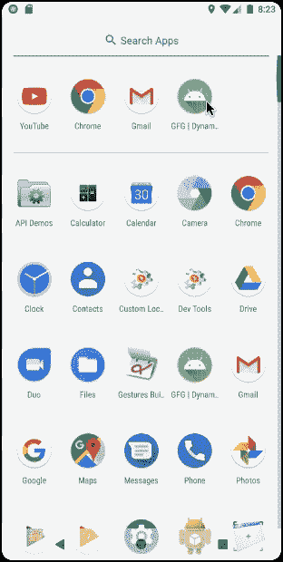

# 如何创建安卓应用的动态小部件？

> 原文:[https://www . geeksforgeeks . org/如何创建动态安卓小部件应用/](https://www.geeksforgeeks.org/how-to-create-a-dynamic-widget-of-an-android-app/)

#### 先决条件: [**如何创建安卓应用的基本小部件？**T3】](https://www.geeksforgeeks.org/how-to-create-a-basic-widget-of-an-android-app/)

小部件是应用程序提供的用户界面元素，用于从主屏幕或锁定屏幕远程访问它的一些功能。小部件可以是**静态的**或**动态的**意味着显示元素不会随时间而变化(静态)或变化(动态)。通过本文，让我们演示一个**动态小部件**的实现。在我们的例子中，我们将使用 [**螺纹**](https://www.geeksforgeeks.org/running-user-interface-thread-in-android-using-kotlin/) 改变相对于时间的显示。下面是同样的预览:



### 创建动态小部件的步骤

**第一步:创建新项目**

在安卓工作室创建新项目请参考 [**【如何在安卓工作室创建/启动新项目】**](https://www.geeksforgeeks.org/android-how-to-create-start-a-new-project-in-android-studio/) 。**注意，选择** [**柯特林**](https://www.geeksforgeeks.org/introduction-to-kotlin/) **作为编程语言。**

**第二步:将 App Widget 添加到项目中**

*   右键点击 **app** ，将光标移动到**新增的**，找到末尾的“**小工具**”选项，选择。


*   指定小部件所需的属性，如**最小宽度**和**高度**，配置文件和首选语言等，然后继续。文件会自动生成。


**第三步:编程什么？在哪里编程？**

1.  在我们的应用程序中，由于我们希望一个接一个地同时显示两个消息“**只管做**”&“**你真棒**”(用户可以选择他们自己的消息)，我们将实现一个线程来在两者之间产生暂停(1 秒)。
2.  整个编程(后端)是在主源文件夹中新创建的**new appwidget . kt**Kotlin 类文件中完成的。

**仅对******new appwidget . kt 文件**进行了更改**

## **NewAppWidget.kt**

```kt
package org.geeksforgeeks.widget_dynamic

import android.appwidget.AppWidgetManager
import android.appwidget.AppWidgetProvider
import android.content.Context
import android.content.Intent
import android.widget.RemoteViews

// Implementation of App Widget functionality
class NewAppWidget : AppWidgetProvider() {
    override fun onUpdate(
        context: Context,
        appWidgetManager: AppWidgetManager,
        appWidgetIds: IntArray
    ) {
        // There may be multiple widgets active, so update all of them
        for (appWidgetId in appWidgetIds) {
            updateAppWidget(context, appWidgetManager, appWidgetId)
        }
    }

    // Enter relevant functionality for 
      // when the first widget is created
    override fun onEnabled(context: Context) {

    }

    // Enter relevant functionality for
    // when the last widget is disabled
    override fun onDisabled(context: Context) {

    }
}

internal fun updateAppWidget(
    context: Context,
    appWidgetManager: AppWidgetManager,
    appWidgetId: Int
) 
/////////////////////////Add functionality here ///////////////////////////////
{
    Thread(Runnable {
        while(true){
                // Construct the RemoteViews object
                val views = RemoteViews(context.packageName, R.layout.new_app_widget)
                views.setTextViewText(R.id.appwidget_text, "Just do it")
                // Instruct the widget manager to update the widget
                appWidgetManager.updateAppWidget(appWidgetId, views)
                Thread.sleep(1000)

                // Construct the RemoteViews object
                views.setTextViewText(R.id.appwidget_text, "You are awesome")
                // Instruct the widget manager to update the widget
                appWidgetManager.updateAppWidget(appWidgetId, views)
                Thread.sleep(1000)
        }
    }).start()
}
////////////////////////////////////////////////////////////////////////////////////
```

**就这样，运行代码，你会在小部件列表中看到这个小部件，把它带到主屏幕。**

### **输出:在模拟器上运行**

**<video class="wp-video-shortcode" id="video-481792-1" width="456" height="732" preload="metadata" controls=""><source type="video/mp4" src="https://media.geeksforgeeks.org/wp-content/cdn-uploads/20200907222136/Screen-Recording-2020-08-30-at-20.22.59.mp4?_=1">[https://media.geeksforgeeks.org/wp-content/cdn-uploads/20200907222136/Screen-Recording-2020-08-30-at-20.22.59.mp4](https://media.geeksforgeeks.org/wp-content/cdn-uploads/20200907222136/Screen-Recording-2020-08-30-at-20.22.59.mp4)</video>**