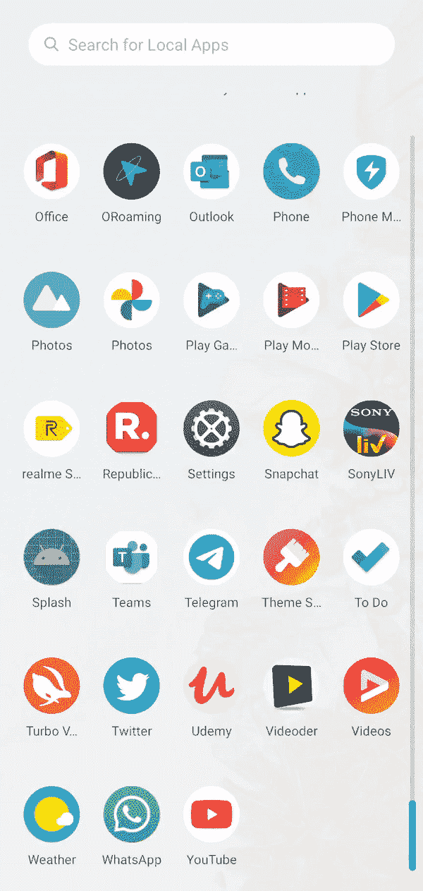

# 如何使用 Kotlin 在安卓中创建闪屏？

> 原文:[https://www . geeksforgeeks . org/如何使用 kotlin 创建安卓闪屏/](https://www.geeksforgeeks.org/how-to-create-a-splash-screen-in-android-using-kotlin/)

安卓闪屏是应用程序启动时用户看到的第一个屏幕。闪屏是用户对应用程序的第一次体验，这就是为什么它被认为是应用程序中最重要的屏幕之一。用于显示公司标志、公司名称等信息。我们也可以在闪屏中添加一些动画。下面给出了一个 GIF 示例，来了解一下在这篇文章中要做什么。



### **创建闪屏的步骤**

**第一步:创建新项目**

要在安卓工作室创建新项目，请参考[如何在安卓工作室创建/启动新项目](https://www.geeksforgeeks.org/android-how-to-create-start-a-new-project-in-android-studio/)。注意选择**科特林**作为编程语言。

**第二步:创建另一个活动**

转到 **app > java >第一个包名>右键>新建>活动>清空活动**创建另一个活动并命名为**闪屏**。编辑**activity _ splash screen . XML**文件，并根据需要在 splash screen 中添加图像、文本。在这里，我们向闪屏添加一个图像。下面是**activity _ splash _ screen . XML**文件的代码。

## 可扩展标记语言

```
<?xml version="1.0" encoding="utf-8"?>
<androidx.constraintlayout.widget.ConstraintLayout 
    xmlns:android="http://schemas.android.com/apk/res/android"
    xmlns:app="http://schemas.android.com/apk/res-auto"
    xmlns:tools="http://schemas.android.com/tools"
    android:layout_width="match_parent"
    android:layout_height="match_parent"
    android:background="#fff"
    tools:context=".SplashScreen">

    <ImageView
        android:id="@+id/SplashScreenImage"
        android:layout_width="300dp"
        android:layout_height="200dp"
        android:src="@drawable/geeksforgeeks"
        app:layout_constraintBottom_toBottomOf="parent"
        app:layout_constraintLeft_toLeftOf="parent"
        app:layout_constraintRight_toRightOf="parent"
        app:layout_constraintTop_toTopOf="parent" />

</androidx.constraintlayout.widget.ConstraintLayout>
```

转到 **SplashScreen.kt** 文件，参考以下代码。下面是 **SplashScreen.kt** 文件的代码。代码中添加了注释，以更详细地理解代码。

## 我的锅

```
import android.content.Intent
import android.os.Bundle
import android.os.Handler
import android.view.WindowManager
import androidx.appcompat.app.AppCompatActivity

@Suppress("DEPRECATION")
class SplashScreen : AppCompatActivity() {
    override fun onCreate(savedInstanceState: Bundle?) {
        super.onCreate(savedInstanceState)
        setContentView(R.layout.activity_splash_screen)

        // This is used to hide the status bar and make 
        // the splash screen as a full screen activity.
        window.setFlags(
            WindowManager.LayoutParams.FLAG_FULLSCREEN,
            WindowManager.LayoutParams.FLAG_FULLSCREEN
        )

        // we used the postDelayed(Runnable, time) method 
        // to send a message with a delayed time.
        Handler().postDelayed({
            val intent = Intent(this, MainActivity::class.java)
            startActivity(intent)
            finish()
        }, 3000) // 3000 is the delayed time in milliseconds.
    }
}
```

**第 3 步:使用 AndroidMenifest.xml 文件**

转到 **AndroidMenifest.xml** 文件，并在闪屏活动中添加以下代码。这用于隐藏状态栏或操作栏。

> 安卓:主题="@style/Theme。灯。无功能栏"

另外，在闪屏活动中添加 **<意图过滤器>** **，使该活动成为开始活动。因此，无论应用程序何时执行，用户都可以在开始时看到闪屏。下面是**androidmenifest . XML**文件的完整代码。**

## 可扩展标记语言

```
<?xml version="1.0" encoding="utf-8"?>
<manifest xmlns:android="http://schemas.android.com/apk/res/android"
    package="com.example.splashscreeninandroid">

    <application
        android:allowBackup="true"
        android:icon="@mipmap/ic_launcher"
        android:label="@string/app_name"
        android:roundIcon="@mipmap/ic_launcher_round"
        android:supportsRtl="true"
        android:theme="@style/AppTheme">
        <activity android:name=".MainActivity"></activity>
        <activity
            android:name=".SplashScreen"
            android:theme="@style/Theme.AppCompat.Light.NoActionBar">
            <intent-filter>
                <action android:name="android.intent.action.MAIN" />

                <category android:name="android.intent.category.LAUNCHER" />
            </intent-filter>
        </activity>
    </application>

</manifest>
```

**第 4 步:使用 activity_main.xml 文件**

转到 **activity_main.xml** 文件，并添加一个文本，当用户进入主活动时，该文本将显示“欢迎来到极客论坛”。下面是**activity _ main . XML**文件的代码。

## 可扩展标记语言

```
<?xml version="1.0" encoding="utf-8"?>
<androidx.constraintlayout.widget.ConstraintLayout 
    xmlns:android="http://schemas.android.com/apk/res/android"
    xmlns:app="http://schemas.android.com/apk/res-auto"
    xmlns:tools="http://schemas.android.com/tools"
    android:layout_width="match_parent"
    android:layout_height="match_parent"
    android:background="@color/black"
    tools:context=".MainActivity">

    <TextView
        android:layout_width="wrap_content"
        android:layout_height="wrap_content"
        android:text="Welcome To GeeksforGeeks"
        android:textColor="@color/colorAccent"
        android:textSize="20dp"
        app:layout_constraintBottom_toBottomOf="parent"
        app:layout_constraintLeft_toLeftOf="parent"
        app:layout_constraintRight_toRightOf="parent"
        app:layout_constraintTop_toTopOf="parent" />

</androidx.constraintlayout.widget.ConstraintLayout>
```

**步骤 5:使用 MainActivity.kt 文件**

在 **MainActivity.kt** 文件中不要做任何事情，因为我们已经为闪屏创建了一个新的活动。下面是 **MainActivity.kt** 文件的代码

## 我的锅

```
import androidx.appcompat.app.AppCompatActivity
import android.os.Bundle
import android.widget.Toast

class MainActivity : AppCompatActivity() {
    override fun onCreate(savedInstanceState: Bundle?) {
        super.onCreate(savedInstanceState)
        setContentView(R.layout.activity_main)
    }
}
```

### **输出**

<video class="wp-video-shortcode" id="video-502550-1" width="640" height="360" preload="metadata" controls=""><source type="video/mp4" src="https://media.geeksforgeeks.org/wp-content/uploads/20201021231023/VID_20201021230130.mp4?_=1">[https://media.geeksforgeeks.org/wp-content/uploads/20201021231023/VID_20201021230130.mp4](https://media.geeksforgeeks.org/wp-content/uploads/20201021231023/VID_20201021230130.mp4)</video>

**在 Github 上找到这个项目:**[https://github.com/Gauravverma245/SplashScreen](https://github.com/Gauravverma245/SplashScreen)