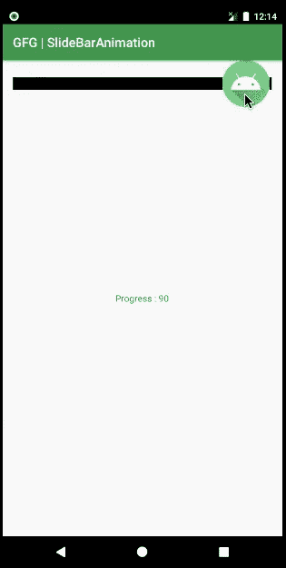

# 如何在安卓中创建解锁滑杆？

> 原文:[https://www . geesforgeks . org/如何在安卓中创建解锁滑动条/](https://www.geeksforgeeks.org/how-to-create-a-unlock-slide-bar-in-android/)

一个 [SeekBar](https://www.geeksforgeeks.org/seekbar-in-kotlin/) 是 [ProgressBar](https://www.geeksforgeeks.org/progressbar-in-kotlin/) 的扩展，增加了一个可拖动的拇指。用户可以触摸拇指并向左或向右拖动来设置当前进度级别或使用箭头键。SeekBar 是 Android 中一个有用的用户界面元素，允许使用自然的用户界面选择整数值。SeekBar 的一个例子是设备的亮度控制和音量控制。但是你知道 SeekBar 可以实现为解锁滑动条吗？通过这篇文章，我们想与您分享如何使用 SeekBar 实现解锁滑动条。

### SeekBar 和 ProgressBar 之间的区别

SeekBar 与 ProgressBar 具有相同的属性。但唯一不同的是，用户通过在 SeekBar 中移动滑块(拇指)来确定进度。要将 SeekBar 添加到布局(XML)文件中，可以使用<seekbar>元素。下面是解锁滑动条的示例。</seekbar>


### 在哪里可以使用？

*   要解锁屏幕、解锁活动，请转到活动(我们在本文中讨论的内容)。
*   使用类似的概念来构建游戏。
*   在支付网关确认结账。
*   用于关闭警报。

下面给出一个 GIF 示例，了解一下在这篇 文章中我们要做什么。注意 我们要用 **Kotlin** 语言来实现这个项目。



### **接近**

**请参考以下几点，这些点为我们实现的应用程序定义了模块:**

*   应用程序有两个活动，主活动和主活动 2，它们都有各自的布局文件 activity_main 和 activity_main2。
*   SeekBar 存在于第一个活动中，即在 activity_main 文件中声明。
*   我们对 SeekBar 进行了编程，这样当用户滑动它直到结束时，用户会进入一个新的活动，即 MainActivity2。否则，SeekBar 将其进度设置为 0，并显示一条[吐司](https://www.geeksforgeeks.org/android-what-is-toast-and-how-to-use-it-with-examples/)消息。
*   第一个活动中提供了一个文本视图，实时显示搜索栏的进度。

要在安卓系统中创建滑动条，我们需要遵循以下步骤:

**第一步:创建新项目**

要在安卓工作室创建新项目，请参考[如何在安卓工作室创建/启动新项目](https://www.geeksforgeeks.org/android-how-to-create-start-a-new-project-in-android-studio/)。注意选择**科特林**作为编程语言。

**步骤 2:使用 activity_main.xml 文件**

现在转到 **activity_main.xml** 文件，该文件表示应用程序的用户界面。如图所示，创建一个 SeekBar 和 TextView。下面是**activity _ main . XML**文件的代码。

## 可扩展标记语言

```kt
<?xml version="1.0" encoding="utf-8"?>
<RelativeLayout 
    xmlns:android="http://schemas.android.com/apk/res/android"
    xmlns:tools="http://schemas.android.com/tools"
    android:layout_width="match_parent"
    android:layout_height="match_parent"
    tools:context=".MainActivity">

    <!--Seek Bar, set max to 100 to view the progress with respect to 100-->
    <!--progressDrawable is the color you want for your progress track-->
    <!--thumb is the icon that user will slide over the track-->
    <SeekBar
        android:id="@+id/sbb"
        android:layout_width="match_parent"
        android:layout_height="wrap_content"
        android:clickable="false"
        android:max="100"
        android:progressDrawable="@color/colorPrimaryDark"
        android:thumb="@mipmap/ic_launcher"
        tools:ignore="MissingConstraints" />

    <!--This textView will display the progress of SeekBar-->
    <TextView
        android:id="@+id/tv"
        android:layout_width="wrap_content"
        android:layout_height="wrap_content"
        android:layout_centerInParent="true" />

</RelativeLayout>
```

**第三步:使用 MainActivity.kt 文件**

转到 **MainActivity.kt** 文件，参考以下代码。下面是 **MainActivity.kt** 文件的代码。代码中添加了注释，以更详细地理解代码。

## 我的锅

```kt
import android.content.Intent
import android.os.Bundle
import android.widget.SeekBar
import android.widget.TextView
import android.widget.Toast
import androidx.appcompat.app.AppCompatActivity

class MainActivity : AppCompatActivity() {
    override fun onCreate(savedInstanceState: Bundle?) {
        super.onCreate(savedInstanceState)
        setContentView(R.layout.activity_main)

        // declare the textView from the layout file
        val tv = findViewById<TextView>(R.id.tv)

        // declare the SeekBar from the layout file
        val sb = findViewById<SeekBar>(R.id.sbb)

        // Action when SeekBar is used
        sb.setOnSeekBarChangeListener(object : SeekBar.OnSeekBarChangeListener {

            // Member Implementation (Required)
            // Keeps the track if touch was lifted off the SeekBar
            override fun onStopTrackingTouch(seekBar: SeekBar) {

                // If touch was lifted before the SeekBar progress was 100
                // Make a Toast message "Try Again" and set the progress to 0
                if (seekBar.progress < 100) {
                    Toast.makeText(applicationContext, "Try Again", Toast.LENGTH_SHORT).show()
                    seekBar.progress = 0
                }
            }

            // Member Implementation (Required)
            override fun onStartTrackingTouch(seekBar: SeekBar) {

                // Do anything or Nothing

            }

            // Member Implementation (Required)
            // Keeps the track of progress of the seekbar
            override fun onProgressChanged(
                seekBar: SeekBar, progress: Int,
                fromUser: Boolean
            ) {
                // Show the progress when progress was less than 100
                if (progress < 100) {
                    tv.text = "Progress : $progress"
                }

                // If the progress is 100, take the user to another activity
                // Via Intent
                if (progress == 100) {
                    startActivity(
                        Intent(
                            applicationContext,
                            MainActivity2::class.java
                        )
                    )
                }
            }
        })
    }
}
```

**第 4 步:创建另一个活动**

通过右键单击应用文件夹>新建>活动>清空活动，创建另一个带有布局文件的活动。并参考以下代码。仅对 **activity_main2.xml** 文件进行了更改，对 **MainActivity2.kt** 文件没有进行任何更改。下面是 **activity_main2.xml** 和 **MainActivity2.kt** 文件的核心。

## 可扩展标记语言

```kt
<?xml version="1.0" encoding="utf-8"?>
<RelativeLayout 
    xmlns:android="http://schemas.android.com/apk/res/android"
    xmlns:tools="http://schemas.android.com/tools"
    android:layout_width="match_parent"
    android:layout_height="match_parent"
    tools:context=".MainActivity2">

    <!--activity_main2.xml file that shows
        "New Activity" message in a textView-->
    <TextView
        android:layout_width="wrap_content"
        android:layout_height="wrap_content"
        android:layout_centerInParent="true"
        android:text="New Activity"
        android:textSize="50sp" />

</RelativeLayout>
```

## 我的锅

```kt
// No Changes in this file
import androidx.appcompat.app.AppCompatActivity
import android.os.Bundle

class MainActivity2 : AppCompatActivity() {
    override fun onCreate(savedInstanceState: Bundle?) {
        super.onCreate(savedInstanceState)
        setContentView(R.layout.activity_main2)
    }
}
```

### 输出:在模拟器上运行

<video class="wp-video-shortcode" id="video-498712-1" width="640" height="360" preload="metadata" controls=""><source type="video/mp4" src="https://media.geeksforgeeks.org/wp-content/uploads/20201010001633/slidebar.mp4?_=1">[https://media.geeksforgeeks.org/wp-content/uploads/20201010001633/slidebar.mp4](https://media.geeksforgeeks.org/wp-content/uploads/20201010001633/slidebar.mp4)</video>