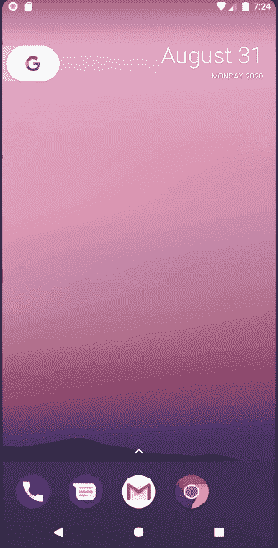

# 如何在安卓中创建小部件内部的按钮？

> 原文:[https://www . geesforgeks . org/how-to-create-buttons-in-widget-in-Android/](https://www.geeksforgeeks.org/how-to-create-buttons-inside-a-widget-in-android/)

#### 先决条件

*   [**如何创建安卓应用的基本小部件？**T3】](https://www.geeksforgeeks.org/how-to-create-a-basic-widget-of-an-android-app/)
*   [**如何创建安卓应用的动态小部件？**T3】](https://www.geeksforgeeks.org/how-to-create-a-dynamic-widget-of-an-android-app/)

小部件是应用程序的迷你版本，它为用户提供了一个在主屏幕或锁定屏幕上浏览或使用其功能的平台。小部件根据它提供的特性包含元素。小部件，如之前所称的应用程序的迷你版本，能够显示类似于应用程序的元素，通过本文，让我们演示按钮的实现，以及相应地如何将它们用于某些功能。下面是同样的预览:



### 在小部件内创建按钮的步骤

**第一步:创建新项目**

在安卓工作室创建新项目请参考 [**【如何在安卓工作室创建/启动新项目】**](https://www.geeksforgeeks.org/android-how-to-create-start-a-new-project-in-android-studio/) 。**注意，选择** [**柯特林**](https://www.geeksforgeeks.org/introduction-to-kotlin/) **作为编程语言。**

**第二步:将 App Widget 添加到项目中**

*   右键点击 **app** ，将光标移动到**新增的**，找到末尾的“**小工具**”选项，选择。


*   指定小部件所需的属性，如**最小宽度**和**高度**，配置文件和首选语言等，然后继续。文件会自动生成。


**第三步:编程什么？在哪里编程？**

1.  在我们的应用程序中，由于我们希望显示两个名为“**活动 1**”&”**活动 2** 的**按钮，我们需要在 **new_app_widget.xml** 文件中声明它们，该文件位于“资源”文件夹的“布局”中。**
2.  整个编程(后端)是在主源文件夹中新创建的 **NewAppWidget.kt、** Kotlin 类文件中完成的。这里，我们构建**按钮**。由于这些按钮会将用户重定向到不同的活动，我们需要创建两个空活动，我们将它们分别命名为“**活动 1** ”和“**活动 2** ”。
3.  这些活动充当待定意图，因为它们仅在用户单击其中一个按钮时初始化。
4.  对活动 1 和活动 2 前端文件进行更改，以表示它们的名称。
5.  只需参考下面的代码和下面给出的相应注释。

*   **new_app_widget.xml 和 NewAppWidget.kt 文件**

## 可扩展标记语言

```
<RelativeLayout 
    xmlns:android="http://schemas.android.com/apk/res/android"
    android:layout_width="match_parent"
    android:layout_height="match_parent"
    android:background="#0F9D58"
    android:padding="@dimen/widget_margin">

    <!-- Button 1 -->
    <Button
        android:id="@+id/btn1"
        android:layout_width="wrap_content"
        android:layout_height="wrap_content"
        android:text="Activity1"
        android:layout_centerInParent="true"
        />

    <!-- Button 2 -->
    <Button
        android:id="@+id/btn2"
        android:layout_width="wrap_content"
        android:layout_height="wrap_content"
        android:text="Activity2"
        android:layout_centerHorizontal="true"
        android:layout_below="@id/btn1"
        />

</RelativeLayout>
```

## 我的锅

```
package org.geeksforgeeks.widget_buttons

import android.app.PendingIntent
import android.appwidget.AppWidgetManager
import android.appwidget.AppWidgetProvider
import android.content.Context
import android.content.Intent
import android.widget.RemoteViews

// Implementation of App Widget functionality
class NewAppWidget : AppWidgetProvider() {
    override fun onUpdate(
        context: Context,
        appWidgetManager: AppWidgetManager,
        appWidgetIds: IntArray
    ) {
        // There may be multiple widgets active, so update all of them
        for (appWidgetId in appWidgetIds) {
            updateAppWidget(context, appWidgetManager, appWidgetId)
        }
    }

    // Enter relevant functionality for when
      // the first widget is created
    override fun onEnabled(context: Context) {

    }

    // Enter relevant functionality for when
      // the last widget is disabled
    override fun onDisabled(context: Context) {

    }

}

internal fun updateAppWidget(
    context: Context,
    appWidgetManager: AppWidgetManager,
    appWidgetId: Int
) 

/////////////////////////////Start Coding Here///////////////////////////////////////
{

    // Create a pending Intent for Activity 1
    val i1 : PendingIntent = Intent(context,Activity1::class.java).let { intent ->
        PendingIntent.getActivity(context, 0, intent, 0)  }

    // Create a pending Intent for Activity 2
    val i2 : PendingIntent = Intent(context,Activity2::class.java).let { intent ->
        PendingIntent.getActivity(context, 0, intent, 0)  }

    // Construct the RemoteViews object
    val views = RemoteViews(context.packageName, R.layout.new_app_widget)
        // Button 1 onClick Function
        .apply{setOnClickPendingIntent(R.id.btn1,i1)} 
        // Button 2 onClick Function
        .apply { setOnClickPendingIntent(R.id.btn2,i2) } 

    // Instruct the widget manager to update the widget
    appWidgetManager.updateAppWidget(appWidgetId, views)
}
/////////////////////////////Code Ends Here///////////////////////////////////////
```

*   **activity_1.xml，Activity1.kt，activity_2.xml，Activity2.kt 文件**

在这两个文件中，XML 文件只添加了一个 [TextView](https://www.geeksforgeeks.org/textview-in-kotlin/) ，而在 Kotlin 文件中，我们什么都没有添加。用户可以根据自己的需求在这些文件中编写自己的代码。

## 可扩展标记语言

```
<?xml version="1.0" encoding="utf-8"?>
<RelativeLayout 
    xmlns:android="http://schemas.android.com/apk/res/android"
    xmlns:app="http://schemas.android.com/apk/res-auto"
    xmlns:tools="http://schemas.android.com/tools"
    android:layout_width="match_parent"
    android:layout_height="match_parent"
    tools:context=".Activity1">

    <TextView
        android:layout_width="wrap_content"
        android:layout_height="wrap_content"
        android:text="Activity 1"
        android:layout_centerInParent="true"
        />

</RelativeLayout>
```

## 我的锅

```
package org.geeksforgeeks.widget_buttons

import androidx.appcompat.app.AppCompatActivity
import android.os.Bundle

class Activity1 : AppCompatActivity() {
    override fun onCreate(savedInstanceState: Bundle?) {
        super.onCreate(savedInstanceState)
        setContentView(R.layout.activity_1)
    }
}
```

## 可扩展标记语言

```
<?xml version="1.0" encoding="utf-8"?>
<RelativeLayout 
    xmlns:android="http://schemas.android.com/apk/res/android"
    xmlns:app="http://schemas.android.com/apk/res-auto"
    xmlns:tools="http://schemas.android.com/tools"
    android:layout_width="match_parent"
    android:layout_height="match_parent"
    tools:context=".Activity2">

    <TextView
        android:layout_width="wrap_content"
        android:layout_height="wrap_content"
        android:text="Activity 2"
        android:layout_centerInParent="true"
        />

</RelativeLayout>
```

## 我的锅

```
package org.geeksforgeeks.widget_buttons

import androidx.appcompat.app.AppCompatActivity
import android.os.Bundle

class Activity2 : AppCompatActivity() {
    override fun onCreate(savedInstanceState: Bundle?) {
        super.onCreate(savedInstanceState)
        setContentView(R.layout.activity_2)
    }
}
```

*   **activity_main.xml，MainActivity.kt 文件**

在 activity_main.xml、MainActivity.kt 文件中没有什么可做的。用户可以根据自己的需求在这些文件中编写自己的代码。

## 可扩展标记语言

```
<?xml version="1.0" encoding="utf-8"?>
<androidx.constraintlayout.widget.ConstraintLayout 
    xmlns:android="http://schemas.android.com/apk/res/android"
    xmlns:app="http://schemas.android.com/apk/res-auto"
    xmlns:tools="http://schemas.android.com/tools"
    android:layout_width="match_parent"
    android:layout_height="match_parent"
    tools:context=".MainActivity">

    <TextView
        android:layout_width="wrap_content"
        android:layout_height="wrap_content"
        android:text="Hello World!"
        app:layout_constraintBottom_toBottomOf="parent"
        app:layout_constraintLeft_toLeftOf="parent"
        app:layout_constraintRight_toRightOf="parent"
        app:layout_constraintTop_toTopOf="parent" />

</androidx.constraintlayout.widget.ConstraintLayout>
```

## 我的锅

```
package org.geeksforgeeks.widget_buttons

import androidx.appcompat.app.AppCompatActivity
import android.os.Bundle

class MainActivity : AppCompatActivity() {
    override fun onCreate(savedInstanceState: Bundle?) {
        super.onCreate(savedInstanceState)
        setContentView(R.layout.activity_main)
    }
}
```

### 输出:在模拟器上运行

<video class="wp-video-shortcode" id="video-481941-1" width="640" height="360" preload="metadata" controls=""><source type="video/mp4" src="https://media.geeksforgeeks.org/wp-content/uploads/20200907224522/Screen-Recording-2020-08-31-at-19.24.34.mp4?_=1">[https://media.geeksforgeeks.org/wp-content/uploads/20200907224522/Screen-Recording-2020-08-31-at-19.24.34.mp4](https://media.geeksforgeeks.org/wp-content/uploads/20200907224522/Screen-Recording-2020-08-31-at-19.24.34.mp4)</video>