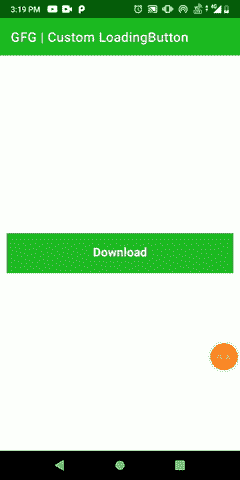

# 如何在安卓中通过扩展 ViewClass 创建自定义加载按钮？

> 原文:[https://www . geeksforgeeks . org/如何在安卓中通过扩展视图类来创建自定义加载按钮/](https://www.geeksforgeeks.org/how-to-create-custom-loading-button-by-extending-viewclass-in-android/)

在本文中，我们将通过扩展视图类来创建一个自定义加载按钮，并在单击自定义按钮后设置其属性的动画。我们在下载任何文件并密切关注下载进度时遇到过很多次。在这里，我们将只创建动画自定义按钮。下面给出了一个示例 GIF，以了解我们将在本文中做什么。注意，我们将使用 **Kotlin** 语言来实现这个项目。



### **分步实施**

**第一步:创建新项目**

要在安卓工作室创建新项目，请参考[如何在安卓工作室创建/启动新项目](https://www.geeksforgeeks.org/android-how-to-create-start-a-new-project-in-android-studio/)。注意选择**科特林**作为编程语言。

**第二步:**创建一个密封类，**按钮状态**描述自定义按钮的状态(如点击，加载&完成)。下面是**按钮状态. kt** 文件的代码。

## 我的锅

```
package com.gfg.article.customloadingbutton

// describes the state of the custom button
sealed class ButtonState() {
    object Clicked : ButtonState()   // when button is clicked for downloading
    object Loading : ButtonState()   // when downloading is in progress
    object Completed : ButtonState() // when downloading is finished
}
```

**第三步:**创建另一个类，**加载按钮**，其中与按钮相关的所有内容，如颜色、文本、动画等都将被定义。通过用 [JvmOverloads](https://kotlinlang.org/api/latest/jvm/stdlib/kotlin.jvm/-jvm-overloads/) 注释来创建构造函数。下面是 **LoadingButton.kt** 文件的代码。

## 我的锅

```
import android.animation.AnimatorInflater
import android.animation.ValueAnimator
import android.content.Context
import android.graphics.Canvas
import android.graphics.Color
import android.graphics.Paint
import android.graphics.Typeface
import android.util.AttributeSet
import android.view.View
import androidx.core.content.ContextCompat
import com.gfg.article.customloadingbutton.ButtonState
import kotlin.properties.Delegates

class LoadingButton @JvmOverloads constructor(

    context: Context, attrs: AttributeSet? = null, defStyleAttr: Int = 0) : View(context, attrs, defStyleAttr) {

    private var bgColor: Int = Color.BLACK
    private var textColor: Int = Color.BLACK // default color

    // tells the compiler that the value of a variable 
    // must never be cached as its value may change outside
    @Volatile
    private var progress: Double = 0.0
    private var valueAnimator: ValueAnimator

    // observes the state of button
    private var buttonState: ButtonState by Delegates.observable(ButtonState.Completed) { p, old, new ->
    }

    private val updateListener = ValueAnimator.AnimatorUpdateListener {
        progress = (it.animatedValue as Float).toDouble()
        invalidate()    // redraw the screen
        requestLayout() // when rectangular progress dimension changes
    }

    // call after downloading is completed
    fun hasCompletedDownload() {
        // cancel the animation when file is downloaded
        valueAnimator.cancel()
        buttonState = ButtonState.Completed
        invalidate()
        requestLayout()
    }

    // initialize
    init {
        isClickable = true
        valueAnimator = AnimatorInflater.loadAnimator(
            context,
            // properties for downloading progress is defined
            R.animator.loading_animation    
        ) as ValueAnimator

        valueAnimator.addUpdateListener(updateListener)

        // initialize custom attributes of the button
        val attr = context.theme.obtainStyledAttributes(
            attrs,
            R.styleable.LoadingButton,
            0,
            0
        )
        try {

            // button back-ground color
            bgColor = attr.getColor(
                R.styleable.LoadingButton_bgColor,
                ContextCompat.getColor(context, R.color.purple_200)
            )

            // button text color
            textColor = attr.getColor(
                R.styleable.LoadingButton_textColor,
                ContextCompat.getColor(context, R.color.white)
            )
        } finally {
            // clearing all the data associated with attribute
            attr.recycle()
        }
    }

    // set attributes of paint
    private val paint = Paint(Paint.ANTI_ALIAS_FLAG).apply {
        style = Paint.Style.FILL
        textAlign = Paint.Align.CENTER // button text alignment
        textSize = 55.0f //button text size
        typeface = Typeface.create("", Typeface.BOLD) // button text's font style
    }

    override fun performClick(): Boolean {
        super.performClick()
        if (buttonState == ButtonState.Completed) buttonState = ButtonState.Loading
        animation()

        return true
    }

    // start the animation when button is clicked
    private fun animation() {
        valueAnimator.start()
    }

    override fun onDraw(canvas: Canvas) {
        super.onDraw(canvas)
        paint.strokeWidth = 0f
        paint.color = bgColor
        // draw custom button
        canvas.drawRect(0f, 0f, width.toFloat(), height.toFloat(), paint)

        // to show rectangular progress on custom button while file is downloading
        if (buttonState == ButtonState.Loading) {
            paint.color = Color.parseColor("#004349")
            canvas.drawRect(
                0f, 0f,
                (width * (progress / 100)).toFloat(), height.toFloat(), paint
            )
        }
        // check the button state
        val buttonText = if (buttonState == ButtonState.Loading)
            resources.getString(R.string.loading)  // We are loading as button text
        else resources.getString(R.string.download)// download as button text

        // write the text on custom button
        paint.color = textColor
        canvas.drawText(buttonText, (width / 2).toFloat(), ((height + 30) / 2).toFloat(), paint)
    }

}
```

**第 4 步:使用 XML 文件**

导航到**应用程序> res >布局> activity_main.xml** 并将下面的代码添加到该文件中。下面是 **activity_main.xml** 文件的代码。

## 可扩展标记语言

```
<?xml version="1.0" encoding="utf-8"?>
<androidx.constraintlayout.widget.ConstraintLayout
    xmlns:android="http://schemas.android.com/apk/res/android"
    xmlns:app="http://schemas.android.com/apk/res-auto"
    xmlns:tools="http://schemas.android.com/tools"
    android:layout_width="match_parent"
    android:layout_height="match_parent"
    tools:context=".MainActivity">

    <!--Custom Button-->
    <com.example.customloadingbutton.LoadingButton
        android:id="@+id/custom_button"
        android:layout_width="0dp"
        android:layout_height="60dp"
        android:layout_marginStart="10dp"
        android:layout_marginTop="100dp"
        android:layout_marginEnd="10dp"
        android:layout_marginBottom="100dp"
        app:layout_constraintBottom_toBottomOf="parent"
        app:layout_constraintEnd_toEndOf="parent"
        app:layout_constraintStart_toStartOf="parent"
        app:layout_constraintTop_toTopOf="parent"
        app:textColor="@color/white" />

</androidx.constraintlayout.widget.ConstraintLayout>
```

**attrs.xml** (在 **res - > values** 下)

## 可扩展标记语言

```
<?xml version="1.0" encoding="utf-8"?>
<resources>
    <declare-styleable name="LoadingButton">
        <!--create custom attributes for the view-->
        <attr name="bgColor" format="integer" />
        <attr name="textColor" format="integer" />
    </declare-styleable>
</resources>
```

**loading_animation.xml** (在 **res - >动画师**下，在 res 下创建动画师目录)

## 可扩展标记语言

```
<?xml version="1.0" encoding="utf-8"?>
<animator 
    xmlns:android="http://schemas.android.com/apk/res/android"
    android:duration="2000"
    android:interpolator="@android:anim/accelerate_decelerate_interpolator"
    android:valueFrom="0f"
    android:valueTo="100f"
    android:valueType="floatType" />
```

**步骤 5:使用**T2【主活动. kt】文件

转到 **MainActivity.kt** 文件，参考以下代码。下面是 **MainActivity.kt** 文件的代码。代码中添加了注释，以更详细地理解代码。

## 我的锅

```
import android.os.Bundle
import android.widget.Toast
import androidx.appcompat.app.AppCompatActivity

class MainActivity : AppCompatActivity() {

    lateinit var loadingButton: LoadingButton
    private var complete = false

    override fun onCreate(savedInstanceState: Bundle?) {
        super.onCreate(savedInstanceState)
        setContentView(R.layout.activity_main)

        loadingButton = findViewById(R.id.custom_button)

        loadingButton.setOnClickListener {
            Toast.makeText(this, "File is downloading", Toast.LENGTH_LONG).show()
            complete = true
        }

        if (complete) {
            // call when download completed
            loadingButton.hasCompletedDownload()
        }
    }
}
```

**输出:**

<video class="wp-video-shortcode" id="video-658504-1" width="640" height="360" preload="metadata" controls=""><source type="video/mp4" src="https://media.geeksforgeeks.org/wp-content/uploads/20210802185153/customButton.mp4?_=1">[https://media.geeksforgeeks.org/wp-content/uploads/20210802185153/customButton.mp4](https://media.geeksforgeeks.org/wp-content/uploads/20210802185153/customButton.mp4)</video>

**源代码:** [链接](https://media.geeksforgeeks.org/wp-content/cdn-uploads/20210807124557/customLoadingButton-GFGarticle-main.zip)