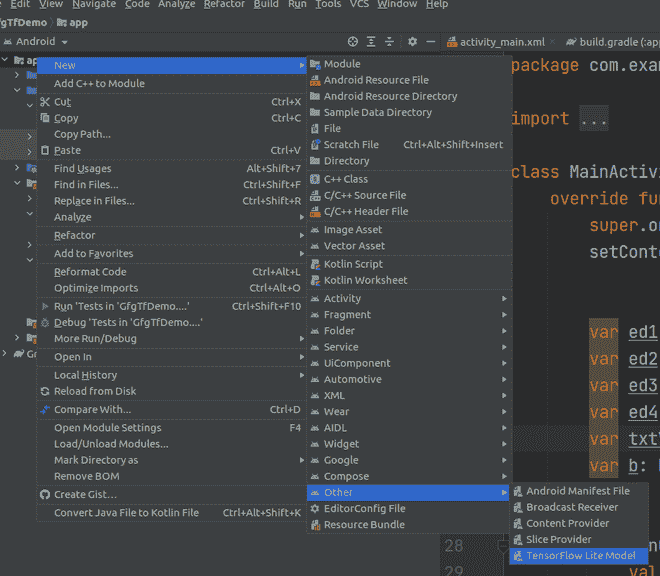
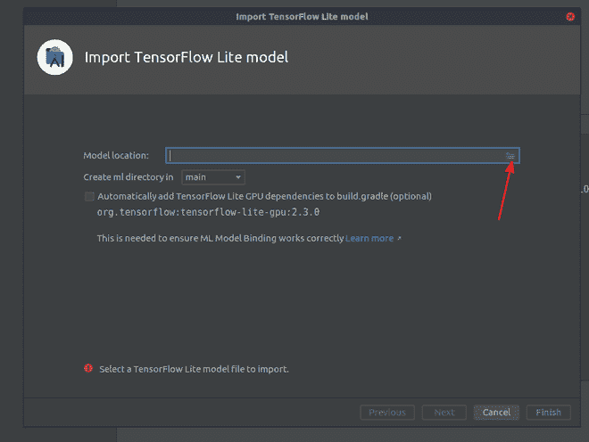
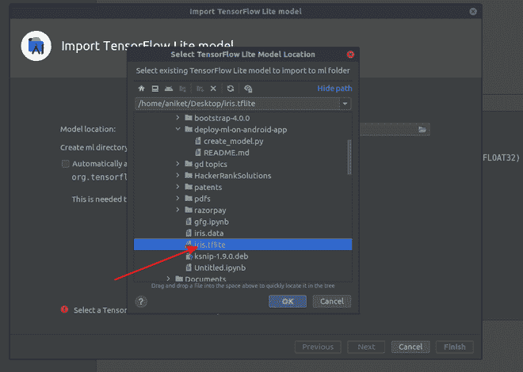
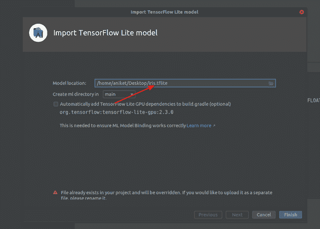
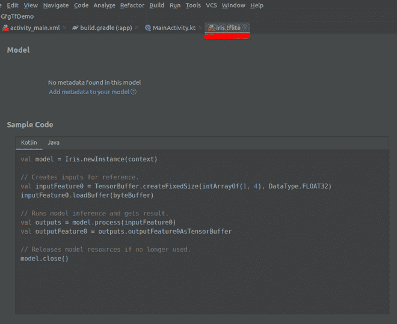

# 如何使用 TensorFlow 为安卓创建自定义模型？

> 原文:[https://www . geeksforgeeks . org/如何使用 tensorflow/为安卓创建定制模型/](https://www.geeksforgeeks.org/how-to-create-custom-model-for-android-using-tensorflow/)

[Tensorflow](https://www.geeksforgeeks.org/introduction-to-tensorflow/) 是机器学习的开源库。在安卓系统中，我们的计算能力和资源都很有限。因此，我们正在使用 TensorFlow 灯，这是专门为在功率有限的设备上运行而设计的。在这篇文章中，我们将看到一个名为 iris 数据集的分类示例。数据集包含 3 个类，每个类 50 个实例，其中每个类指的是鸢尾植物的类型。

**属性信息:**

1.  萼片长厘米
2.  萼片宽度厘米
3.  花瓣长度(厘米)
4.  花瓣宽度(厘米)

根据输入的信息，我们将预测该植物是**濑户鸢尾**、**云芝**还是**弗吉尼亚鸢尾**。更多信息可以参考本链接。

### 逐步实施

**第一步:**

从[这个](https://archive.ics.uci.edu/ml/machine-learning-databases/iris/)(**https://archive . ics . UCI . edu/ml/机器学习-数据库/iris/** )链接下载 iris 数据集(**文件名:iris.data** )。

**第二步:**

在 Jupyter 笔记本中创建一个名为 iris 的新 python 文件。将 iris.data 文件放在 iris.ipynb 所在的目录中。将以下代码复制到 Jupyter 笔记本文件中。

```kt
iris.ipynb
```

## 计算机编程语言

```kt
import pandas as pd
import numpy as np
import tensorflow as tf
from sklearn.preprocessing import LabelEncoder
from keras.utils import to_categorical

# reading the csb into data frame
df = pd.read_csv('iris.data')

# specifying the columns values into x and y variable
# iloc range based selecting 0 to 4 (4) values
X = df.iloc[:, :4].values
y = df.iloc[:, 4].values

# normalizing labels
le = LabelEncoder()

# performing fit and transform data on y
y = le.fit_transform(y)

y = to_categorical(y)

from tensorflow.keras.layers import Dense
from tensorflow.keras.models import Sequential

model = Sequential()

# input layer
# passing number neurons =64
# relu activation
# shape of neuron 4
model.add(Dense(64, activation='relu', input_shape=[4]))

# processing layer
# adding another denser layer of size 64
model.add(Dense(64))

# creating 3 output neuron
model.add(Dense(3, activation='softmax'))

# compiling model
model.compile(optimizer='sgd', loss='categorical_crossentropy',
              metrics=['acc'])

# training the model for fixed number of iterations (epoches)
model.fit(X, y, epochs=200)

from tensorflow import lite
converter = lite.TFLiteConverter.from_keras_model(model)

tfmodel = converter.convert()

open('iris.tflite', 'wb').write(tfmodel)
```

**第三步:**

执行完 **<u>行后打开(' iris.tflite '，' wb ')。write(tfmodel)</u>** 一个名为 **<u>iris.tflite</u>** 的新文件将在 iris.data 所在的目录中创建。

**A)** 打开安卓工作室。创建一个新的 kotlin-android 项目。(创建项目可以参考这里的)。

**B)** 右键点击 app >新增>其他> TensorFlow Lite 模型



**C)** 点击文件夹图标。



**D)** 导航至 iris.tflite 文件



**E)** 点击确定



**F)** 点击完成后你的模型会是这个样子。(加载可能需要一些时间)。



复制代码并粘贴到 MainActivity.kt 中一个按钮的点击监听器中(如下所示)。

**第五步:为预测创建 XML 布局**

导航到**应用程序> res >布局> activity_main.xml** 并将下面的代码添加到该文件中。下面是 **activity_main.xml** 文件的代码。

## 可扩展标记语言

```kt
<?xml version="1.0" encoding="utf-8"?>
<androidx.constraintlayout.widget.ConstraintLayout
    xmlns:android="http://schemas.android.com/apk/res/android"
    xmlns:app="http://schemas.android.com/apk/res-auto"
    xmlns:tools="http://schemas.android.com/tools"
    android:layout_width="match_parent"
    android:layout_height="match_parent"
    tools:context=".MainActivity">

    <ScrollView
        android:layout_width="match_parent"
        android:layout_height="match_parent"
        android:layout_marginBottom="50dp">

        <LinearLayout
            android:layout_width="match_parent"
            android:layout_height="match_parent"
            android:orientation="vertical">

            <!-- creating  edittexts for input-->
            <EditText
                android:id="@+id/tf1"
                android:layout_width="175dp"
                android:layout_height="wrap_content"
                android:layout_gravity="center"
                android:layout_marginTop="70dp"
                android:ems="10"
                android:inputType="numberDecimal" />

            <EditText
                android:id="@+id/tf2"
                android:layout_width="175dp"
                android:layout_height="wrap_content"
                android:layout_gravity="center"
                android:layout_marginTop="20dp"
                android:ems="10"
                android:inputType="numberDecimal" />

            <EditText
                android:id="@+id/tf3"
                android:layout_width="175dp"
                android:layout_height="wrap_content"
                android:layout_gravity="center"
                android:layout_marginTop="20dp"
                android:ems="10"
                android:inputType="numberDecimal" />

            <EditText
                android:id="@+id/tf4"
                android:layout_width="175dp"
                android:layout_height="wrap_content"
                android:layout_gravity="center"
                android:layout_marginTop="20dp"
                android:ems="10"
                android:inputType="numberDecimal" />

            <!-- creating  Button for input-->
            <!-- after clicking on button we will see prediction-->
            <Button
                android:id="@+id/button"
                android:layout_width="wrap_content"
                android:layout_height="wrap_content"
                android:layout_gravity="center"
                android:layout_marginTop="100dp"
                android:text="Button"
                app:layout_constraintBottom_toTopOf="@+id/textView"
                app:layout_constraintEnd_toEndOf="parent"
                app:layout_constraintHorizontal_bias="0.0"
                app:layout_constraintStart_toStartOf="parent" />

            <!-- creating  textview on which we will see prediction-->
            <TextView
                android:id="@+id/textView"
                android:layout_width="wrap_content"
                android:layout_height="wrap_content"
                android:layout_gravity="center"
                android:layout_marginTop="50dp"
                android:text="TextView"
                android:textSize="20dp"
                app:layout_constraintEnd_toEndOf="parent" />
        </LinearLayout>
    </ScrollView>
</androidx.constraintlayout.widget.ConstraintLayout>
```

**第六步:使用** **主活动文件**

转到 **MainActivity.kt** 文件，参考以下代码。下面是 **MainActivity.kt** 文件的代码。代码中添加了注释，以更详细地理解代码。

## 我的锅

```kt
import androidx.appcompat.app.AppCompatActivity
import android.os.Bundle
import android.view.View
import android.widget.Button
import android.widget.EditText
import android.widget.TextView
import com.example.gfgtfdemo.ml.Iris
import org.tensorflow.lite.DataType
import org.tensorflow.lite.support.tensorbuffer.TensorBuffer
import java.nio.ByteBuffer

class MainActivity : AppCompatActivity() {
    override fun onCreate(savedInstanceState: Bundle?) {
        super.onCreate(savedInstanceState)
        setContentView(R.layout.activity_main)

        // getting the object edit texts
        var ed1: EditText = findViewById(R.id.tf1);
        var ed2: EditText = findViewById(R.id.tf2);
        var ed3: EditText = findViewById(R.id.tf3);
        var ed4: EditText = findViewById(R.id.tf4);

        // getting the object of result textview
        var txtView: TextView = findViewById(R.id.textView);
        var b: Button = findViewById<Button>(R.id.button);

        // registering listener
        b.setOnClickListener(View.OnClickListener {

            val model = Iris.newInstance(this)

            // getting values from edit text and converting to float
            var v1: Float = ed1.text.toString().toFloat();
            var v2: Float = ed2.text.toString().toFloat();
            var v3: Float = ed3.text.toString().toFloat();
            var v4: Float = ed4.text.toString().toFloat();

            /*************************ML MODEL CODE STARTS HERE******************/

              // creating byte buffer which will act as input for model
            var byte_buffer: ByteBuffer = ByteBuffer.allocateDirect(4 * 4)
            byte_buffer.putFloat(v1)
            byte_buffer.putFloat(v2)
            byte_buffer.putFloat(v3)
            byte_buffer.putFloat(v4)

            // Creates inputs for reference.
            val inputFeature0 = TensorBuffer.createFixedSize(intArrayOf(1, 4), DataType.FLOAT32)
            inputFeature0.loadBuffer(byte_buffer)

            // Runs model inference and gets result.
            val outputs = model.process(inputFeature0)
            val outputFeature0 = outputs.outputFeature0AsTensorBuffer.floatArray

            // setting the result to the output textview
            txtView.setText(
                "Iris-setosa : =" + outputFeature0[0].toString() + "\n" +
                "Iris-versicolor : =" + outputFeature0[1].toString() + "\n" +
                "Iris-virginica: =" +  outputFeature0[2].toString()
            )

            // Releases model resources if no longer used.
            model.close()
        })
    }
}
```

**输出:**

<video class="wp-video-shortcode" id="video-668058-1" width="640" height="360" preload="metadata" controls=""><source type="video/mp4" src="https://media.geeksforgeeks.org/wp-content/uploads/20210811205355/InShot_20210811_205104536.mp4?_=1">[https://media.geeksforgeeks.org/wp-content/uploads/20210811205355/InShot_20210811_205104536.mp4](https://media.geeksforgeeks.org/wp-content/uploads/20210811205355/InShot_20210811_205104536.mp4)</video>

你可以从[这里](https://media.geeksforgeeks.org/wp-content/cdn-uploads/20210821144614/GfgCustomModel-main.zip)下载这个项目。