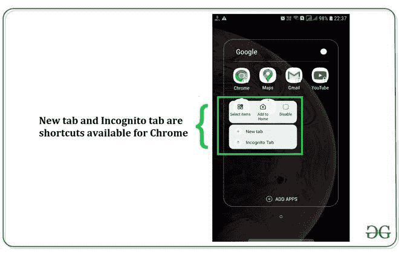
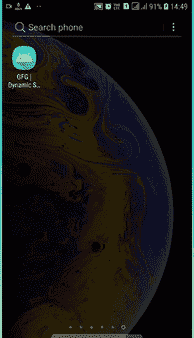

# 如何创建安卓应用的动态快捷方式？

> 原文:[https://www . geeksforgeeks . org/如何创建安卓应用程序的动态快捷方式/](https://www.geeksforgeeks.org/how-to-create-dynamic-shortcuts-of-an-android-applications/)

在安卓手机中，当应用程序被按住超过一秒钟时，某些应用程序动作会出现在列表中。这些应用程序操作不过是在不打开应用程序的情况下执行和操作的快捷方式。应用程序的快捷方式是功能列表(快速服务)，帮助用户轻松快速地跳转到应用程序中的特定功能或活动。快捷方式的列出和构造取决于它提供的服务。参考下图截图。



这些快捷方式可以预定义或硬编码，并且在其整个生命周期中从不改变(静态)，因此被称为**静态快捷方式**。另一组可能随时间或环境变化的快捷方式叫做**动态快捷方式**。在本文中，我们将讨论并实现安卓应用程序中的动态快捷方式。实现应用程序的主要语言应为 [**科特林**](https://www.geeksforgeeks.org/introduction-to-kotlin/) 。

> ***注意:**要创建安卓应用的静态快捷方式，请参考* [*如何在安卓应用中创建静态快捷方式？*](https://www.geeksforgeeks.org/how-to-create-static-shortcuts-in-android-app/)

### **已实施应用背后的概念**

在这个项目中，创建一个安卓应用程序，其中我们只有一个活动，即显示 2 个[按钮](https://www.geeksforgeeks.org/button-in-kotlin/)、**点击**和**追加**的主活动。我们两个都没点击。应用程序内部编程的是最初显示 2 个快捷方式， **Ask.fm** 和**Instagram.com**。我们首先检查这两个快捷方式是否显示。然后我们打开应用，点击**点击**按钮，关闭应用。我们再次检查快捷方式，现在它们被更改为**Facebook.com**和**Google.com**。**点击按钮用于动态改变快捷键。**我们再次打开 app，点击**追加**按钮，关闭 app。Instagram 和 AskFM 列表中添加了一个新的快捷方式**new yappended(测试用例)**。通过这种方式，快捷方式的数量以及其中的上下文可以改变。通常，安卓系统接受多个快捷方式(在应用程序中编程)，但对于 UX，它只显示其中的 4 个。



### 方法

**第一步:创建新项目**

在安卓工作室创建新项目请参考 [**【如何在安卓工作室创建/启动新项目】**](https://www.geeksforgeeks.org/android-how-to-create-start-a-new-project-in-android-studio/) 。**注意，选择 Kotlin 作为编程语言。**

**第二步:使用 activity_main.xml 文件**

正如我们之前讨论的，在 **activity_main.xml** 文件中添加两个[按钮](https://www.geeksforgeeks.org/button-in-kotlin/)，一个“点击”，另一个“追加”。完整的 **activity_main.xml** 文件如下。

## activity_main.xml

```kt
<?xml version="1.0" encoding="utf-8"?>
<RelativeLayout
    xmlns:android="http://schemas.android.com/apk/res/android"
    xmlns:tools="http://schemas.android.com/tools"
    android:layout_width="match_parent"
    android:layout_height="match_parent"
    tools:context=".MainActivity">

    <!--Defining 2 Buttons, Click and Append-->
    <Button
        android:id="@+id/btn"
        android:layout_width="wrap_content"
        android:layout_height="wrap_content"
        android:layout_centerInParent="true"
        android:text="click" />

    <Button
        android:id="@+id/append"
        android:layout_width="wrap_content"
        android:layout_height="wrap_content"
        android:layout_below="@id/btn"
        android:layout_centerHorizontal="true"
        android:text="append" />

</RelativeLayout>
```

**第三步:使用 MainActivity.kt 文件**

*   要构建快捷方式，需要两个元素**快捷方式管理器**和**快捷方式构建器**。请参考以下结构(在 Kotlin 中编程):

> var shortcut manager = getsystemservice(shortcut manager::class . Java)
> 
> var 快捷键= ShortcutInfo。生成器(应用程序上下文，“样本标识”)
> 
> 。setShortLabel(“样本名称”)
> 
> 。setIcon(icon . createwith resource(application context，r . drawinable . sampleicon))
> 
> 。意图(Intent)。ACTION_VIEW，……。样本意图...-什么))
> 
> 。构建()
> 
> 快捷方式管理器！！。dynamicShortcuts = listOf(样本快捷方式)

快捷方式中有四个基本元素:

1.  **setShortLabel:** 当应用程序被按住时，出现在快捷方式旁边的字符串。
2.  **设置图标:**按住应用程序时出现在快捷方式旁边的图像。
3.  **设置意图**:快捷方式重定向到的活动。
4.  **构建:**用给定的实体构建快捷方式。

*   我们创建了 4 个重定向到 4 个不同社交网站脸书、Instagram、AskFM 的网络意图，以及一个将另一个意图附加到当前列表的测试用例“NewlyAppended”。
*   在“MainActivity.kt”文件中，声明它们并设置点击监听器，以便在按钮被点击时可以进行操作。
*   快捷方式直接声明到“MainActivity.kt”文件中。
*   现在所有模块都准备好了，我们可以在“MainActivity.kt”文件中定义快捷方式
*   的**列表是要在该列表中显示的已声明快捷方式的列表。要声明的快捷方式的数量没有限制，可以是 1 个甚至 1000 个，但是对于 UX，系统最多只允许显示 4 个快捷方式。现在参考下面的代码，添加注释以理解每个元素。以下是 **MainActivity.kt** 文件的完整代码。**

## MainActivity.kt 公司

```kt
package org.geeksforgeeks.dynamic_shortcuts

import android.content.Intent
import android.content.pm.ShortcutInfo
import android.content.pm.ShortcutManager
import android.graphics.drawable.Icon
import android.net.Uri
import android.os.Build
import android.os.Bundle
import android.widget.Button
import androidx.annotation.RequiresApi
import androidx.appcompat.app.AppCompatActivity

class MainActivity : AppCompatActivity() {
    @RequiresApi(Build.VERSION_CODES.N_MR1)
    override fun onCreate(savedInstanceState: Bundle?) {
        super.onCreate(savedInstanceState)
        setContentView(R.layout.activity_main)

        // Shortcut Manager for managing the shortcuts
        var shortcutManager = getSystemService(ShortcutManager::class.java)

        // Defining a shortcut, Shortcut 1
        var shortcut1 = ShortcutInfo.Builder(applicationContext, "ID1")
                .setShortLabel("Instagram")
                .setIcon(Icon.createWithResource(applicationContext, R.drawable.icon))
                .setIntent(Intent(Intent.ACTION_VIEW, Uri.parse("https://www.instagram.com")))
                .build()

        // Defining a shortcut, Shortcut 2
        var shortcut2 = ShortcutInfo.Builder(applicationContext, "ID2")
                .setShortLabel("AskFM")
                .setIcon(Icon.createWithResource(applicationContext, R.drawable.icon))
                .setIntent(Intent(Intent.ACTION_VIEW, Uri.parse("https://www.ask.fm")))
                .build()

        // Show list of shortcuts when held
        shortcutManager!!.dynamicShortcuts = listOf(shortcut1, shortcut2)

        // When btn is clicked, changes are made to Shortcut 1 and Shortcut 2
        val btn = findViewById<Button>(R.id.btn)

        btn.setOnClickListener {

            shortcut1 = ShortcutInfo.Builder(applicationContext, "ID1")
                    .setShortLabel("Google")
                    .setIcon(Icon.createWithResource(applicationContext, R.drawable.icon))
                    .setIntent(Intent(Intent.ACTION_VIEW, Uri.parse("https://www.google.com")))
                    .build()
            shortcut2 = ShortcutInfo.Builder(applicationContext, "ID2")
                    .setShortLabel("Facebook")
                    .setIcon(Icon.createWithResource(applicationContext, R.drawable.icon))
                    .setIntent(Intent(Intent.ACTION_VIEW, Uri.parse("https://www.facebook.com")))
                    .build()

            shortcutManager!!.dynamicShortcuts = listOf(shortcut1, shortcut2)
        }

        // When add is clicked, a new shortcut is appended to the existing list of shortcuts
        val add = findViewById<Button>(R.id.append)

        add.setOnClickListener {
            var shortcut3 = ShortcutInfo.Builder(applicationContext, "ID3")
                    .setShortLabel("NewlyAppended")
                    .setIcon(Icon.createWithResource(applicationContext, R.drawable.icon))
                    .setIntent(Intent(Intent.ACTION_VIEW, Uri.parse("https://www.newlyAppended.com")))
                    .build()

            shortcutManager!!.dynamicShortcuts = listOf(shortcut1, shortcut2, shortcut3)
        }
    }
}
```

### 输出:在模拟器上运行

<video class="wp-video-shortcode" id="video-480950-1" width="640" height="360" preload="metadata" controls=""><source type="video/mp4" src="https://media.geeksforgeeks.org/wp-content/uploads/20200825231945/ezgif.com-gif-maker-1.mp4?_=1">[https://media.geeksforgeeks.org/wp-content/uploads/20200825231945/ezgif.com-gif-maker-1.mp4](https://media.geeksforgeeks.org/wp-content/uploads/20200825231945/ezgif.com-gif-maker-1.mp4)</video>