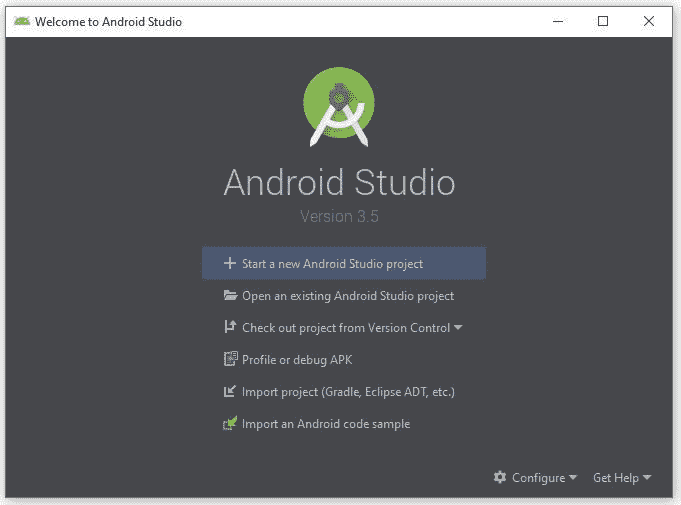
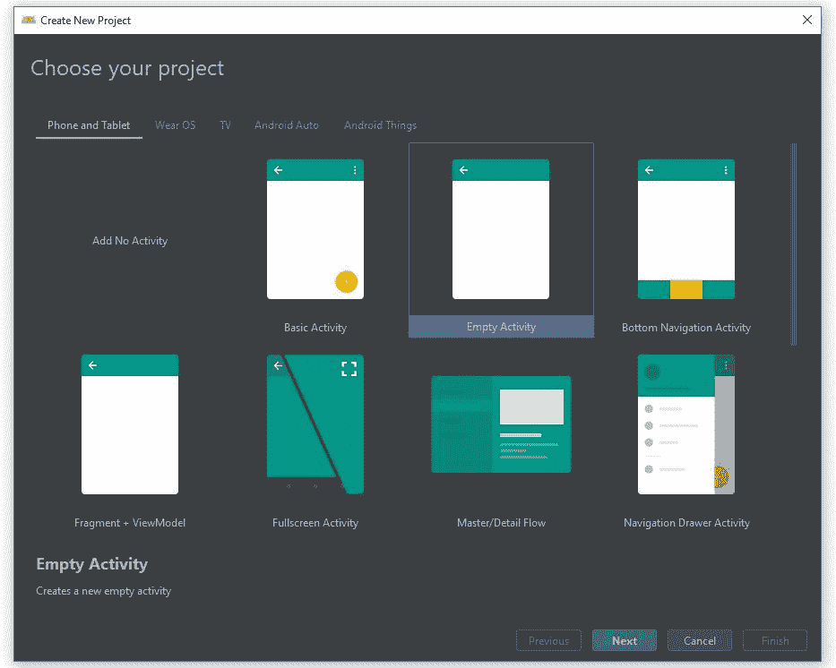
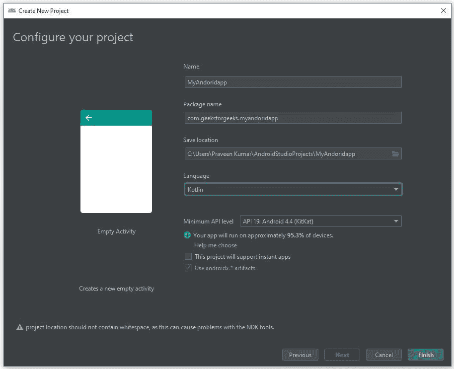
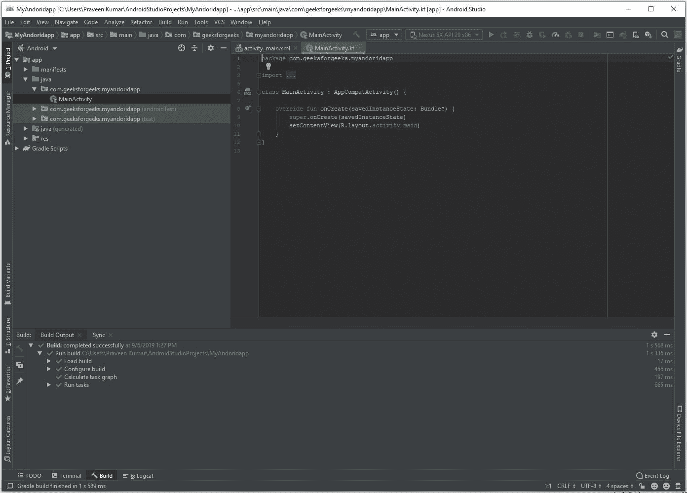

# 如何使用 Kotlin 在 Android Studio 中创建项目

> 原文:[https://www . geeksforgeeks . org/如何在 android 中创建项目-studio-use-kot Lin/](https://www.geeksforgeeks.org/how-to-create-project-in-android-studio-using-kotlin/)

我们知道 Kotlin 插件是和 Android Studio 捆绑在一起的上面版本 **3.0** ，我们可以用 Kotlin 语言而不是 Java 来构建 Android 应用。

以下是用 Kotlin 编程语言创建新项目的步骤。

**第一步:**在欢迎来到安卓工作室画面中，选择**开始新的安卓工作室项目**。

**第二步:**选择**空活动**，点击**下一步**按钮。

**第 3 步:**这里我们写下应用程序的名称，并为项目选择语言**科特林**。然后，点击**完成**按钮启动项目。

**第 4 步:**最后我们新创建的项目打开，其中包含不同数量的文件。
