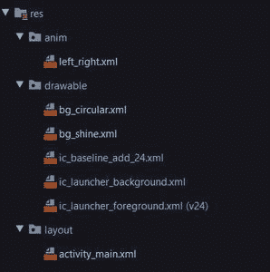

# 如何在安卓中打造闪耀效果？

> 原文:[https://www . geesforgeks . org/如何在安卓中创造闪耀效果/](https://www.geeksforgeeks.org/how-to-create-shine-effect-in-android/)

**发光效果**用于给[图像视图](https://www.geeksforgeeks.org/imageview-in-kotlin/)、[按钮](https://www.geeksforgeeks.org/button-in-kotlin/)或**视图**一个更好的动画外观。它非常容易实现。下面给出了一个 GIF 示例，来了解一下我们在本文中要做什么。注意，我们将使用 **Kotlin** 语言来实现这个项目。


### **分步实施**

**第一步:创建新项目**

在安卓工作室创建新项目请参考 [**【如何在安卓工作室创建/启动新项目】**](https://www.geeksforgeeks.org/android-how-to-create-start-a-new-project-in-android-studio/) 。注意选择**柯特林**作为编程语言

**步骤 2:使用 activity_main.xml 文件**

转到 **activity_main.xml** 文件，参考以下代码。下面是 **activity_main.xml** 文件的代码。

## 可扩展标记语言

```kt
<?xml version="1.0" encoding="utf-8"?>
<androidx.constraintlayout.widget.ConstraintLayout 
    xmlns:android="http://schemas.android.com/apk/res/android"
    xmlns:app="http://schemas.android.com/apk/res-auto"
    xmlns:tools="http://schemas.android.com/tools"
    android:layout_width="match_parent"
    android:layout_height="match_parent"
    tools:context=".MainActivity">

    <RelativeLayout
        android:layout_width="200dp"
        android:layout_height="80dp"
        android:layout_marginRight="20dp"
        android:layout_marginBottom="20dp"
        app:layout_constraintBottom_toBottomOf="parent"
        app:layout_constraintRight_toRightOf="parent">

        <LinearLayout
            android:layout_width="match_parent"
            android:layout_height="60dp"
            android:layout_marginStart="30dp"
            android:layout_marginTop="10dp"
            android:layout_marginBottom="10dp"
            android:background="@drawable/bg_circular"
            android:gravity="center"
            android:weightSum="6">

            <ImageView
                android:layout_width="40dp"
                android:layout_height="40dp"
                android:layout_weight="1"
                android:src="@drawable/ic_baseline_add_24" />

            <TextView
                android:layout_width="wrap_content"
                android:layout_height="wrap_content"
                android:layout_weight="2"
                android:text="Create"
                android:textColor="@color/white"
                android:textSize="20sp" />

        </LinearLayout>

        <!--This is the view which we will be animating
            in order to show shine effect-->
        <View
            android:id="@+id/shine"
            android:layout_width="30dp"
            android:layout_height="85dp"
            android:background="@drawable/bg_shine"
            android:rotation="20" />

    </RelativeLayout>

</androidx.constraintlayout.widget.ConstraintLayout>
```

**第三步:在可绘制文件夹中创建 bg_circular.xml 我们将把它作为线性布局**的背景

参考****[如何在安卓工作室](https://www.geeksforgeeks.org/how-to-create-drawable-resource-xml-file-in-android-studio/)创建可绘制资源 XML 文件。****

## ****可扩展标记语言****

```kt
**<?xml version="1.0" encoding="utf-8"?>
<shape xmlns:android="http://schemas.android.com/apk/res/android"
    android:shape="rectangle">
    <corners
        android:radius="40dp"/>

    <solid
        android:color="#308D46"/>
</shape>**
```

******第四步:在可绘制的文件夹中创建 bg_shine.xml 我们将使用它作为我们动画视图**的背景****

## ****可扩展标记语言****

```kt
**<?xml version="1.0" encoding="utf-8"?>
<shape xmlns:android="http://schemas.android.com/apk/res/android">
    <gradient
        android:centerColor="#AAffffff"
        android:endColor="#00ffffff"
        android:startColor="#00ffffff"/>
</shape>**
```

******第五步:在 res 的 anim 文件夹中创建 left_right.xml。我们将使用这个动画在我们的视图**中显示它****

****参考本文[如何在安卓工作室](https://www.geeksforgeeks.org/how-to-create-anim-folder-animation-file-in-android-studio/)创建动漫文件夹&动漫文件。****

******文件夹结构:******

********

## ****可扩展标记语言****

```kt
**<?xml version="1.0" encoding="utf-8"?>
<set xmlns:android="http://schemas.android.com/apk/res/android">
    <translate
        android:fromXDelta="0"
        android:toXDelta="100%p"
        android:duration="1500"
        />
</set>**
```

******第 6 步:使用 MainActivity.kt 文件******

****转到 **MainActivity.kt** 文件，参考以下代码。下面是 **MainActivity.kt** 文件的代码。代码中添加了注释，以更详细地理解代码。****

## ****我的锅****

```kt
**import android.os.Bundle
import android.view.View
import android.view.animation.Animation
import android.view.animation.AnimationUtils
import androidx.appcompat.app.AppCompatActivity

class MainActivity : AppCompatActivity() {

    // Initialize the view
    lateinit var shine: View

    override fun onCreate(savedInstanceState: Bundle?) {
        super.onCreate(savedInstanceState)
        setContentView(R.layout.activity_main)

        // attach it with the id of view
        // that we will animate
        shine = findViewById(R.id.shine)
        shineAnimation()
    }

    private fun shineAnimation() {
        // attach the animation layout Using AnimationUtils.loadAnimation
        val anim = AnimationUtils.loadAnimation(this, R.anim.left_right)
        shine.startAnimation(anim)
        // override three function There will error 
        // line below the object
        // click on it and override three functions
        anim.setAnimationListener(object : Animation.AnimationListener {
            // This function starts the 
            // animation again after it ends
            override fun onAnimationEnd(p0: Animation?) {
                shine.startAnimation(anim)
            }

            override fun onAnimationStart(p0: Animation?) {}

            override fun onAnimationRepeat(p0: Animation?) {}

        })
    }
}**
```

### ****输出:****

****<video class="wp-video-shortcode" id="video-546084-1" width="640" height="360" preload="metadata" controls=""><source type="video/mp4" src="https://media.geeksforgeeks.org/wp-content/uploads/20210117172433/shine_effect_preview_android_gfg.mp4?_=1">[https://media.geeksforgeeks.org/wp-content/uploads/20210117172433/shine_effect_preview_android_gfg.mp4](https://media.geeksforgeeks.org/wp-content/uploads/20210117172433/shine_effect_preview_android_gfg.mp4)</video>****

****github rest 在这里。****