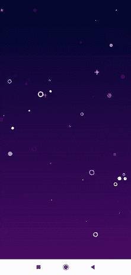

# 如何在安卓中创建明星动画？

> 原文:[https://www . geesforgeks . org/如何在安卓中创建明星动画/](https://www.geeksforgeeks.org/how-to-create-star-animation-in-android/)

在本文中，我们将使用动画明星库创建明星动画。在这里，我们将创建一个背景可绘制文件，并将指定动画的颜色。我们创建的明星动画很容易创建，因为我们正在使用一个库。下面给出了一个 GIF 示例，来了解一下我们将在本文中做什么。注意，我们将使用 **Kotlin** 语言来实现这个项目。



### **分步实施**

**第一步:创建新项目**

要在安卓工作室创建新项目，请参考[如何在安卓工作室创建/启动新项目](https://www.geeksforgeeks.org/android-how-to-create-start-a-new-project-in-android-studio/)。注意选择**科特林**作为编程语言。

**第二步:添加依赖和 JitPack 存储库**

导航到**渐变脚本>构建.渐变(模块:应用)**，并在依赖项部分添加以下依赖项。

> 实现' com . sofakingforever . libraries:animated-star-Android:1 . 1 . 4 @ AAR '

将 JitPack 存储库添加到构建文件中。将其添加到 allprojects{ }部分内存储库末尾的 root build.gradle 中。

> *所有项目{*
> 
> *存储库{*
> 
> *……*
> 
> *maven { URL " http://dl . bintray . com/sofakingforever/libraries " }*
> 
> **}**
> 
> **}**

*添加这个依赖项后，同步您的项目，现在我们将开始实现它。*

***步骤 3:使用 colors.xml 文件***

```
*<?xml version="1.0" encoding="utf-8"?>
<resources>
    <color name="colorPrimary">#008577</color>
    <color name="colorPrimaryDark">#00574B</color>
    <color name="colorAccent">#D81B60</color>
    <color name="star_color_1">#ffffff</color>
    <color name="star_color_2">#25Adff</color>
    <color name="star_color_3">#FFC100</color>
    <color name="star_color_4">#FF3800</color>

</resources>*
```

***步骤 4:** **使用数组. xml 文件***

*在 values 文件夹中创建一个 **array.xml** 文件。右键单击，然后单击**新建>值资源文件**，然后创建一个名为**数组**的文件。*

```
*<?xml version="1.0" encoding="utf-8"?>
<resources>
    <integer-array name="star_colors">
        <!-- This is how you can configure the ratio of star colors-->
        <item>@color/star_color_1</item>
        <item>@color/star_color_1</item>
        <item>@color/star_color_1</item>
        <item>@color/star_color_1</item>
        <item>@color/star_color_2</item>
        <item>@color/star_color_3</item>
    </integer-array>
    <integer-array name="meteorites_colors">
        <item>@color/star_color_2</item>
        <item>@color/star_color_4</item>
        <item>@color/star_color_3</item>
    </integer-array>
</resources>*
```

***步骤 5:** 使用**后台. xml** 文件。创建这个在后台添加。*

## *可扩展标记语言*

```
*<?xml version="1.0" encoding="utf-8"?>
<shape 
    xmlns:android="http://schemas.android.com/apk/res/android"
    android:shape="rectangle">
    <gradient
        android:angle="270"
        android:endColor="#4D0C66"
        android:startColor="#000A2F"
        android:type="linear" />
</shape>*
```

***第 6 步:使用 activity_main.xml 文件***

*导航到**应用程序> res >布局> activity_main.xml** 并将下面的代码添加到该文件中。下面是 **activity_main.xml** 文件的代码。*

## *可扩展标记语言*

```
*<?xml version="1.0" encoding="utf-8"?>
<LinearLayout 
    xmlns:android="http://schemas.android.com/apk/res/android"
    xmlns:app="http://schemas.android.com/apk/res-auto"
    xmlns:tools="http://schemas.android.com/tools"
    android:layout_width="match_parent"
    android:layout_height="match_parent"
    android:background="@drawable/background"
    tools:context=".MainActivity">

    <com.sofakingforever.stars.AnimatedStarsView
        android:id="@+id/stars"
        android:layout_width="match_parent"
        android:layout_height="match_parent"
        app:starsView_bigStarThreshold="10dp"
        app:starsView_maxStarSize="16dp"
        app:starsView_meteoritesColors="@array/meteorites_colors"
        app:starsView_meteoritesEnabled="true"
        app:starsView_meteoritesInterval="2000"
        app:starsView_minStarSize="1dp"
        app:starsView_starColors="@array/star_colors"
        app:starsView_starCount="50" />

</LinearLayout>*
```

***第 7 步:使用**T2【主活动. kt】文件*

*转到 **MainActivity.kt** 文件，参考以下代码。下面是 **MainActivity.kt** 文件的代码。代码中添加了注释，以更详细地理解代码。*

## *我的锅*

```
*import android.os.Bundle
import androidx.appcompat.app.AppCompatActivity
import kotlinx.android.synthetic.main.activity_main.*

class MainActivity : AppCompatActivity() {

    override fun onCreate(savedInstanceState: Bundle?) {
        super.onCreate(savedInstanceState)
        setContentView(R.layout.activity_main)
    }

    override fun onStart() {
        super.onStart()
        stars.onStart()
    }

    override fun onStop() {
        stars.onStop()
        super.onStop()
    }
}*
```

***输出:***

*<video class="wp-video-shortcode" id="video-590564-1" width="640" height="360" preload="metadata" controls=""><source type="video/mp4" src="https://media.geeksforgeeks.org/wp-content/uploads/20210403125159/staranimation.mp4?_=1">[https://media.geeksforgeeks.org/wp-content/uploads/20210403125159/staranimation.mp4](https://media.geeksforgeeks.org/wp-content/uploads/20210403125159/staranimation.mp4)</video>*