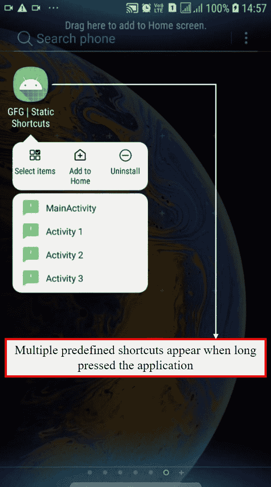
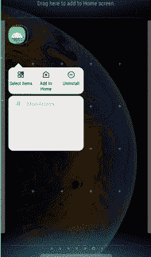
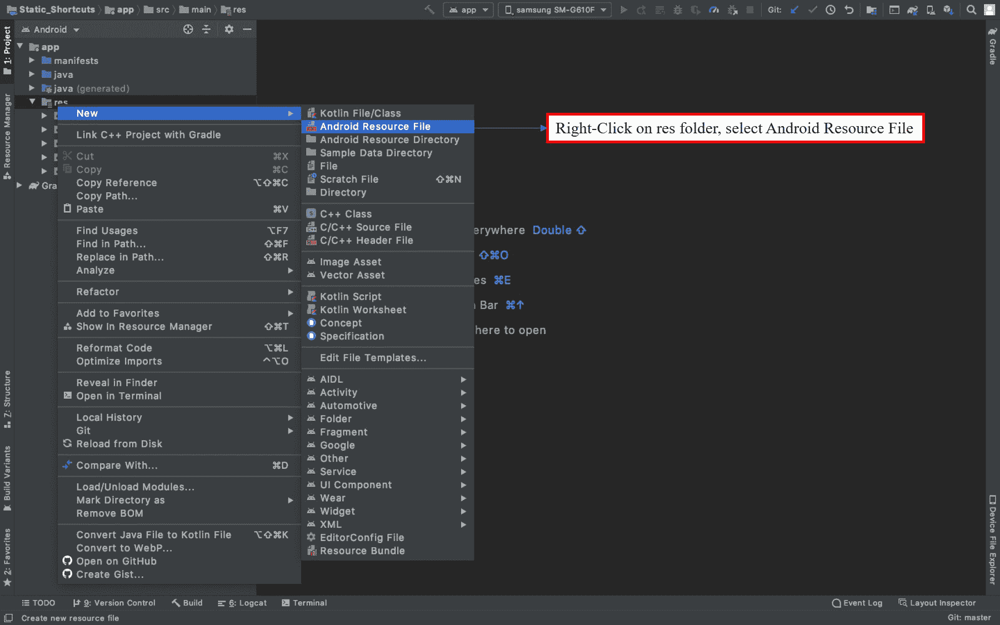
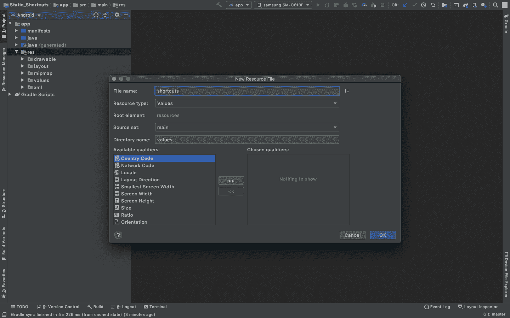
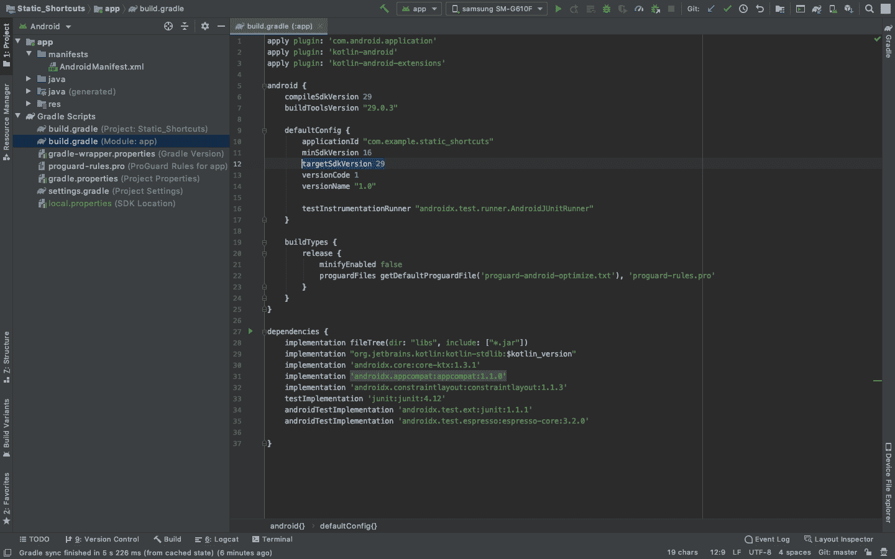
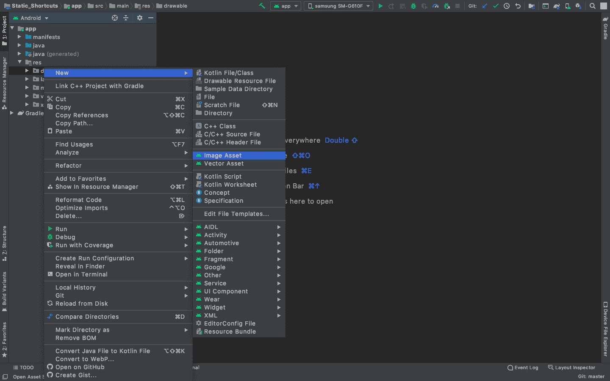
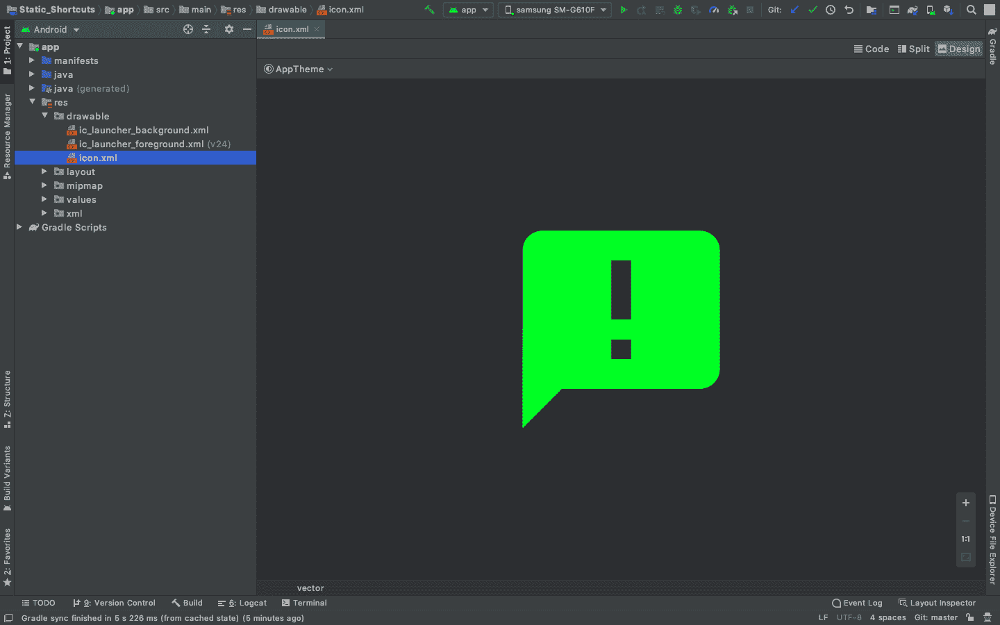

# 如何在安卓 App 中创建静态快捷方式？

> 原文:[https://www . geesforgeks . org/how-create-static-快捷键-in-android-app/](https://www.geeksforgeeks.org/how-to-create-static-shortcuts-in-android-app/)

一个应用程序可能为用户包含几个服务，为了方便用户快速访问这些服务，使用了快捷方式。应用程序的快捷方式是一系列功能(快速服务)，帮助用户轻松快速地跳转到应用程序中的特定功能或活动。快捷方式的列出和构造取决于它提供的服务。当长按应用程序图标时，应用程序的快捷方式(如果它们是显式构建的)可以被视为项目列表，如下所示。



具有可用快捷方式的示例应用程序

在本文中，让我们演示应用程序中各种活动的固定(静态)快捷方式的实现。但是首先，我们需要知道**静态**在这里是什么意思。**静态快捷方式**是一组预定义的快捷方式，它们在应用程序中被硬编码。它们不会随着时间或用户操作而改变。它们是固定的，可以随时访问，即使应用程序没有在后台运行。关于快捷键，一个应用最多只能有**4 个快捷键**。如果程序中声明了多个快捷方式，那么列表中只有前四个快捷方式可用。这是为了改善快捷方式的视觉外观。



### 方法

#### **第一步:创建新项目**

创建空活动请参考[如何在安卓工作室](https://www.geeksforgeeks.org/android-how-to-create-start-a-new-project-in-android-studio/)创建/启动新项目。请注意，使用**科特林**作为本项目的主要语言。

#### **第二步:在 res/xml 文件夹**中创建安卓资源文件(xml)

转到 **res - >安卓资源文件**并创建一个如下所示的安卓资源文件。



创建一个文件，我们可以存储所有的快捷方式。一个具有 XML 格式的安卓资源文件被创建，在那里我们编程所有的快捷方式。保存该文件的文件路径为***RES/XML/快捷键. xml*** 。无需更改任何其他参数，点击**确定**。



一旦文件生成，快捷方式可以被声明，但是在此之前，在安卓清单中声明**元数据来链接***快捷方式. xml*** 文件作为应用程序的资源。**

#### **第 3 步:将快捷方式. xml 文件声明为应用程序快捷方式的资源**

在***AnDroidManifest . XML***文件中，元数据将在活动内部声明，如下代码所示。

## AndroidManifest.xml

```kt
<?xml version="1.0" encoding="utf-8"?>
<manifest xmlns:android="http://schemas.android.com/apk/res/android"
    package="org.geeksforgeeks.static_shortcuts">

    <application
        android:allowBackup="true"
        android:icon="@mipmap/ic_launcher"
        android:label="@string/app_name"
        android:roundIcon="@mipmap/ic_launcher_round"
        android:supportsRtl="true"
        android:theme="@style/AppTheme">
        <activity android:name=".Activity3"></activity>
        <activity android:name=".Activity2" />
        <activity android:name=".Activity1" />
        <activity android:name=".MainActivity">
            <intent-filter>
                <action android:name="android.intent.action.MAIN" />

                <category android:name="android.intent.category.LAUNCHER" />
            </intent-filter>

<!-- Meta Data for linking the shortcuts.xml file to the Application Shortcuts -->
            <meta-data
                android:name="android.app.shortcuts"
                android:resource="@xml/shortcuts" />
<!------------------------------------------------------------------------------->

        </activity>
    </application>

</manifest>
```

#### **第四步:将 App Gradle 内的目标 SDK 版本设置为 26**

快捷方式仅支持 **API 等级为 25 及以上**的安卓设备。自我保证，将**目标版本**设置为 **26** 。



#### **第五步:配置快捷方式. xml 文件生成不同的快捷方式**

因为这是一个 XML 文件，这个文件的结构将是分层元素的形式。 *<快捷键>* 是根元素而*的<快捷键>* 元素定义了快捷键的上下文。一个快捷方式主要由 6 个参数和 1 个意图 3 个参数组成。我们现在简单地定义每一个。

**快捷元素的参数:**

<figure class="table">

| 

元素

 | 

描述

 |
| --- | --- |
| ***android:短句*** | 字符串文字，表示快捷方式管理器对象对其执行操作。 |
| ***安卓:启用*** | 确定用户是否可以与快捷方式交互从支持的发射器，或者*真*或者*假*。 |
| ***android:短句标签*** | 描述快捷方式的简洁短语

用途最多 10 个字符。 |
| ***android:短句长标签*** | 描述快捷方式的扩展短语用途最多 25 个字符。 |
| ***Android:shortcutdisabledmessage*** | 出现在支持的启动器中的消息当用户试图启动禁用的快捷方式时。 |
| **安卓:图标** | 根据快捷方式显示图标。 |

</figure>

通过右键单击图标并单击**图像/矢量**资源，可在**RES/drawing**文件夹中创建一个图标。参考下图。



选择矢量资产，选择剪贴画，给它命名 ***如下图所示*** 。



**意图参数:**

<figure class="table">

| 

因素

 | 

描述

 |
| --- | --- |
| **android:动作** | 当用户选择快捷方式时，系统启动的操作。 |
| ***android:目标包*** | 应用程序的包。 |
| ***Android:target class*** | 快捷方式希望用户重定向到的应用程序的类。 |

</figure>

**快捷方式代码. xml 文件:**

只是为了可视化快捷方式，需要参数 shortcutID、enabled、icon、short cut label，其余可以忽略。这些值是随机的，并在本文后面部分提供的***RES/values/strings . XML***文件中定义。在这里，意图的行为方式与将用户从一个活动发送到另一个活动时的行为方式相同。当用户按住应用程序图标 2 秒钟时，会出现 4 个快捷方式，单击这些快捷方式会打开应用程序的不同活动。参考以下程序中的注释。

> **注:**
> 
> Android:TargetClass = " org . geeksforgeeks . static _ 快捷键。主要活动"
> 
> Android:TargetPackage = " org . geeksforgeeks . static _ 快捷键"
> 
> **记得在这里输入你的项目包名称。**

## 快捷方式. xml

```kt
<shortcuts xmlns:android="http://schemas.android.com/apk/res/android">

    <!-- Shortcut 1:
    Throws the user to Main Activity through the intent-->
    <shortcut
        android:enabled="true"
        android:icon="@drawable/icon"
        android:shortcutId="compose0"
        android:shortcutShortLabel="@string/compose_shortcut_short_label0">
        <intent
            android:action="android.intent.action.VIEW"
            android:targetClass="org.geeksforgeeks.static_shortcuts.MainActivity"
            android:targetPackage="org.geeksforgeeks.static_shortcuts" />
    </shortcut>

    <!-- Shortcut 2:
    Throws the user to Activity 1 through the intent-->
    <shortcut
        android:enabled="true"
        android:icon="@drawable/icon"
        android:shortcutId="compose1"
        android:shortcutShortLabel="@string/compose_shortcut_short_label1">
        <intent
            android:action="android.intent.action.VIEW"
            android:targetClass="org.geeksforgeeks.static_shortcuts.Activity1"
            android:targetPackage="org.geeksforgeeks.static_shortcuts" />
    </shortcut>

    <!-- Shortcut 3:
    Throws the user to Activity 2 through the intent-->
    <shortcut
        android:enabled="true"
        android:icon="@drawable/icon"
        android:shortcutId="compose2"
        android:shortcutShortLabel="@string/compose_shortcut_short_label2">
        <intent
            android:action="android.intent.action.VIEW"
            android:targetClass="org.geeksforgeeks.static_shortcuts.Activity2"
            android:targetPackage="org.geeksforgeeks.static_shortcuts" />
    </shortcut>

    <!-- Shortcut 4:
    Throws the user to Activity 3 through the intent-->
    <shortcut
        android:enabled="true"
        android:icon="@drawable/icon"
        android:shortcutId="compose3"
        android:shortcutShortLabel="@string/compose_shortcut_short_label3">
        <intent
            android:action="android.intent.action.VIEW"
            android:targetClass="org.geeksforgeeks.static_shortcuts.Activity3"
            android:targetPackage="org.geeksforgeeks.static_shortcuts" />
    </shortcut>

</shortcuts>
```

#### **第 6 步:为快捷方式创建不同的活动**

要检查快捷方式是否将用户带入不同的活动，请在项目中再添加 3 个活动:活动 1、活动 2 和活动 3。这些活动也在上面的代码中实现。以下是这些活动的前端代码。 *Activity1.kt，Activity2.kt，Activity3.k* 的代码不相同。

## Activity1.xml

```kt
<?xml version="1.0" encoding="utf-8"?>
<RelativeLayout xmlns:android="http://schemas.android.com/apk/res/android"
    xmlns:app="http://schemas.android.com/apk/res-auto"
    xmlns:tools="http://schemas.android.com/tools"
    android:layout_width="match_parent"
    android:layout_height="match_parent"
    tools:context=".Activity1">

    <!-- Activity 1-->
    <TextView
        android:layout_width="wrap_content"
        android:layout_height="wrap_content"
        android:layout_centerInParent="true"
        android:text="Activity 1"
        android:textSize="40sp"
        />

</RelativeLayout>
```

## Activity1.kt

```kt
package org.geeksforgeeks.static_shortcuts

import androidx.appcompat.app.AppCompatActivity
import android.os.Bundle

class Activity1 : AppCompatActivity() {
    override fun onCreate(savedInstanceState: Bundle?) {
        super.onCreate(savedInstanceState)
        setContentView(R.layout.activity_1)
    }
}
```

## Activity2.xml

```kt
<?xml version="1.0" encoding="utf-8"?>
<RelativeLayout xmlns:android="http://schemas.android.com/apk/res/android"
    xmlns:app="http://schemas.android.com/apk/res-auto"
    xmlns:tools="http://schemas.android.com/tools"
    android:layout_width="match_parent"
    android:layout_height="match_parent"
    tools:context=".Activity2">

    <!-- Activity 2-->
    <TextView
        android:layout_width="wrap_content"
        android:layout_height="wrap_content"
        android:layout_centerInParent="true"
        android:text="Activity 2"
        android:textSize="40sp"
        />

</RelativeLayout>
```

## 活动 2.kt

```kt
package org.geeksforgeeks.static_shortcuts

import androidx.appcompat.app.AppCompatActivity
import android.os.Bundle

class Activity2 : AppCompatActivity() {
    override fun onCreate(savedInstanceState: Bundle?) {
        super.onCreate(savedInstanceState)
        setContentView(R.layout.activity_2)
    }
}
```

## Activity3.xml

```kt
<?xml version="1.0" encoding="utf-8"?>
<RelativeLayout xmlns:android="http://schemas.android.com/apk/res/android"
    xmlns:app="http://schemas.android.com/apk/res-auto"
    xmlns:tools="http://schemas.android.com/tools"
    android:layout_width="match_parent"
    android:layout_height="match_parent"
    tools:context=".Activity3">

    <!-- Activity 3-->
    <TextView
        android:layout_width="wrap_content"
        android:layout_height="wrap_content"
        android:layout_centerInParent="true"
        android:text="Activity 3"
        android:textSize="40sp"
        />

</RelativeLayout>
```

## Activity3.kt

```kt
package org.geeksforgeeks.static_shortcuts

import androidx.appcompat.app.AppCompatActivity
import android.os.Bundle

class Activity3 : AppCompatActivity() {
    override fun onCreate(savedInstanceState: Bundle?) {
        super.onCreate(savedInstanceState)
        setContentView(R.layout.activity_3)
    }
}
```

#### **第七步:配置 MainActivity.kt 和 activity_main.xml**

***MainActivity.kt*** 是应用程序的主要活动和第一个活动。添加按钮以导航到其他活动。请参考代码中的注释。

## activity_main.xml

```kt
<?xml version="1.0" encoding="utf-8"?>
<RelativeLayout xmlns:android="http://schemas.android.com/apk/res/android"
    xmlns:app="http://schemas.android.com/apk/res-auto"
    xmlns:tools="http://schemas.android.com/tools"
    android:layout_width="match_parent"
    android:layout_height="match_parent"
    tools:context=".MainActivity">

    <TextView
        android:layout_width="wrap_content"
        android:layout_height="wrap_content"
        android:text="Main Activity"
        android:textSize="40sp"
        android:layout_centerHorizontal="true"
        android:layout_above="@id/btn2"/>

    <!-- Button for navigating to Activity 1 -->
    <Button
        android:id="@+id/btn1"
        android:text="Activity1"
        android:layout_centerVertical="true"
        android:layout_toLeftOf="@id/btn2"
        android:layout_width="wrap_content"
        android:layout_height="wrap_content"/>

    <!-- Button for navigating to Activity 2 -->
    <Button
        android:id="@+id/btn2"
        android:text="Activity2"
        android:layout_centerInParent="true"
        android:layout_width="wrap_content"
        android:layout_height="wrap_content"/>

    <!-- Button for navigating to Activity 3 -->
    <Button
        android:id="@+id/btn3"
        android:text="Activity3"
        android:layout_centerVertical="true"
        android:layout_toRightOf="@id/btn2"
        android:layout_width="wrap_content"
        android:layout_height="wrap_content"/>

</RelativeLayout>
```

## MainActivity.kt 公司

```kt
package org.geeksforgeeks.static_shortcuts

import android.content.Intent
import androidx.appcompat.app.AppCompatActivity
import android.os.Bundle
import android.widget.Button

class MainActivity : AppCompatActivity() {
    override fun onCreate(savedInstanceState: Bundle?) {
        super.onCreate(savedInstanceState)
        setContentView(R.layout.activity_main)

        //Just to check if these buttons starts other activities

        // Declaring Buttons
        val btn1 = findViewById<Button>(R.id.btn1)
        val btn2 = findViewById<Button>(R.id.btn2)
        val btn3 = findViewById<Button>(R.id.btn3)

        // Intents when buttons are pressed

        // Takes to Activity 1
        btn1.setOnClickListener 
        {
          startActivity(Intent(this, Activity1::class.java))
        }

        // Takes to Activity 2
        btn2.setOnClickListener 
        {
          startActivity(Intent(this, Activity2::class.java))
        }

        // Takes to Activity 3
        btn3.setOnClickListener 
        {
          startActivity(Intent(this, Activity3::class.java))
        }
    }
}
```

#### **第八步:修改 Strings.xml 文件**

在*****RES/values/strings . XML***下声明的这些字符串值(compose…label 1，label2，label3，label0)定义了当快捷方式列表扩展时显示为快捷方式快捷方式标签的字符串。**

## **Strings.xml**

```kt
<resources>
    <string name="app_name">Static_Shortcuts</string>
    <string name="compose_shortcut_short_label0">MainActivity</string>
    <string name="compose_shortcut_short_label1">Activity 1</string>
    <string name="compose_shortcut_short_label2">Activity 2</string>
    <string name="compose_shortcut_short_label3">Activity 3</string>
</resources>
```

#### **输出:在模拟器上运行**

**<video class="wp-video-shortcode" id="video-473003-1" width="640" height="360" preload="metadata" controls=""><source type="video/mp4" src="https://media.geeksforgeeks.org/wp-content/uploads/20200820223246/ezgif.com-gif-maker.mp4?_=1">[https://media.geeksforgeeks.org/wp-content/uploads/20200820223246/ezgif.com-gif-maker.mp4](https://media.geeksforgeeks.org/wp-content/uploads/20200820223246/ezgif.com-gif-maker.mp4)</video>**