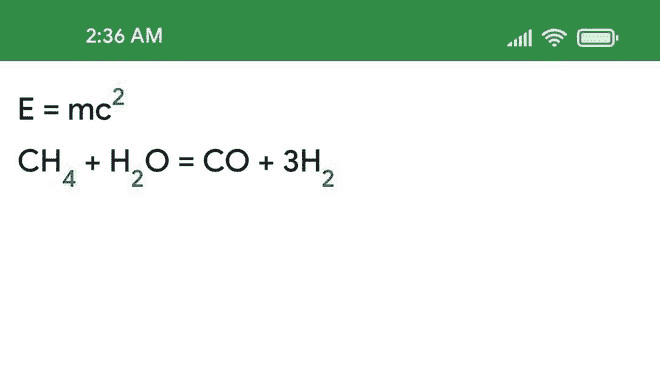
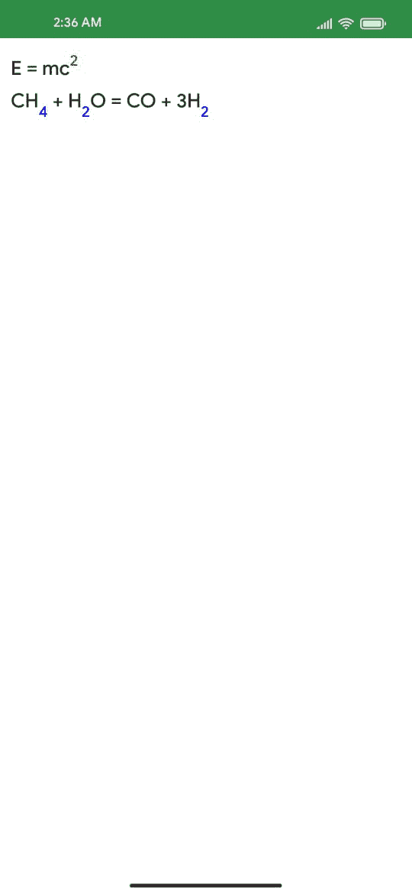

# 如何在安卓系统中使用 Jetpack Compose 创建上标和下标文本？

> 原文:[https://www . geesforgeks . org/如何使用安卓中的 jetpack-compose 创建上标和下标文本/](https://www.geeksforgeeks.org/how-to-create-superscript-and-subscript-text-using-jetpack-compose-in-android/)

在本文中，我们将解释如何使用 Jetpack Compose 创建上标和下标文本。下面是展示我们将要构建的内容的示例图片。注意，我们将使用 **Kotlin** 语言来实现这个项目。



**先决条件:**

*   [科特林](https://www.geeksforgeeks.org/kotlin-programming-language/)基础知识。
*   [Jetpack 在 Android 中合成。](https://www.geeksforgeeks.org/basics-of-jetpack-compose-in-android/)

### **分步实施**

**第一步:创建新项目**

使用 Jetpack Compose 在 Android Studio 中创建新项目请参考[如何使用 Jetpack Compose 在 Android Studio Canary 版本](https://www.geeksforgeeks.org/how-to-install-android-studio-canary-version/)中创建新项目。

**第二步:使用 MainActivity.kt**

转到 **MainActivity.kt** 文件，参考以下代码。下面是 **MainActivity.k** t 文件的代码。代码中添加了注释，以更详细地理解代码。

## 我的锅

```
import android.os.Bundle
import androidx.activity.ComponentActivity
import androidx.activity.compose.setContent
import androidx.compose.foundation.layout.Column
import androidx.compose.foundation.layout.padding
import androidx.compose.material.Surface
import androidx.compose.material.Text
import androidx.compose.runtime.Composable
import androidx.compose.ui.Modifier
import androidx.compose.ui.graphics.Color
import androidx.compose.ui.text.SpanStyle
import androidx.compose.ui.text.buildAnnotatedString
import androidx.compose.ui.text.style.BaselineShift
import androidx.compose.ui.text.withStyle
import androidx.compose.ui.unit.dp
import androidx.compose.ui.unit.sp
import com.example.jetpack_playground.ui.theme.Jetpack_playgroundTheme

class MainActivity : ComponentActivity() {
    override fun onCreate(savedInstanceState: Bundle?) {
        super.onCreate(savedInstanceState)
        setContent {
            Jetpack_playgroundTheme {
                Surface(color = Color.White) {
                    Column(modifier = Modifier.padding(10.dp)) {
                        // call the function
                        superScriptAndSubscript()
                    }
                }
            }
        }
    }
}

// create the composable function
@Composable
fun superScriptAndSubscript() {
    // create a variable superScript
    // enter the baselineShift to 
    // BaselineShift.Superscript for superscript
    val superscript = SpanStyle(
        baselineShift = BaselineShift.Superscript,
        fontSize = 16.sp, // font size of superscript
        color = Color.Red // color
    )
    // create a variable subScript
    // enter the baselineShift to 
    // BaselineShift.Subscript for subscript
    val subscript = SpanStyle(
        baselineShift = BaselineShift.Subscript,
        fontSize = 16.sp, // font size of subscript
        color = Color.Blue // color
    )

    Column {
        // create first text
        Text(
            fontSize = 20.sp,
            text = buildAnnotatedString {
                // instead of directly passing
                // string value to text
                // use append
                append("E = mc")
                withStyle(superscript) {
                    append("2")
                }
            }
        )

        // Create second text
        Text(
            fontSize = 20.sp,
            text = buildAnnotatedString {
                // instead of directly passing
                // string value to text
                // use append
                append("CH")
                withStyle(subscript) {
                    append("4")
                }
                append(" + H")
                withStyle(subscript) {
                    append("2")
                }
                append("O = CO + 3H")
                withStyle(subscript) {
                    append("2")
                }
            }
        )
    }
}
```

**输出:**

