# 如何创建自己的安卓库并发布到 GitHub？

> 原文:[https://www . geesforgeks . org/如何创建自己的安卓库并在 github 中发布/](https://www.geeksforgeeks.org/how-to-create-your-own-android-library-and-publish-it-in-github/)

在本文中，我们将创建我们自己的**安卓库**并发布它，这样它就可以在我们的项目中随时使用。其他人也可以在他们的项目中使用您的库。在这里，我们将为眨眼效果创建一个库，用于突出显示链接、显示重要公告等。使用安卓库的好处:

*   加快开发时间。
*   重用具有特定功能的代码。

让我们开始吧。

### **创建安卓库**

**第一步:打开安卓工作室，创建新项目**

在安卓工作室创建新项目请参考 [如何在安卓工作室创建/启动新项目](https://www.geeksforgeeks.org/android-how-to-create-start-a-new-project-in-android-studio/) 。将您的应用程序命名为 **BlinkEffectExample** 并确保选择 **Kotlin** 作为编程语言，因为我将使用 Kotlin 作为源代码，但是您也可以遵循相同的过程**创建&发布 android 库**用于 Java。

**步骤 2:现在在你的项目中创建一个新的模块**

转到**文件>新建>新模块。**从选项中选择**安卓库**，点击**下一步**。

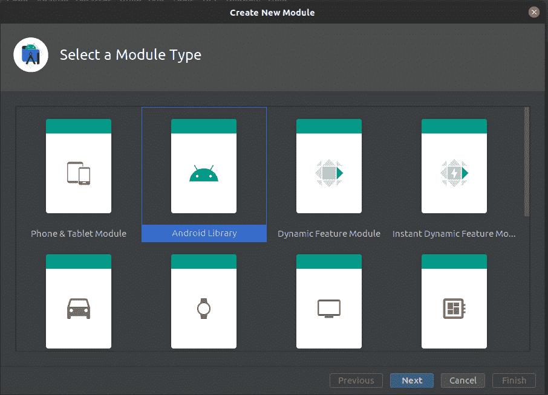

选择模块类型

将您的图书馆命名为**图书馆**并点击**完成**。

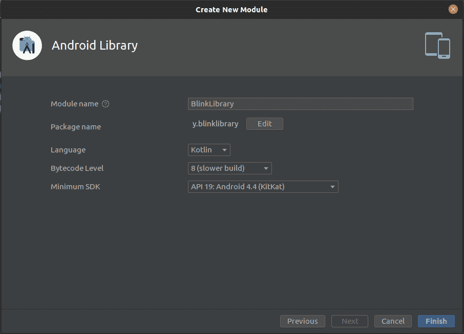

创建新模块

您的模块 **BlinkLibrary** 被创建。

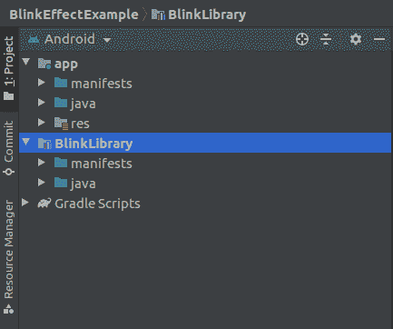

BlinkLibrary 被添加到结构中

**第三步:**现在，是时候给我们的库添加代码了。为此，转到您的模块 **BlinkLibrary > Java >您的包名称(如 com.learn.blinklibrary)** 右键单击转到**新建>Kotlin/类文件**。

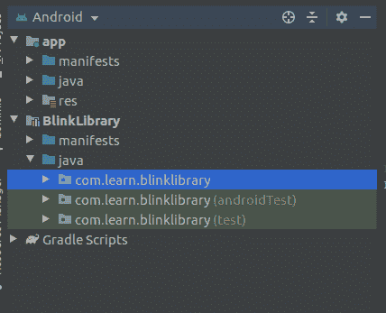

在您的模块中创建新文件，并将其命名为 **BlinkEffect** 确保从以下选项中选择**对象**。

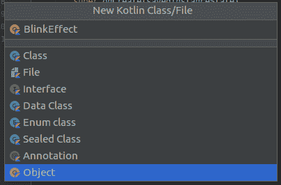

创建新文件

**第 4 步:** **修改 BlinkEffect.kt 如下**

## 我的锅

```
import android.animation.ArgbEvaluator
import android.animation.ObjectAnimator
import android.graphics.Color
import android.view.View
import android.view.animation.Animation

object BlinkEffect {

    fun blink(view: View) {
        // adding the color to be shown
        val animator: ObjectAnimator = ObjectAnimator.ofInt(
            view, "backgroundColor", Color.YELLOW,
            Color.RED, Color.GREEN
        )
        // duration of one color
        animator.duration = 500;
        animator.setEvaluator(ArgbEvaluator())
        // color will be shown in reverse manner
        animator.repeatCount = Animation.REVERSE
        // Repeat up to infinite time
        animator.repeatCount = Animation.INFINITE
        animator.start()
    }
}
```

我们将视图作为**闪烁()**功能的参数，以便将闪烁效果添加到该特定视图中。现在我们的图书馆完工了。是时候发布它了，所以为此**在你的 Github 上创建一个新的资源库**并把项目推给它(如果没有，请创建你的 GitHub)。我们将使用 **JitPack** 来发布我们的库，因为为了发布一个库，这个过程会变得容易得多。

### **在 GitHub 发布安卓库**

**步骤 1:** 创建新的 GitHub 存储库。

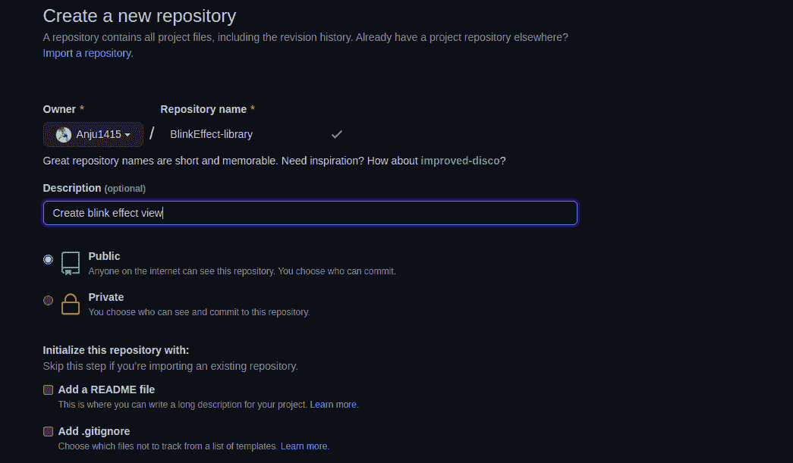

创建存储库 BlinkEffect 库

复制**存储库的 https 地址**。

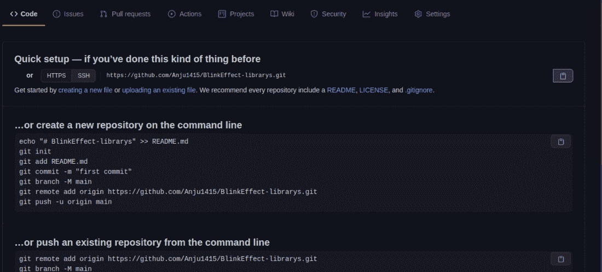

复制回购的地址

**第二步:推送你的代码**

确保系统中安装了 **git** 。如果 Git 和 GitHub 已经在 android studio 中设置好了，那么按照以下步骤推送您的代码。

*   前往 **VCS** (菜单中的选项) **>选择启用版本控制启用**
*   对话框打开，选择 **Git** ，点击**确定**按钮。

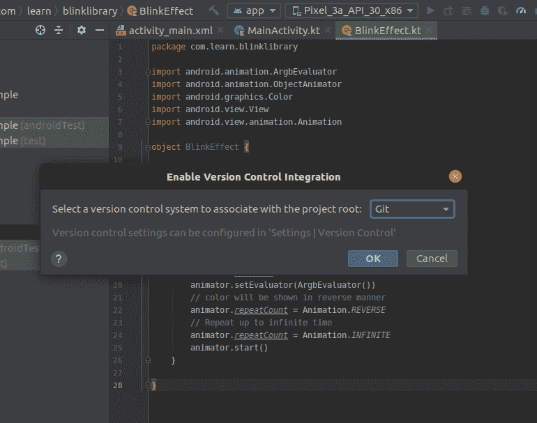

您会发现所有文件名的颜色都变成了红色，如下图所示。

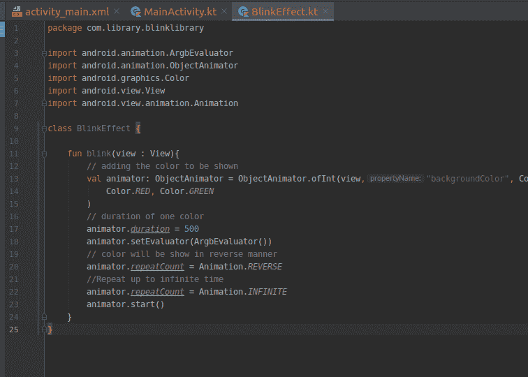

现在，将文件树结构(左面板)从 android 更改为 project，如下所示。

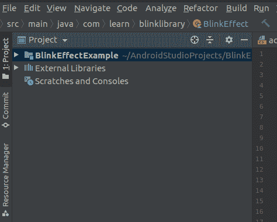

**右键点击**上面的项目名称 **BlinkEffectExample** 然后前往 **Git >添加。**您将观察到所有文件名的颜色变为绿色。现在打开你的安卓工作室的**终端**(找到安卓工作室底部的终端)。执行以下操作来添加、提交和推送代码。

```
-> git add .
-> git commit -m "blink library added"
```

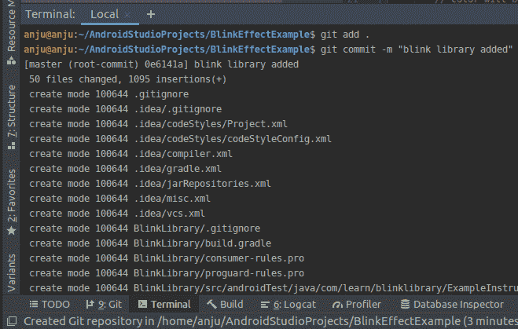

```
-> git remote add origin " Paste Your-Repository-Address"
-> git push origin master
-> Give your GitHub id name & password
```

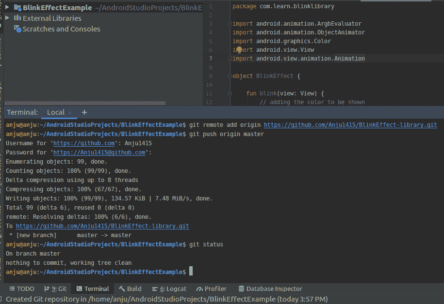

你的项目被**推送到了仓库！**

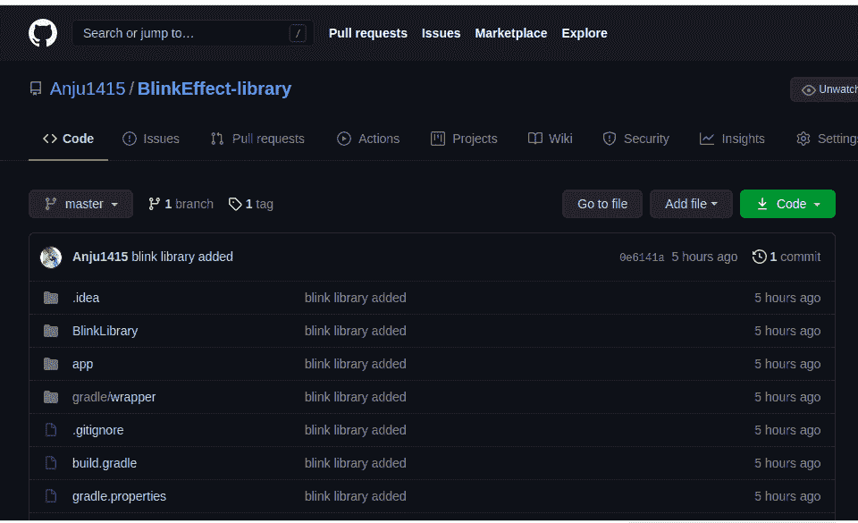

您也可以遵循另一种方法来推送代码(当 git 和 GitHub 没有在 android studio 中设置时)。打开系统终端，确保当前目录在“BlinkEffectExample”(项目的文件夹名)中，并执行以下命令:

```
-> git init
-> git add
-> git commit -m "blink library added"
```

现在通过执行以下操作来添加您的远程原点

```
-> git remote add origin “Paste Your-Repository-Address”
-> git remote -v
-> git push origin master
```

您的应用程序代码被推送到存储库。

**第三步:在你的存储库中，转到标签并选择发布**

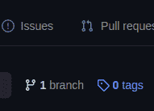

点击标签并选择释放

点击**创建新版本**。

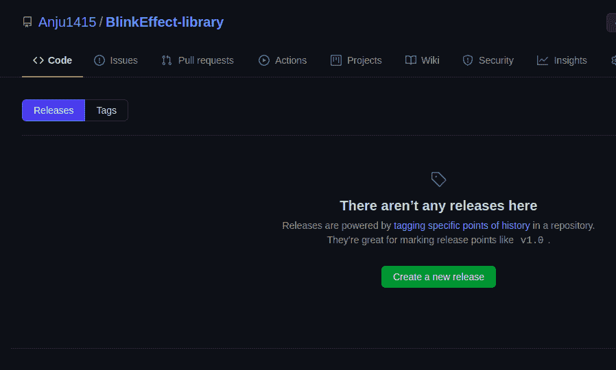

现在添加版本**版本**和一个关于你的库的**简介**。

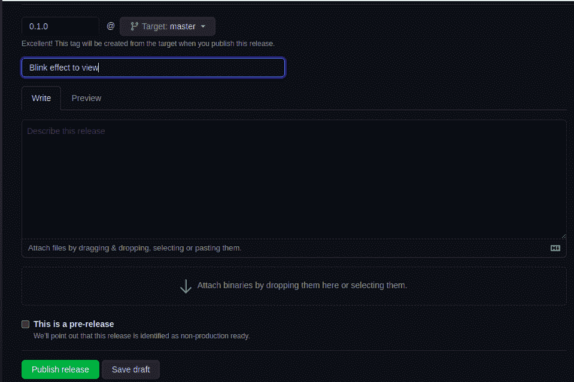

发布版本

点击**发布发布**。打开一个新标签页，进入 [jitpack.io](jitpack.io) 。插入您的**存储库地址**(在我的例子中是 Anju1415/BlinkEffect-library)，然后点击**查找**。您的版本将被列出。

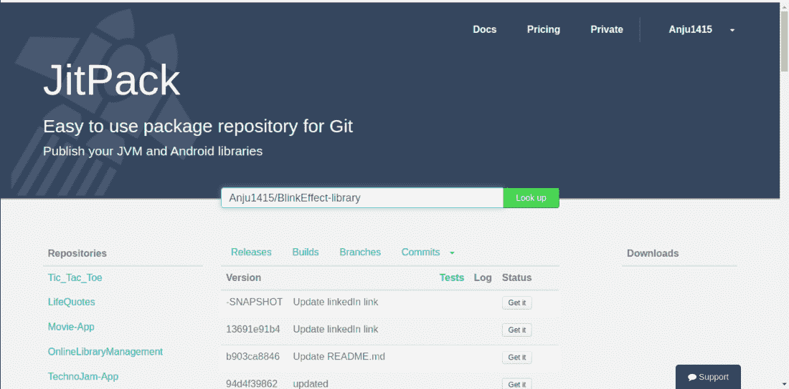

现在点击**获取**。

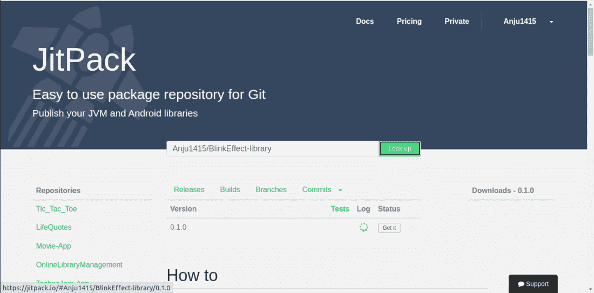 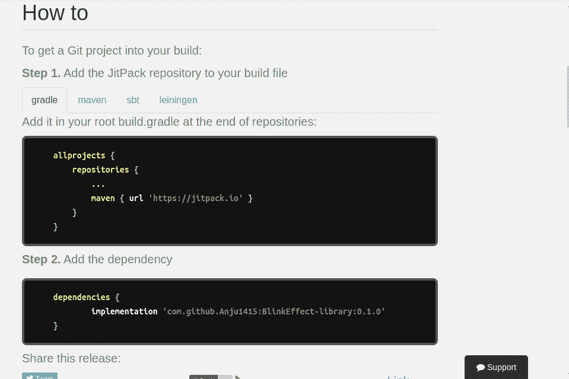

你的安卓库现在已经发布了，并且**已经准备好使用**。

### **在你的安卓应用中使用安卓库**

**第一步:**现在你可以在你的任何项目中使用这个安卓库。打开任何项目或创建一个新项目(我在这里创建一个新项目来使用这个库)。在您项目的 **build.gradle(项目:applicationName)** 中添加以下行

> 所有项目{
> 
> …
> 
> maven { URL https://jitpack . I }
> 
> …
> 
> }

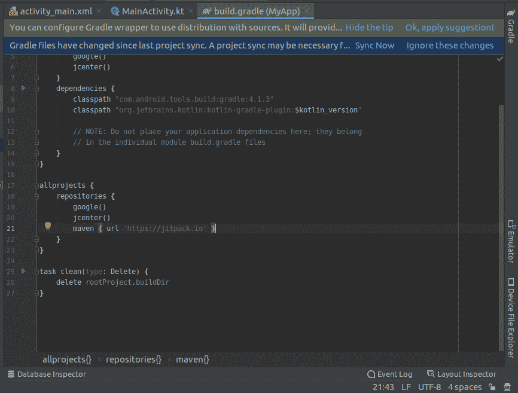

并在你的应用的 **build.gradle(模块:applicationName.app)** 中添加依赖项。

> 依赖项{
> 
> ….
> 
> 实现' com . github . anju 1415:BlinkEffect-library:0 . 1 . 0 '
> 
> …
> 
> }

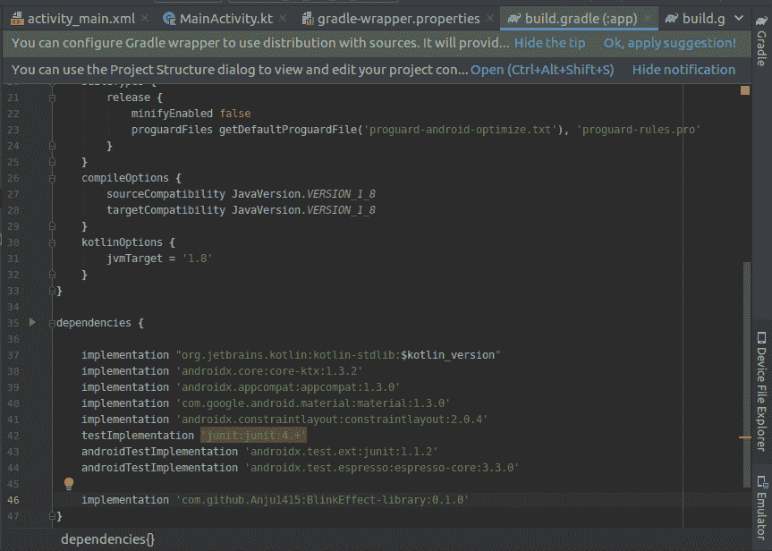

现在**可以在活动中使用库**。

**步骤 2:使用 activity_main.xml 文件**

导航到**应用程序> res >布局> activity_main.xml** 并将下面的代码添加到该文件中。下面是 **activity_main.xml** 文件的代码。

## 可扩展标记语言

```
<?xml version="1.0" encoding="utf-8"?>
<androidx.constraintlayout.widget.ConstraintLayout 
    xmlns:android="http://schemas.android.com/apk/res/android"
    xmlns:app="http://schemas.android.com/apk/res-auto"
    xmlns:tools="http://schemas.android.com/tools"
    android:layout_width="match_parent"
    android:layout_height="match_parent"
    tools:context=".MainActivity">

    <Button
        android:id="@+id/buttonView"
        android:layout_width="wrap_content"
        android:layout_height="wrap_content"
        android:text="GeeksForGeeks"
        android:textAllCaps="false"
        app:layout_constraintBottom_toBottomOf="parent"
        app:layout_constraintLeft_toLeftOf="parent"
        app:layout_constraintRight_toRightOf="parent"
        app:layout_constraintTop_toTopOf="parent" />

</androidx.constraintlayout.widget.ConstraintLayout>
```

**第三步:使用**T2【主活动. kt】文件

转到 **MainActivity.kt** 文件，参考以下代码。下面是 **MainActivity.kt** 文件的代码。代码中添加了注释，以更详细地理解代码。

## 我的锅

```
import androidx.appcompat.app.AppCompatActivity
import android.os.Bundle
import android.widget.Button
import com.learn.blinklibrary.BlinkEffect

class MainActivity : AppCompatActivity() {

    private lateinit var btn : Button

    override fun onCreate(savedInstanceState: Bundle?) {
        super.onCreate(savedInstanceState)
        setContentView(R.layout.activity_main)

        btn = findViewById(R.id.buttonView)
        btn.setOnClickListener {
              // use of blink-library
            BlinkEffect.blink(btn) 
        }
    }
}
```

**输出:**

<video class="wp-video-shortcode" id="video-618698-1" width="640" height="360" preload="metadata" controls=""><source type="video/mp4" src="https://media.geeksforgeeks.org/wp-content/uploads/20210523194213/output.mp4?_=1">[https://media.geeksforgeeks.org/wp-content/uploads/20210523194213/output.mp4](https://media.geeksforgeeks.org/wp-content/uploads/20210523194213/output.mp4)</video>

**GitHub 上的源代码:**[https://github.com/Anju1415/BlinkEffect-library](https://github.com/Anju1415/BlinkEffect-library)