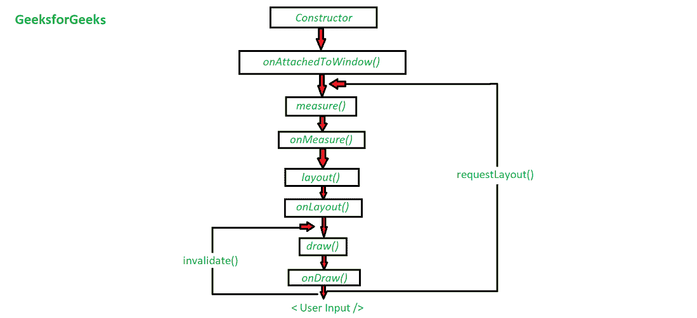

# 如何用 Kotlin 在安卓中创建自己的自定义视图？

> 原文:[https://www . geeksforgeeks . org/如何使用 kotlin 在安卓中创建自己的自定义视图/](https://www.geeksforgeeks.org/how-to-create-your-own-custom-view-in-android-with-kotlin/)

在本文中，我们将讨论如何在 Android 中一步步创建自己的自定义视图。我们都知道一开始安卓平台给我们提供了一些基本的视图比如——TextView、ImageView、EditText、Button、ImageButton、RadioButton 等。但是，有时我们需要一种全新的视图，我们预先构建的布局和小部件无法满足我们的需求。所以，让我们深入研究一下。

### 安卓中什么是自定义视图？

首先，安卓中定制视图的概念无非是拥有我们自己的定制视图模型，而不是预先构建的视图模型。我们如何做到这一点？只需将不同类型的预构建视图组合在一起，然后将组合视图作为单个视图使用。

### 为什么我们的应用程序中甚至需要它们？

我们都知道一开始安卓平台给我们提供了一些基本的视图比如–[TextView](https://www.geeksforgeeks.org/textview-in-kotlin/)、 [ImageView](https://www.geeksforgeeks.org/imageview-in-android-with-example/) 、 [EditText](https://www.geeksforgeeks.org/android-edittext-in-kotlin/) 、 [Button](https://www.geeksforgeeks.org/button-in-kotlin/) 、 [ImageButton](https://www.geeksforgeeks.org/imagebutton-in-kotlin/) 、 [RadioButton](https://www.geeksforgeeks.org/radiobutton-in-kotlin/) 等。但是，有时我们需要一种更具交互性和复杂性的视图，在这种视图中，我们预先构建的布局和小部件无法满足我们的需求。在那里，自定义视图进入画面。现在安卓系统中的定制视图都是开发者为了达到目的而完全定制的。虽然定制视图并不是到处都需要。但是，在复杂性更高的更高开发级别，我们需要它们。

### 我们将如何创建自己的自定义视图？

每当我们要为我们的应用程序创建自定义视图时，我们都需要考虑一些项目。介绍一下安卓系统中视图的生命周期。



现在，有三个基本方法很重要。

1.  **onMeasure()**
2.  **only layout()**
3.  **onDraw()**

这 3 个方法将在相应的 Java/Kotlin 类中被覆盖。

### 1.测量()方法

如方法名称所示，它用于测量目的。基本上，我们可以控制自定义视图的宽度和高度。

*   **如果没有被覆盖:**视图的大小将是“match_parent”或“wrap_content”。
*   **如果被覆盖:**在覆盖这个方法时，我们对自定义视图的大小有更多的控制。不要叫方法 ***【超级测量()】*** 。相反，我们将调用方法 ***“设置测量尺寸(宽度，高度)”。***

**覆盖测量():**

当这个方法被调用时，我们得到 ***【宽度测量规格】*** & ***【高度测量规格】*** 作为参数。大小模式是由父代为其子代视图设置的约束。下面列出了可用的 3 种模式。

*   **unspecify:**没有给定约束，所以可以是它想要的任何大小。
*   **精确:**为子视图确定精确的大小。
*   **AT_MOST:** Child 可以任意大到指定的大小。

**示例:**

## 我的锅

```kt
override fun onMeasure(widthMeasureSpec: Int, heightMeasureSpec: Int) {

          // requested width and mode
        val reqWidth = MeasureSpec.getSize(widthMeasureSpec)
        val reqWidthMode = MeasureSpec.getMode(widthMeasureSpec)

        // requested height and mode
        val reqHeight = MeasureSpec.getSize(heightMeasureSpec)
        val reqHeightMode = MeasureSpec.getMode(heightMeasureSpec)

        // your choice
        val desiredWidth: Int =  // TODO("Define your desired width")
        val desiredHeight: Int = // TODO("Define your desired height")

        val width = when (requestedWidthMode) {
            MeasureSpec.EXACTLY -> reqWidth
            MeasureSpec.UNSPECIFIED -> desiredWidth
            else -> Math.min(reqWidth, desiredWidth) // AT_MOST condition
        }

        val height = when (requestedHeightMode) {
            MeasureSpec.EXACTLY -> reqHeight
            MeasureSpec.UNSPECIFIED -> desiredHeight
            else -> Math.min(reqHeight, desiredHeight) // AT_MOST condition
        }

        // set the width and the height of the view
        setMeasuredDimension(width, height)
}
```

### 2.onLayout()方法

父视图使用此方法通知我们的自定义视图它的位置。人们应该用它来计算他们的绘图宽度和高度。点记无论在*发生什么事情 **onMeasure()*** 都会影响仓位，从母公司得到。建议在继续绘制视图之前，应始终计算此处的绘图尺寸。

### 3.onDraw()方法

所有的绘图都发生在这个部分。这一点也不难，因为你得到了一个画布对象的实例，你可以自由地画任何你想要的东西。

**覆盖 onDraw() :**

首先为了简单起见用***【getWidth()’***&***【getHeight()’***方法得到画布对象的宽度和高度。

**示例:**

## 我的锅

```kt
protected fun onDraw(canvas:Canvas) {
  // Grab canvas dimensions.
  val canvasWidth = canvas.getWidth()
  val canvasHeight = canvas.getHeight()
  // Calculate horizontal center.
  val centerX = canvasWidth * 0.5f
  // Draw the background.
  backgroundRect.set(0f, 0f, canvasWidth, canvasHeight)
  canvas.drawRoundRect(backgroundRect, cornerRadius, cornerRadius, backgroundPaint)
  // Draw baseline.
  val baselineY = Math.round(canvasHeight * 0.6f).toFloat()
  canvas.drawLine(0, baselineY, canvasWidth, baselineY, linePaint)
  // Draw text.

  // Measure the width of text to display.
  val textWidth = numberPaint.measureText(displayedCount)
  // Figure out an x-coordinate that will center the text in the canvas.
  val textX = Math.round(centerX - textWidth * 0.5f).toFloat()
  // Draw.
  canvas.drawText(displayedCount, textX, baselineY, numberPaint)
}
```