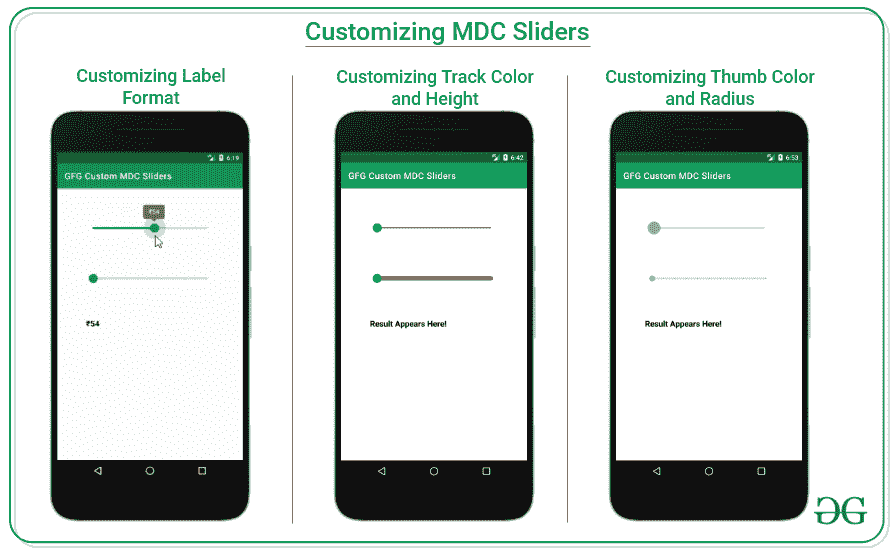
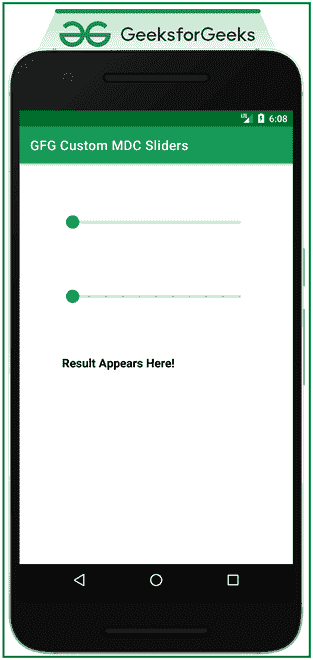
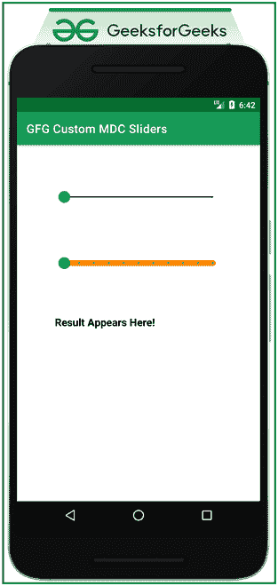
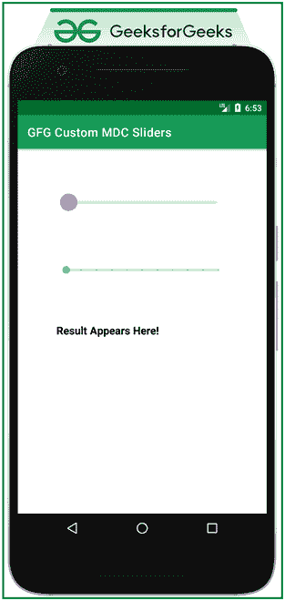

# 如何在安卓中自定义 MDC 滑块？

> 原文:[https://www . geesforgeks . org/how-customize-MDC-sliders-in-Android/](https://www.geeksforgeeks.org/how-to-customise-mdc-sliders-in-android/)

在**Android**中的材质设计组件滑块的文章中，已经讨论了如何在 Android 中实现材质设计组件滑块，并且还处理了所有类型滑块的点击监听器。在本文中，已经讨论了如何在安卓系统中定制材质设计组件滑块。请看下图，了解讨论概况。在继续之前，了解滑块的解剖结构很重要，这在上一篇文章中已经讨论过。



**创建项目**

要在安卓工作室创建新项目，请参考[如何在安卓工作室创建/启动新项目](https://www.geeksforgeeks.org/android-how-to-create-start-a-new-project-in-android-studio/)。

**添加所需的依赖关系**

在 build.gradle 文件中包含 google material design 组件依赖项。添加依赖项后，不要忘记点击右上角的**“立即同步”**按钮。

> 实现' com . Google . Android . material:material:1 . 4 . 0 '

请注意，在同步您的项目时，您需要连接到网络，并确保您正在将依赖项添加到**应用程序级渐变**文件，如下所示。

**步骤 1:使用 activity_main.xml 文件**

应用程序的主布局包含两个滑块，一个是连续滑块，另一个是离散滑块，还有一个显示滑块结果的文本视图。出于演示目的。要实现相同的布局，请在 activity_main.xml 文件中调用以下代码。

## 可扩展标记语言

```
<?xml version="1.0" encoding="utf-8"?>
<androidx.constraintlayout.widget.ConstraintLayout 
    xmlns:android="http://schemas.android.com/apk/res/android"
    xmlns:app="http://schemas.android.com/apk/res-auto"
    xmlns:tools="http://schemas.android.com/tools"
    android:layout_width="match_parent"
    android:layout_height="match_parent"
    tools:context=".MainActivity">

    <com.google.android.material.slider.Slider
        android:id="@+id/slider1"
        android:layout_width="match_parent"
        android:layout_height="wrap_content"
        android:layout_margin="64dp"
        android:valueFrom="0"
        android:valueTo="100"
        app:layout_constraintEnd_toEndOf="parent"
        app:layout_constraintStart_toStartOf="parent"
        app:layout_constraintTop_toTopOf="parent" />

    <com.google.android.material.slider.Slider
        android:id="@+id/slider2"
        android:layout_width="match_parent"
        android:layout_height="wrap_content"
        android:layout_margin="64dp"
        android:stepSize="10"
        android:valueFrom="0"
        android:valueTo="100"
        app:layout_constraintTop_toBottomOf="@+id/slider1"
        tools:layout_editor_absoluteX="64dp" />

    <TextView
        android:id="@+id/tvResult"
        android:layout_width="match_parent"
        android:layout_height="wrap_content"
        android:layout_margin="64dp"
        android:text="Result Appears Here!"
        android:textColor="@color/black"
        android:textSize="18sp"
        android:textStyle="bold"
        app:layout_constraintTop_toBottomOf="@+id/slider2" />

</androidx.constraintlayout.widget.ConstraintLayout>
```

**输出 UI**



**设置滑块的标签格式**

在 **MainActivity.kt** 文件中，我们必须使用带有 setLabelFormat{}的滑块实例来覆盖滑块的默认**工具提示文本**。要实现相同的功能，请在 MainActivity.kt 文件中调用以下代码。

## 我的锅

```
import android.annotation.SuppressLint
import android.os.Bundle
import android.widget.TextView
import androidx.appcompat.app.AppCompatActivity
import com.google.android.material.slider.Slider
import java.text.NumberFormat
import java.util.*

class MainActivity : AppCompatActivity() {
    @SuppressLint("NewApi")
    override fun onCreate(savedInstanceState: Bundle?) {
        super.onCreate(savedInstanceState)
        setContentView(R.layout.activity_main)

        // register all UI elements with their appropriate IDs
        val tvResult: TextView = findViewById(R.id.tvResult)
        val slider1: Slider = findViewById(R.id.slider1)
        val slider2: Slider = findViewById(R.id.slider2)

        // create instance of current format of INR
        val formatINR = NumberFormat.getCurrencyInstance()
        formatINR.maximumFractionDigits = 0
        formatINR.currency = Currency.getInstance("INR")

        // create instance of current format of USD
        val formatUSD = NumberFormat.getCurrencyInstance()
        formatUSD.maximumFractionDigits = 0
        formatUSD.currency = Currency.getInstance("USD")

        // set the custom label for slider1 as INR
        slider1.setLabelFormatter {
            formatINR.format(it.toDouble())
        }

        // set the custom label for slider1 as USD
        slider2.setLabelFormatter {
            formatUSD.format(it.toDouble())
        }

        // add Change Listener for slider1 to show the result on TextView
        slider1.addOnChangeListener { slider, value, fromUser ->
            tvResult.text = formatINR.format(value.toDouble())
        }

        // add Change Listener for slider2 to show the result on TextView
        slider2.addOnChangeListener { slider, value, fromUser ->
            tvResult.text = formatUSD.format(value.toDouble())
        }
    }
}
```

**输出:**

<video class="wp-video-shortcode" id="video-683291-1" width="640" height="360" preload="metadata" controls=""><source type="video/mp4" src="https://media.geeksforgeeks.org/wp-content/uploads/20210919182153/Untitled.mp4?_=1">[https://media.geeksforgeeks.org/wp-content/uploads/20210919182153/Untitled.mp4](https://media.geeksforgeeks.org/wp-content/uploads/20210919182153/Untitled.mp4)</video>

**改变轨道的高度和颜色:**

轨道高度的 XML 属性:

> app:track height = " valueindp "

轨道颜色的 XML 属性:

> app：trackColor="CustomColorValue"

要实现相同的功能，请在 activity_main.xml 文件中调用以下代码

## 可扩展标记语言

```
<?xml version="1.0" encoding="utf-8"?>
<androidx.constraintlayout.widget.ConstraintLayout 
    xmlns:android="http://schemas.android.com/apk/res/android"
    xmlns:app="http://schemas.android.com/apk/res-auto"
    xmlns:tools="http://schemas.android.com/tools"
    android:layout_width="match_parent"
    android:layout_height="match_parent"
    tools:context=".MainActivity">

    <com.google.android.material.slider.Slider
        android:id="@+id/slider1"
        android:layout_width="match_parent"
        android:layout_height="wrap_content"
        android:layout_margin="64dp"
        android:valueFrom="0"
        android:valueTo="100"
        app:layout_constraintEnd_toEndOf="parent"
        app:layout_constraintStart_toStartOf="parent"
        app:layout_constraintTop_toTopOf="parent"
        app:trackColor="@color/black"
        app:trackHeight="2dp" />

    <com.google.android.material.slider.Slider
        android:id="@+id/slider2"
        android:layout_width="match_parent"
        android:layout_height="wrap_content"
        android:layout_margin="64dp"
        android:stepSize="10"
        android:valueFrom="0"
        android:valueTo="100"
        app:layout_constraintTop_toBottomOf="@+id/slider1"
        app:trackColor="@android:color/holo_orange_dark"
        app:trackHeight="10dp"
        tools:layout_editor_absoluteX="64dp" />

    <TextView
        android:id="@+id/tvResult"
        android:layout_width="match_parent"
        android:layout_height="wrap_content"
        android:layout_margin="64dp"
        android:text="Result Appears Here!"
        android:textColor="@color/black"
        android:textSize="18sp"
        android:textStyle="bold"
        app:layout_constraintTop_toBottomOf="@+id/slider2" />

</androidx.constraintlayout.widget.ConstraintLayout>
```

**输出 UI:**



**赛道的其他一些属性有:**

<figure class="table">

| 

元素

 | 

属性

 |
| --- | --- |
| 最小值 | android:valueFrom |
| 最大值 | android:已评估 |
| 步长(离散) | 安卓:步长 |
| 初始选定值(滑块) | 安卓:价值 |
| 初始选定值(范围滑块) | 应用:价值观 |
| 高度 | app:trackHeight |
| 颜色 | 应用：跟踪颜色 |
| 轨道活动部分的颜色 | 应用程序:跟踪颜色活动 |
| 轨道非活动部分的颜色 | 应用程序:跟踪颜色不活动 |
| 相邻拇指的最小间距 | app:minSeparation |

</figure>

**改变拇指的颜色和半径颜色:**

缩略图颜色的 XML 属性:

> app:track height = " valueindp "

拇指半径的 XML 属性:

> app：trackColor="CustomColorValue"

要实现相同的功能，请在 activity_main.xml 文件中调用以下代码

## 可扩展标记语言

```
<?xml version="1.0" encoding="utf-8"?>
<androidx.constraintlayout.widget.ConstraintLayout
    xmlns:android="http://schemas.android.com/apk/res/android"
    xmlns:app="http://schemas.android.com/apk/res-auto"
    xmlns:tools="http://schemas.android.com/tools"
    android:layout_width="match_parent"
    android:layout_height="match_parent"
    tools:context=".MainActivity">

    <com.google.android.material.slider.Slider
        android:id="@+id/slider1"
        android:layout_width="match_parent"
        android:layout_height="wrap_content"
        android:layout_margin="64dp"
        android:valueFrom="0"
        android:valueTo="100"
        app:layout_constraintEnd_toEndOf="parent"
        app:layout_constraintStart_toStartOf="parent"
        app:layout_constraintTop_toTopOf="parent"
        app:thumbColor="@android:color/holo_purple" />

    <com.google.android.material.slider.Slider
        android:id="@+id/slider2"
        android:layout_width="match_parent"
        android:layout_height="wrap_content"
        android:layout_margin="64dp"
        android:stepSize="10"
        android:valueFrom="0"
        android:valueTo="100"
        app:layout_constraintTop_toBottomOf="@+id/slider1"
        app:thumbColor="@android:color/holo_blue_bright"
        tools:layout_editor_absoluteX="64dp" />

    <TextView
        android:id="@+id/tvResult"
        android:layout_width="match_parent"
        android:layout_height="wrap_content"
        android:layout_margin="64dp"
        android:text="Result Appears Here!"
        android:textColor="@color/black"
        android:textSize="18sp"
        android:textStyle="bold"
        app:layout_constraintTop_toBottomOf="@+id/slider2" />

</androidx.constraintlayout.widget.ConstraintLayout>
```

**输出 UI**



**拇指的其他一些属性有:**

<figure class="table">

| 元素 | 属性 |
| --- | --- |
| 颜色 | app:拇指颜色 |
| 半径 | app:拇指边缘 |
| 海拔 | 应用程序:拇指仰角 |
| 光晕颜色 | app:haloColor |
| 光环半径 | app:光晕半径 |
| 笔画颜色 | 应用程式:脑中风 |
| 笔画宽度 | 应用程序:缩略图宽度 |

</figure>

**改变刻度线的颜色，使其可见和不可见:**

这些变化只在离散滑块中看到，因为连续滑块在轨道上没有刻度线。

刻度线可见性的属性:

> app:tickVisible="booleanValue "

刻度线颜色的属性:

> app:tick color = " @ Android:color/black "

要实现相同的功能，请在 activity_main.xml 文件中调用以下代码

## 可扩展标记语言

```
<?xml version="1.0" encoding="utf-8"?>
<androidx.constraintlayout.widget.ConstraintLayout
    xmlns:android="http://schemas.android.com/apk/res/android"
    xmlns:app="http://schemas.android.com/apk/res-auto"
    xmlns:tools="http://schemas.android.com/tools"
    android:layout_width="match_parent"
    android:layout_height="match_parent"
    tools:context=".MainActivity">

    <com.google.android.material.slider.Slider
        android:id="@+id/slider1"
        android:layout_width="match_parent"
        android:layout_height="wrap_content"
        android:layout_margin="64dp"
        android:stepSize="10"
        android:valueFrom="0"
        android:valueTo="100"
        app:layout_constraintEnd_toEndOf="parent"
        app:layout_constraintStart_toStartOf="parent"
        app:layout_constraintTop_toTopOf="parent"
        app:tickVisible="false" />

    <com.google.android.material.slider.Slider
        android:id="@+id/slider2"
        android:layout_width="match_parent"
        android:layout_height="wrap_content"
        android:layout_margin="64dp"
        android:stepSize="10"
        android:valueFrom="0"
        android:valueTo="100"
        app:layout_constraintTop_toBottomOf="@+id/slider1"
        app:tickColor="@android:color/black"
        tools:layout_editor_absoluteX="64dp" />

    <TextView
        android:id="@+id/tvResult"
        android:layout_width="match_parent"
        android:layout_height="wrap_content"
        android:layout_margin="64dp"
        android:text="Result Appears Here!"
        android:textColor="@color/black"
        android:textSize="18sp"
        android:textStyle="bold"
        app:layout_constraintTop_toBottomOf="@+id/slider2" />

</androidx.constraintlayout.widget.ConstraintLayout>
```

**输出:**

<video class="wp-video-shortcode" id="video-683291-2" width="640" height="360" preload="metadata" controls=""><source type="video/mp4" src="https://media.geeksforgeeks.org/wp-content/uploads/20210919190307/Untitled.mp4?_=2">[https://media.geeksforgeeks.org/wp-content/uploads/20210919190307/Untitled.mp4](https://media.geeksforgeeks.org/wp-content/uploads/20210919190307/Untitled.mp4)</video>

**刻度线的其他属性有:**

<figure class="table">

| 

元素

 | 

属性

 |
| --- | --- |
| 颜色 | 应用：滴答颜色 |
| 轨道活动部分的颜色 | app:tickColorActive |
| 轨道非活动部分的颜色 | 应用程序:tickColorInactive |
| 刻度可见 | app:tickVisible |

</figure>