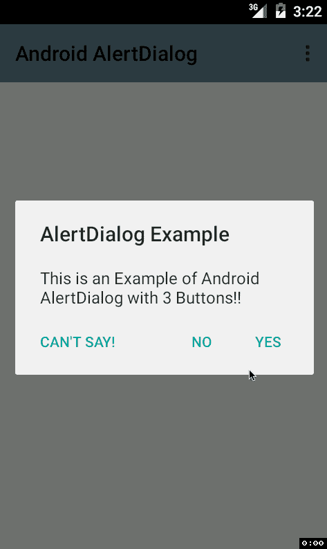

# 如何在安卓中自定义 AlertDialog 维度？

> 原文:[https://www . geesforgeks . org/how-customize-alertdialog-dimensions-in-Android/](https://www.geeksforgeeks.org/how-to-customize-alertdialog-dimensions-in-android/)

[安卓中的 AlertDialog](https://www.geeksforgeeks.org/android-alert-dialog-box-and-how-to-create-it/)是一种弹出消息，提醒用户活动用途。这是由开发人员专门开发的，用于执行任何操作或请求任何权限，而不是安卓操作系统调用。警报对话框通常没有固定的尺寸值，而是根据应用程序屏幕的大小因设备而异。



在本文中，我们将向您展示如何在您的安卓应用程序中定制警报对话框的尺寸。

### 逐步实施

**第一步:在安卓工作室新建项目**

要在安卓工作室创建新项目，请参考[如何在安卓工作室创建/启动新项目](https://www.geeksforgeeks.org/android-how-to-create-start-a-new-project-in-android-studio/)。我们在 **Kotlin** 中演示了该应用程序，因此在创建新项目时，请确保选择 Kotlin 作为主要语言。

**步骤 2:使用 activity_main.xml 文件**

导航到**应用程序> res >布局> activity_main.xml** ，并将下面的代码添加到该文件中。下面是 **activity_main.xml** 文件的代码。在布局文件中添加按钮。创建一个[按钮](https://www.geeksforgeeks.org/button-in-kotlin/)，点击该按钮将生成警报对话框。

## 可扩展标记语言

```
<?xml version="1.0" encoding="utf-8"?>
<RelativeLayout 
    xmlns:android="http://schemas.android.com/apk/res/android"
    xmlns:app="http://schemas.android.com/apk/res-auto"
    xmlns:tools="http://schemas.android.com/tools"
    android:layout_width="match_parent"
    android:layout_height="match_parent"
    tools:context=".MainActivity">

    <!-- Click this button to show alert dialog -->
    <Button
        android:id="@+id/button"
        android:layout_width="wrap_content"
        android:layout_height="wrap_content"
        android:text="Show Alert Dialog"
        android:layout_centerInParent="true"/>

</RelativeLayout>
```

**第三步:使用**T2【主活动. kt】文件

转到 **MainActivity.kt** 文件，参考以下代码。下面是 **MainActivity.kt** 文件的代码。代码中添加了注释，以更详细地理解代码。

## 我的锅

```
import android.os.Build
import androidx.appcompat.app.AppCompatActivity
import android.os.Bundle
import android.view.WindowManager
import android.widget.Button
import androidx.annotation.RequiresApi
import androidx.appcompat.app.AlertDialog

class MainActivity : AppCompatActivity() {
    @RequiresApi(Build.VERSION_CODES.R)
    override fun onCreate(savedInstanceState: Bundle?) {
        super.onCreate(savedInstanceState)
        setContentView(R.layout.activity_main)

        // Declaring and initializing button from the layout
        val mButton = findViewById<Button>(R.id.button)

        // When button is clicked
        mButton.setOnClickListener {

            // Build an alert dialog, declare its attributes
            val mDialogBuilder = AlertDialog.Builder(this)
            mDialogBuilder.apply {
                setTitle("This is Title")
                setMessage("This is Message: \n\nWidth & Height set to 50% of app screen size")
                setPositiveButton("Positive Button", null)
                setNegativeButton("Negative Button", null)
            }

            // Create and show the dialog
            val mDialog = mDialogBuilder.create()
            mDialog.show()

            // Get the current app screen width and height
            val mDisplayMetrics = windowManager.currentWindowMetrics
            val mDisplayWidth = mDisplayMetrics.bounds.width()
            val mDisplayHeight = mDisplayMetrics.bounds.height()

            // Generate custom width and height and 
            // add to the dialog attributes
            // we multiplied the width and height by 0.5,
            // meaning reducing the size to 50%
            val mLayoutParams = WindowManager.LayoutParams()
            mLayoutParams.width = (mDisplayWidth * 0.5f).toInt()
            mLayoutParams.height = (mDisplayHeight * 0.5f).toInt()
            mDialog.window?.attributes = mLayoutParams
        }
    }
}
```

**输出:**

您可以看到 AlertDialog 尺寸现已定制。

<video class="wp-video-shortcode" id="video-659028-1" width="640" height="360" preload="metadata" controls=""><source type="video/mp4" src="https://media.geeksforgeeks.org/wp-content/uploads/20210803102447/43.mp4?_=1">[https://media.geeksforgeeks.org/wp-content/uploads/20210803102447/43.mp4](https://media.geeksforgeeks.org/wp-content/uploads/20210803102447/43.mp4)</video>