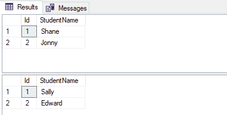
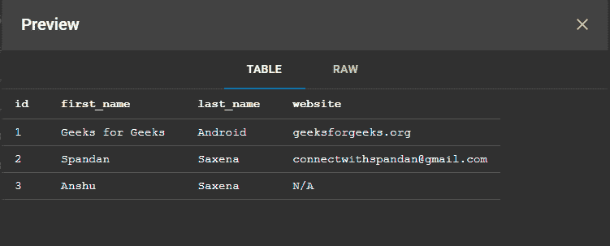
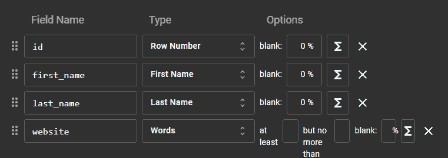

# 如何在安卓系统中调试数据库？

> 原文:[https://www . geesforgeks . org/如何在安卓系统中调试数据库/](https://www.geeksforgeeks.org/how-to-debug-database-in-android/)

安卓调试数据库库是对安卓应用程序中的数据库和共享首选项进行故障排除的有用工具。在这篇文章中，我们期待着使用这个图书馆，并得到它，所以继续阅读，放纵自己。首先，

### 什么是安卓调试数据库？

答案很简单，安卓调试数据库**让你可以直接在浏览器中检查数据库和共享设置。**不仅如此，ADD 还使您能够以可调试的格式查看数据库的结构，以便您能够以更精细和复杂的方式对数据采取行动。

> 所有这些功能都可以无缝运行，即使**没有** [**为你的安卓设备**](https://www.geeksforgeeks.org/what-is-android-rooting/) 生根发芽！这不是很棒吗？

让我们深入了解一下细节。**安卓调试数据库能做什么。**

**下面是它的列表:**

*   翻翻你的文件。
*   [整理信息。](https://www.geeksforgeeks.org/counting-sort/)
*   数据库可以下载。
*   在内存中调试房间数据库。
*   [查看所有数据库。](https://www.geeksforgeeks.org/interfaces-in-dbms/)
*   查看应用程序共享首选项中的所有数据。
*   直接编辑共享首选项。
*   [直接在数据库中增加一行。](https://www.geeksforgeeks.org/sql-insert-statement/)
*   [要更新和删除您的数据，请在指定的数据库](https://www.geeksforgeeks.org/performing-database-operations-java-sql-create-insert-update-delete-select/)上运行任何 SQL 查询。
*   直接编辑数据库值。
*   在共享首选项中，直接添加键值。
*   [删除共享首选项和数据库行。](https://www.geeksforgeeks.org/shared-preferences-in-android-with-examples/)

### 听起来不错，首先，让我们开始吧！

**步骤#1** :将依赖项添加到你的安卓项目中

```kt
debugImplementation 'com.amitshekhar.android:debug-db:1.0.6'
```

**步骤#2:** 设置认证

```kt
debug {
    resValue("string", "DB_PASSWORD_GEEKSFORGEEKS", "password")
}
```

> **注意:**如果您希望使用 8080 以外的其他端口，请使用。对 app build.gradle 文件的 buildTypes 部分进行以下更改。



**图 1。**运行数据库调试器。

如果您错过了[日志中的地址日志，请使用](https://www.geeksforgeeks.org/logcat-window-in-android-studio/)[吐司](https://www.geeksforgeeks.org/android-what-is-toast-and-how-to-use-it-with-examples/)获取地址。因为这个库是自动初始化的，如果您希望检索地址日志，请添加以下函数并使用反射调用它(我们必须这样做，以避免发布版本中的构建错误，因为这个库将不包括在内)。只需用这个简单地弹出一个祝酒词:

## 我的锅

```kt
public static void showingDebug(Context context) {
    if (BuildConfig.DEBUG) {
       try {
            Class<?> debugDB = Class.forName("com.GeeksforGeeks.DebugDB");
            Method getAddressLog = debugDB.getMethod("getAddressLog");
            Object value = getAddressLog.invoke(null);
            Toast.makeText(context, (String) value, Toast.LENGTH_LONG).show();
       } catch (Exception ignore) {
         // A simple catch statement!
       }
    }
}
```



**图 2。**查看数据。

**如果你想添加自己的数据库文件，那么:**

## 我的锅

```kt
public static void applyCustomFileDBHere(Context c) {
    if (BuildConfig.DEBUG) {
        try {
            Class<?> GeeksforGeeksDB = Class.forName("com.GeeksforGeeks.GeeksforGeeksDB");
            Class[] argTypes = new Class[]{HashMap.class};
            Method setCustomDatabaseFiles = GeeksforGeeksDB.getMethod("setCustomDatabaseFiles", argTypes);
            HashMap<String, Pair<File, String>> customDatabaseFiles = new HashMap<>();
            // set your custom database files
            customDatabaseFiles.put(GfGDBHelper.DATABASE_NAME,
                    new Pair<>(new File(c.getFilesDir() + "/" + GfGDBHelper.DIR_NAME +
                                                    "/" + GfGDBHelper.DATABASE_NAME), ""));
            setCustomDatabaseFiles.invoke(null, customDatabaseFiles);
        } catch (Exception ignore) {

        }
    }
}
```



**图 3** 。编辑数据

就像这样，您已经将自己的安卓调试数据库添加到了您的安卓项目中，要了解更多信息，请访问这里的 GitHub [资源库](https://github.com/amitshekhariitbhu/Android-Debug-Database)。