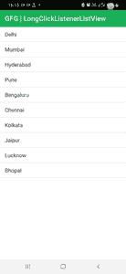

# 如何检测安卓系统中 ListView 项上的长按？

> 原文:[https://www . geeksforgeeks . org/如何检测-长按-列表查看-安卓中的物品/](https://www.geeksforgeeks.org/how-to-detect-long-press-on-listview-items-in-android/)

[Android 中的 ListView](https://www.geeksforgeeks.org/android-listview-in-kotlin/) 是一个 ViewGroup，用来显示行中的项目，并且有一个适配器，可以将所需的元素插入列表中。一旦项目被插入到列表视图中，就可以单击它们并执行所需的操作。



由于可以在一个列表视图上执行多个操作，在本文中，我们将向您展示如何在列表视图中处理长时间按下项目。

### 逐步实施

**第一步:在安卓工作室新建项目**

要在安卓工作室创建新项目，请参考[如何在安卓工作室创建/启动新项目](https://www.geeksforgeeks.org/android-how-to-create-start-a-new-project-in-android-studio/)。我们在**科特林**中演示了该应用程序，因此在创建新项目时，请确保选择科特林作为主要语言。

**步骤 2:使用 activity_main.xml 文件**

导航到**应用程序> res >布局> activity_main.xml** 并将下面的代码添加到该文件中。下面是 **activity_main.xml** 文件的代码。在布局中添加列表视图。

## 可扩展标记语言

```kt
<?xml version="1.0" encoding="utf-8"?>
<RelativeLayout 
    xmlns:android="http://schemas.android.com/apk/res/android"
    xmlns:app="http://schemas.android.com/apk/res-auto"
    xmlns:tools="http://schemas.android.com/tools"
    android:layout_width="match_parent"
    android:layout_height="match_parent"
    tools:context=".MainActivity">

    <ListView
        android:id="@+id/listView"
        android:layout_width="match_parent"
        android:layout_height="match_parent"/>

</RelativeLayout>
```

**第三步:使用**T2【主活动. kt】文件

转到 **MainActivity.kt** 文件，参考以下代码。下面是 **MainActivity.kt** 文件的代码。代码中添加了注释，以更详细地理解代码。

## 我的锅

```kt
import androidx.appcompat.app.AppCompatActivity
import android.os.Bundle
import android.widget.AdapterView
import android.widget.ArrayAdapter
import android.widget.ListView
import android.widget.Toast

class MainActivity : AppCompatActivity() {
    override fun onCreate(savedInstanceState: Bundle?) {
        super.onCreate(savedInstanceState)
        setContentView(R.layout.activity_main)

        // Create a list of items
        val mCity = arrayOf("Delhi", "Mumbai", "Hyderabad", "Pune", "Bengaluru", "Chennai", "Kolkata", "Jaipur", "Lucknow", "Bhopal")

        // Declare and initialize the ListView
        val mListView: ListView = findViewById(R.id.listView)

        // Create adapter for the list view
        val mAdapter: ArrayAdapter<*> = ArrayAdapter<Any?>(this, android.R.layout.simple_list_item_1, mCity)
        mListView.adapter = mAdapter

        // Handle long press on the ListView item
        mListView.onItemLongClickListener = AdapterView.OnItemLongClickListener { _, _, index, _ ->
            Toast.makeText(applicationContext, "Long clicked on ${mCity[index]}", Toast.LENGTH_SHORT).show()
            true
        }
    }
}
```

**输出:**

您可以看到，在长时间按下任何元素时，都会显示一条关于项目的消息。您可以自定义操作以执行任何所需的操作。

<video class="wp-video-shortcode" id="video-659829-1" width="640" height="360" preload="metadata" controls=""><source type="video/mp4" src="https://media.geeksforgeeks.org/wp-content/uploads/20210804111650/350.mp4?_=1">[https://media.geeksforgeeks.org/wp-content/uploads/20210804111650/350.mp4](https://media.geeksforgeeks.org/wp-content/uploads/20210804111650/350.mp4)</video>