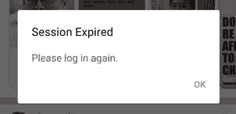

# 安卓系统如何检测用户不活跃？

> 原文:[https://www . geeksforgeeks . org/如何检测安卓系统中的用户不活动/](https://www.geeksforgeeks.org/how-to-detect-user-inactivity-in-android/)

在显示或包含私人凭证的应用程序(如社交应用程序、银行应用程序、钱包应用程序等)中检测用户的不活动非常重要。在这样的应用程序中，有一个登录会话来验证登录凭据。一旦会话开始，用户就可以执行所需的操作。但是，如果屏幕长时间未使用，则应用程序必须开始显示警报或将用户从当前会话中注销，用户不活动是注销的原因。因此，一定有一个计时器或计数器在后台运行，计算用户在某个特定时间内的不活动。



因此，通过这篇文章，我们将向您展示如何通过了解用户最后一次触摸屏幕的时间并立即启动特定时间的计数器来检测用户的不活动状态。

### 逐步实施

**第一步:在安卓工作室新建项目**

要在安卓工作室创建新项目，请参考[如何在安卓工作室创建/启动新项目](https://www.geeksforgeeks.org/android-how-to-create-start-a-new-project-in-android-studio/)。我们在**科特林**中演示了该应用程序，因此在创建新项目时，请确保选择科特林作为主要语言。

**步骤 2:使用 activity_main.xml 文件**

导航到**应用程序> res >布局> activity_main.xml** 并将下面的代码添加到该文件中。下面是 **activity_main.xml** 文件的代码。将布局的背景更改为较暗的颜色。我们将背景改为黑色，因为我们想在屏幕上显示触摸印象。

## 可扩展标记语言

```kt
<?xml version="1.0" encoding="utf-8"?>
<RelativeLayout 
    xmlns:android="http://schemas.android.com/apk/res/android"
    xmlns:app="http://schemas.android.com/apk/res-auto"
    xmlns:tools="http://schemas.android.com/tools"
    android:layout_width="match_parent"
    android:layout_height="match_parent"
    android:background="@color/black"
    tools:context=".MainActivity">
</RelativeLayout>
```

**第三步:使用**T2【主活动. kt】文件

转到 **MainActivity.kt** 文件，参考以下代码。下面是 **MainActivity.kt** 文件的代码。代码中添加了注释，以更详细地理解代码。

## 我的锅

```kt
import androidx.appcompat.app.AppCompatActivity
import android.os.Bundle
import android.os.Handler
import android.os.Looper
import android.view.MotionEvent
import android.widget.Button
import android.widget.EditText
import android.widget.Toast

class MainActivity : AppCompatActivity() {

    // Declaring handler, runnable and time in milli seconds
    private lateinit var mHandler: Handler
    private lateinit var mRunnable: Runnable
    private var mTime: Long = 2000

    override fun onCreate(savedInstanceState: Bundle?) {
        super.onCreate(savedInstanceState)
        setContentView(R.layout.activity_main)

        // Initializing the handler and the runnable
        mHandler = Handler(Looper.getMainLooper())
        mRunnable = Runnable {
            Toast.makeText(applicationContext, "User inactive for ${mTime/1000} secs!", Toast.LENGTH_SHORT).show()
        }

        // Start the handler
        startHandler()
    }

    // When the screen is touched or motion is detected
    override fun onTouchEvent(event: MotionEvent?): Boolean {

        // Removes the handler callbacks (if any)
        stopHandler()

        // Runs the handler (for the specified time)
        // If any touch or motion is detected before 
        // the specified time, this override function is again called
        startHandler()

        return super.onTouchEvent(event)
    }

    // start handler function
    private fun startHandler(){
        mHandler.postDelayed(mRunnable, mTime)
    }

    // stop handler function
    private fun stopHandler(){
        mHandler.removeCallbacks(mRunnable)
    }
}
```

**输出:**

您可以看到，如果屏幕保持 2 秒钟不动，应用程序会显示一条关于用户不活动的消息。

<video class="wp-video-shortcode" id="video-659034-1" width="640" height="360" preload="metadata" controls=""><source type="video/mp4" src="https://media.geeksforgeeks.org/wp-content/uploads/20210803105917/285.mp4?_=1">[https://media.geeksforgeeks.org/wp-content/uploads/20210803105917/285.mp4](https://media.geeksforgeeks.org/wp-content/uploads/20210803105917/285.mp4)</video>