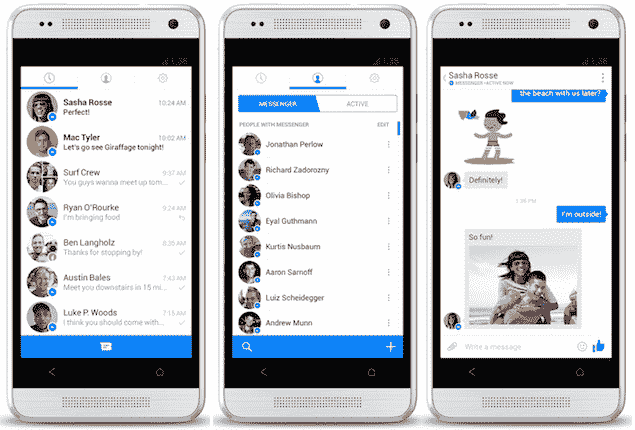

# 如何在安卓中禁用 RecyclerView 滚动？

> 原文:[https://www . geesforgeks . org/如何禁用-回收查看-在安卓中滚动/](https://www.geeksforgeeks.org/how-to-disable-recyclerview-scrolling-in-android/)

RecyclerView 是一个视图组，用于显示来自阵列和数据库的数据。RecyclerView 基本上是来自数据的项目列表。RecyclerView 通常被称为 GridView 和 ListView 的继承者。更多关于回收视图的信息可以在[安卓中的回收视图中找到，示例](https://www.geeksforgeeks.org/android-recyclerview/)。RecyclerView 允许用户通过属性设置适当的方向来上下左右滚动。我们现在使用的大多数应用程序都显著地使用 RecyclerView 来显示或呈现数据。



回收新示例

通过这篇文章，我们想向您展示如何在安卓系统中禁用 RecyclerView 的滚动功能。

### 逐步实施

**第一步:在安卓工作室新建项目**

要在安卓工作室创建新项目，请参考[如何在安卓工作室创建/启动新项目](https://www.geeksforgeeks.org/android-how-to-create-start-a-new-project-in-android-studio/)。我们在**科特林**中演示了该应用程序，因此在创建新项目时，请确保选择科特林作为主要语言。

**步骤 2:使用 activity_main.xml 文件**

导航到**应用程序> res >布局> activity_main.xml** 并将下面的代码添加到该文件中。下面是 **activity_main.xml** 文件的代码。在布局中创建这个简单的回收视图。

## 可扩展标记语言

```kt
<?xml version="1.0" encoding="utf-8"?>
<androidx.constraintlayout.widget.ConstraintLayout 
    xmlns:android="http://schemas.android.com/apk/res/android"
    xmlns:app="http://schemas.android.com/apk/res-auto"
    xmlns:tools="http://schemas.android.com/tools"
    android:layout_width="match_parent"
    android:layout_height="match_parent"
    tools:context=".MainActivity">

    <androidx.recyclerview.widget.RecyclerView
        android:id="@+id/recycler_view_1"
        android:layout_width="match_parent"
        android:layout_height="match_parent"/>

</androidx.constraintlayout.widget.ConstraintLayout>
```

**步骤 3:为回收视图(card.xml)创建一张卡片**

我们需要创建一个布局来显示我们的数据。在我们的例子中，我们有一个城市列表。所以每张这样的卡片都会在文本视图中显示城市名称。

## 可扩展标记语言

```kt
<?xml version="1.0" encoding="utf-8"?>
<RelativeLayout 
    xmlns:android="http://schemas.android.com/apk/res/android"
    android:layout_width="match_parent"
    android:layout_height="wrap_content">

    <TextView
        android:id="@+id/place_name"
        android:layout_width="match_parent"
        android:layout_height="wrap_content"
        android:gravity="center"
        android:layout_marginVertical="30sp"
        android:textSize="70sp"/>

</RelativeLayout>
```

**第 4 步:为回收视图创建一个适配器**

我们必须创建一个适配器来将数据(城市名称数组)传递给 RecyclerView。

## 我的锅

```kt
import android.view.LayoutInflater
import android.view.View
import android.view.ViewGroup
import android.widget.TextView
import androidx.recyclerview.widget.RecyclerView

private val myItemList = arrayListOf("Delhi", "Mumbai", "Hyderabad", "Bangalore", "Chennai", "Kolkata")

class MyRecyclerViewAdapter: RecyclerView.Adapter<MyRecyclerViewAdapter.ViewHolder>() {

    inner class ViewHolder(v: View): RecyclerView.ViewHolder(v), View.OnClickListener{
        val tvPlaceName: TextView = v.findViewById(R.id.place_name)
        override fun onClick(v: View?) {
            TODO()
        }
    }

    override fun onCreateViewHolder(parent: ViewGroup, viewType: Int): MyRecyclerViewAdapter.ViewHolder {
        return ViewHolder(LayoutInflater.from(parent.context)
            .inflate(R.layout.card, parent, false))
    }

    override fun onBindViewHolder(holder: MyRecyclerViewAdapter.ViewHolder, position: Int) {
        holder.tvPlaceName.text = myItemList[position]
    }

    override fun getItemCount(): Int {
        return myItemList.size
    }
}
```

**步骤 5:在主代码(MainActivity.kt)** 中链接回收视图和适配器

请参考代码中的注释。

## 我的锅

```kt
import androidx.appcompat.app.AppCompatActivity
import android.os.Bundle
import androidx.recyclerview.widget.LinearLayoutManager
import androidx.recyclerview.widget.RecyclerView

class MainActivity : AppCompatActivity() {
    override fun onCreate(savedInstanceState: Bundle?) {
        super.onCreate(savedInstanceState)
        setContentView(R.layout.activity_main)

        // Declaring the recycler view from the layout file
        val myRecyclerView = findViewById<RecyclerView>(R.id.recycler_view_1)

        // Declaring a variable for 
        // Initializing Linear Layout Manager
        val myLinearLayoutManager = LinearLayoutManager(this)

        // Setting the layout manager of the
        // recycler view with the Initialized variable
        myRecyclerView.layoutManager = myLinearLayoutManager

        // Setting the adapter of the recycler view
        // with the adapter we created
        myRecyclerView.adapter = MyRecyclerViewAdapter()

    }
}
```

**输出:运行应用程序**

你可以看到我们能够滚动。

<video class="wp-video-shortcode" id="video-651997-1" width="640" height="360" preload="metadata" controls=""><source type="video/mp4" src="https://media.geeksforgeeks.org/wp-content/uploads/20210722202618/411.mp4?_=1">[https://media.geeksforgeeks.org/wp-content/uploads/20210722202618/411.mp4](https://media.geeksforgeeks.org/wp-content/uploads/20210722202618/411.mp4)</video>

**第 6 步:编辑布局管理器，禁用循环视图滚动**

## 我的锅

```kt
import androidx.appcompat.app.AppCompatActivity
import android.os.Bundle
import androidx.recyclerview.widget.LinearLayoutManager
import androidx.recyclerview.widget.RecyclerView

class MainActivity : AppCompatActivity() {
    override fun onCreate(savedInstanceState: Bundle?) {
        super.onCreate(savedInstanceState)
        setContentView(R.layout.activity_main)

        val myRecyclerView = findViewById<RecyclerView>(R.id.recycler_view_1)

        // Calling the override functions from 
        // the Linear Layout Manager inner class
        val myLinearLayoutManager = object : LinearLayoutManager(this) {
            override fun canScrollVertically(): Boolean {
                return false
            }
        }
        myRecyclerView.layoutManager = myLinearLayoutManager
        myRecyclerView.adapter = MyRecyclerViewAdapter()
    }
}
```

**输出:现在运行应用程序**

现在，你可以看到我们无法滚动。

<video class="wp-video-shortcode" id="video-651997-2" width="640" height="360" preload="metadata" controls=""><source type="video/mp4" src="https://media.geeksforgeeks.org/wp-content/uploads/20210722202616/422.mp4?_=2">[https://media.geeksforgeeks.org/wp-content/uploads/20210722202616/422.mp4](https://media.geeksforgeeks.org/wp-content/uploads/20210722202616/422.mp4)</video>