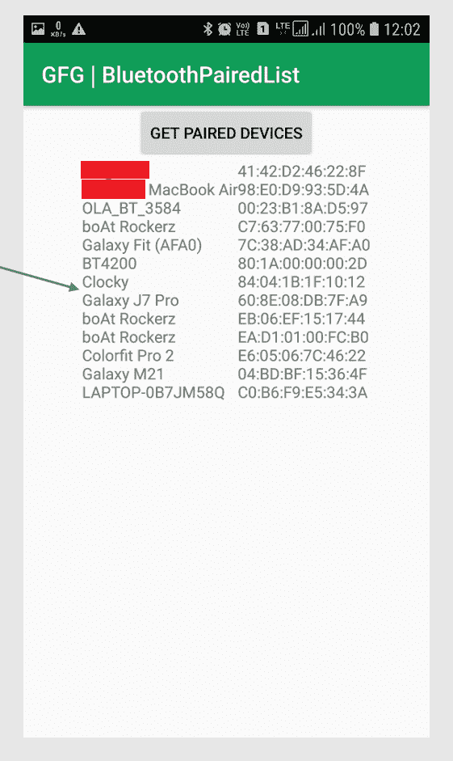

# 如何在安卓中编程显示蓝牙配对设备？

> 原文:[https://www . geeksforgeeks . org/如何显示-蓝牙-配对-设备-以编程方式在安卓系统中/](https://www.geeksforgeeks.org/how-to-display-bluetooth-paired-devices-programmatically-in-android/)

蓝牙技术是一种高速、低功耗的无线技术链路，旨在连接手机或其他便携式设备等设备。它有一个规范 **(IEEE 802.15.1)** ，用于低功率无线电通信，以无线方式在短距离内连接计算机、电话和其他网络设备。蓝牙信号覆盖的距离通常高达 **10 米或 30 英尺**。蓝牙支持 **2.45 GHz** 波段，除了三个语音通道外，还可以支持高达 **721 kbps** 。该波段已被国际协议搁置，以使用**工业、科学和医疗设备(ISM)。rd**-兼容 1.0 设备。蓝牙一次最多可以连接**“八个设备”**。每个设备都提供一个唯一的 **48 位地址**，来自 **IEEE 802 标准**。蓝牙规范定义并支持各种蓝牙网络连接。这样，蓝牙网络对于各种短程应用来说可能是无线系统的一种非常灵活的形式。通过这篇文章，我们想与您分享一个应用程序的实现，该应用程序显示蓝牙配对设备的列表及其 MAC IDs。下面给出了一个示例图像，以了解在这篇文章中我们要做什么。请注意，我们将使用 **Java** 和 **Kotlin** 语言来实现这个项目。



### 逐步实施

要在安卓系统中根据我们的设备以编程方式显示蓝牙配对设备列表，请执行以下步骤:

**第一步:创建新项目**

要在安卓工作室创建新项目，请参考[如何在安卓工作室创建/启动新项目](https://www.geeksforgeeks.org/android-how-to-create-start-a-new-project-in-android-studio/)。注意选择**科特林**作为编程语言。

**步骤 2:使用 AndroidManifest.xml 文件**

转到 **AndroidManifest.xml** 文件，添加蓝牙适配器所需的这些权限: **BLUETOOTH，BLUETOOTH_ADMIN，**和**ACCESS _ rough _ LOCATION**。

下面是 **AndroidManifest.xml** 文件的完整代码。

## 可扩展标记语言

```
<?xml version="1.0" encoding="utf-8"?>
<manifest xmlns:android="http://schemas.android.com/apk/res/android"
    package="org.geeksforgeeks.bluetoothpairedlist">

    <!--Permissions Required for accessing Bluetooth services-->
    <uses-permission android:name="android.permission.BLUETOOTH"/>
    <uses-permission android:name="android.permission.BLUETOOTH_ADMIN"/>
    <uses-permission android:name="android.permission.ACCESS_COARSE_LOCATION"/>

    <application
        android:allowBackup="true"
        android:icon="@mipmap/ic_launcher"
        android:label="@string/app_name"
        android:roundIcon="@mipmap/ic_launcher_round"
        android:supportsRtl="true"
        android:theme="@style/AppTheme">
        <activity android:name=".MainActivity">
            <intent-filter>
                <action android:name="android.intent.action.MAIN" />

                <category android:name="android.intent.category.LAUNCHER" />
            </intent-filter>
        </activity>
    </application>

</manifest>
```