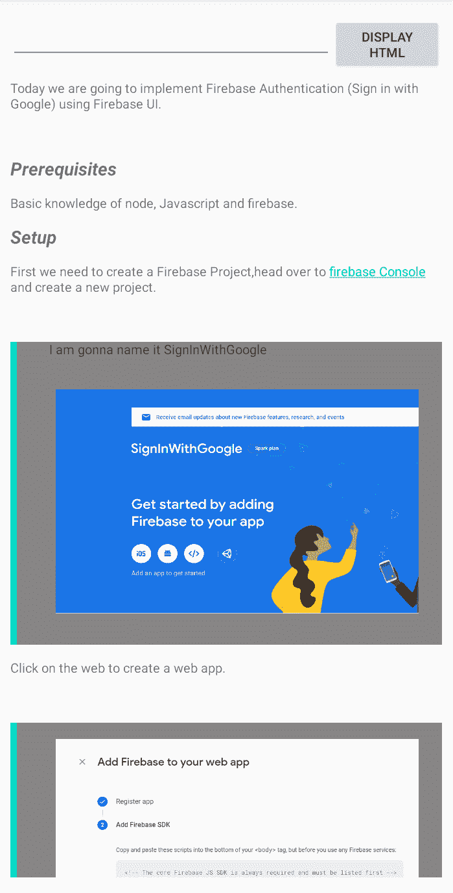
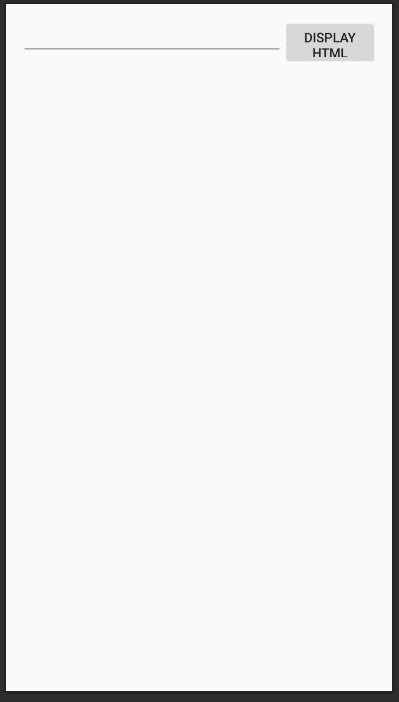

# 如何在安卓系统中在文本视图中显示 HTML 和图像？

> 原文:[https://www . geesforgeks . org/how-display-html-in-textview-with-images-in-Android/](https://www.geeksforgeeks.org/how-to-display-html-in-textview-along-with-images-in-android/)

有些情况下，人们需要在应用程序中显示丰富的格式化文本，比如博客应用程序或像 Quora 这样的应用程序，但是安卓的内置功能默认不允许显示内嵌图像，此外，它们在 blockquote 标签中的任何内容的左侧显示难看的蓝线。以下是在[文本视图](https://www.geeksforgeeks.org/textview-in-kotlin/)中显示 [HTML](https://www.geeksforgeeks.org/html-tutorials/) 以及在[安卓](https://www.geeksforgeeks.org/introduction-to-android-development/)中显示图像的简单解决方案。请注意，我们将在安卓系统中使用 [Kotlin](https://www.geeksforgeeks.org/introduction-to-kotlin/) 语言来实现这个项目。下面是该应用的演示截图。



#### **先决条件**

*   [Coroutines 库](https://kotlinlang.org/docs/tutorials/coroutines/coroutines-basic-jvm.html)的基础知识。
*   [毕加索库](https://www.geeksforgeeks.org/image-loading-caching-library-android-set-1/)基础知识。

### 方法

#### 步骤 1:创建新项目

在安卓工作室创建新项目请参考 [**如何在安卓工作室创建/启动新项目**](https://www.geeksforgeeks.org/android-how-to-create-start-a-new-project-in-android-studio/) 。**注意选择 Kotlin 作为编程语言。**

#### 步骤 2:编码前的项目设置

*   在 **colors.xml** 文件中添加一些颜色。此处的颜色用于区块引用样式。你可以自由选择不同的颜色。

## 

```kt
<?xml version="1.0" encoding="utf-8"?>
<resources>
    <color name="colorPrimary">#0F9D58</color>
    <color name="colorPrimaryDark">#0F9D58</color>
    <color name="colorAccent">#03DAC5</color>
    <color name="Grey">#878585</color>
</resources>
```

*   **转到**[**build . gradle(Module:app)**](https://www.geeksforgeeks.org/android-build-gradle/)文件，添加以下依赖项。

```kt

// Picasso library to downloading images 
implementation 'com.squareup.picasso:picasso:2.71828'
// Coroutines dependency to put the downloading 
process in background thread implementation 
'org.jetbrains.kotlinx:kotlinx-coroutines-android:1.3.9'

```

#### 第三步:使用活动文件

在下面的 **activity_main.xml** 文件中，我们添加了以下小部件:

*   [编辑文本](https://www.geeksforgeeks.org/android-edittext-in-kotlin/)用户输入 HTML 文本的地方，
*   [按钮](https://www.geeksforgeeks.org/button-in-kotlin/)触发事件显示 HTML 文本，
*   [滚动视图](https://www.geeksforgeeks.org/scrollview-in-android/)进行平滑滚动，
*   [文本视图](https://www.geeksforgeeks.org/textview-in-kotlin/)处理输入后显示 HTML。

**activity_main.xml**

## 

```kt
<?xml version="1.0" encoding="utf-8"?>
<androidx.constraintlayout.widget.ConstraintLayout
    xmlns:android="http://schemas.android.com/apk/res/android"
    xmlns:app="http://schemas.android.com/apk/res-auto"
    xmlns:tools="http://schemas.android.com/tools"
    android:layout_width="match_parent"
    android:layout_height="match_parent"
    android:padding="16dp"
    tools:context=".MainActivity">

    <!-- Edittext to take input for this sample app,
          for real app you will not need this -->
    <EditText
        android:id="@+id/editor"
        android:layout_width="0dp"
        android:layout_height="40dp"
        app:layout_constraintEnd_toStartOf="@+id/display_html"
        app:layout_constraintHorizontal_bias="0.0"
        app:layout_constraintStart_toStartOf="parent"
        app:layout_constraintTop_toTopOf="parent" />

    <!-- Button to trigger an event to display html/Rich text-->
    <Button
        android:id="@+id/display_html"
        android:layout_width="100dp"
        android:layout_height="50dp"
        android:text="Display Html"
        app:layout_constraintEnd_toEndOf="parent"
        app:layout_constraintTop_toTopOf="parent" />

    <!-- Scroll View for smooth scrolling -->
    <ScrollView
        android:layout_width="0dp"
        android:layout_height="0dp"
        android:layout_marginTop="16dp"
        app:layout_constraintBottom_toBottomOf="parent"
        app:layout_constraintEnd_toEndOf="parent"
        app:layout_constraintStart_toStartOf="parent"
        app:layout_constraintTop_toBottomOf="@+id/editor">

        <!-- Text View in which you will display the html after 
             processing the input-->
        <TextView
            android:id="@+id/html_viewer"
            android:layout_width="match_parent"
            android:layout_height="match_parent">
        </TextView>

    </ScrollView>

</androidx.constraintlayout.widget.ConstraintLayout>
```

**输出 UI:**



#### 第四步:创建一个 Kotlin 类 **ImageGetter.kt**

创建一个类，该类将下载包含在[**【img】**](https://www.geeksforgeeks.org/html-img-src-attribute/)**标签中的图像。下面是完整的 **ImageGetter.kt** 文件。通过参考代码中相应的注释来理解完整的代码。**

****ImageGetter.kt****

```kt
import android.content.res.Resources
import android.graphics.Bitmap
import android.graphics.Canvas
import android.graphics.drawable.BitmapDrawable
import android.graphics.drawable.Drawable
import android.text.Html
import android.widget.TextView
import com.squareup.picasso.Picasso
import kotlinx.coroutines.Dispatchers
import kotlinx.coroutines.GlobalScope
import kotlinx.coroutines.launch
import kotlinx.coroutines.withContext

// Class to download Images which extends [Html.ImageGetter]
class ImageGetter(
    private val res: Resources,
    private val htmlTextView: TextView
) : Html.ImageGetter {

    // Function needs to overridden when extending [Html.ImageGetter] ,
    // which will download the image
    override fun getDrawable(url: String): Drawable {
        val holder = BitmapDrawablePlaceHolder(res, null)

        // Coroutine Scope to download image in Background
        GlobalScope.launch(Dispatchers.IO) {
            runCatching {

                // downloading image in bitmap format using [Picasso] Library
                val bitmap = Picasso.get().load(url).get()
                val drawable = BitmapDrawable(res, bitmap)

                // To make sure Images don't go out of screen , Setting width less
                // than screen width, You can change image size if you want
                val width = getScreenWidth() - 150

                // Images may stretch out if you will only resize width,
                // hence resize height to according to aspect ratio
                val aspectRatio: Float =
                    (drawable.intrinsicWidth.toFloat()) / (drawable.intrinsicHeight.toFloat())
                val height = width / aspectRatio
                drawable.setBounds(10, 20, width, height.toInt())
                holder.setDrawable(drawable)
                holder.setBounds(10, 20, width, height.toInt())
                withContext(Dispatchers.Main) {
                    htmlTextView.text = htmlTextView.text
                }
            }
        }
        return holder
    }

    // Actually Putting images
    internal class BitmapDrawablePlaceHolder(res: Resources, bitmap: Bitmap?) :
        BitmapDrawable(res, bitmap) {
        private var drawable: Drawable? = null

        override fun draw(canvas: Canvas) {
            drawable?.run { draw(canvas) }
        }

        fun setDrawable(drawable: Drawable) {
            this.drawable = drawable
        }
    }

    // Function to get screenWidth used above
    fun getScreenWidth() =
        Resources.getSystem().displayMetrics.widthPixels
}
```