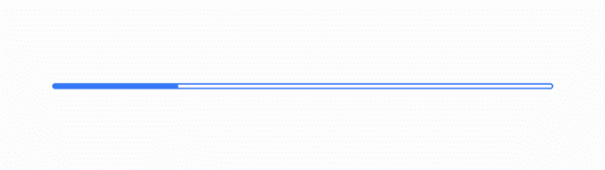

# 在安卓系统的 WebView 中加载 URL 时，如何在 ProgressBar 中显示进度？

> 原文:[https://www . geeksforgeeks . org/如何在加载 url 的同时显示进度进度栏-在 android 中查看 web 视图/](https://www.geeksforgeeks.org/how-to-display-progress-in-progressbar-while-loading-url-in-webview-in-android/)

[Android 中的 ProgressBar](https://www.geeksforgeeks.org/progressbar-in-kotlin/) 是一个 UI 元素，以一些动画的形式在后台显示一些正在做的工作的状态。它可以是任何东西，如计算、加载、搜索、提取、下载等。ProgressBar 大致有两种类型，即纺车和单杠。


纺车进度条



水平进度条

在本文中，我们想向您展示如何在安卓中实现一个进度条，并显示它，直到加载一个特定的网页。

### 逐步实施

**第一步:在安卓工作室新建项目**

要在安卓工作室创建新项目，请参考[如何在安卓工作室创建/启动新项目](https://www.geeksforgeeks.org/android-how-to-create-start-a-new-project-in-android-studio/)。我们在 **Kotlin** 中演示了该应用程序，因此在创建新项目时，请确保选择 Kotlin 作为主要语言。

**第二步:在清单文件(AndroidManifest.xml)** 中添加互联网权限

要加载网页，我们需要我们的应用程序使用互联网。所以我们需要添加使用互联网的许可。

## 可扩展标记语言

```kt
<?xml version="1.0" encoding="utf-8"?>
<manifest......>

    <uses-permission android:name="android.permission.INTERNET"/>

    <application......>
    </application>
</manifest>
```

**第三步:在布局文件(activity_main.xml)中添加一个 ProgressBar 和一个 WebView**

## 可扩展标记语言

```kt
<?xml version="1.0" encoding="utf-8"?>
<RelativeLayout 
    xmlns:android="http://schemas.android.com/apk/res/android"
    xmlns:tools="http://schemas.android.com/tools"
    android:layout_width="match_parent"
    android:layout_height="match_parent"
    android:padding="2dp"
    tools:context=".MainActivity">

    <ProgressBar
        android:id="@+id/progressBar"
        style="?android:attr/progressBarStyleLarge"
        android:layout_width="wrap_content"
        android:layout_height="wrap_content"
        android:layout_centerHorizontal="true"
        android:max="3"
        android:progress="100" />

    <WebView
        android:id="@+id/webView"
        android:layout_width="match_parent"
        android:layout_height="match_parent"
        android:layout_below="@+id/progressBar"
        android:layout_marginTop="5dp" />

</RelativeLayout>
```

**第四步:在主代码(MainActivity.kt)** 中添加这个

请参考评论，以便更好地理解。

## 我的锅

```kt
import android.os.Bundle
import android.view.View
import android.webkit.WebView
import android.widget.ProgressBar
import androidx.appcompat.app.AppCompatActivity

class MainActivity : AppCompatActivity() {

    // Declaring webView and progressBar
    private lateinit var webView: WebView
    lateinit var progressBar: ProgressBar

    override fun onCreate(savedInstanceState: Bundle?) {
        super.onCreate(savedInstanceState)
        setContentView(R.layout.activity_main)

        // Initializing Webview and 
        // progressBar from the layout file
        webView = findViewById(R.id.webView)
        progressBar = findViewById(R.id.progressBar)

        // Setting a webViewClient
        webView.webViewClient = WebViewClient()

        // Loading a URL
        webView.loadUrl("https://geeksforgeeks.org")
    }

    // Overriding WebViewClient functions
    inner class WebViewClient : android.webkit.WebViewClient() {

        // Load the URL
        override fun shouldOverrideUrlLoading(view: WebView, url: String): Boolean {
            view.loadUrl(url)
            return false
        }

        // ProgressBar will disappear once page is loaded
        override fun onPageFinished(view: WebView, url: String) {
            super.onPageFinished(view, url)
            progressBar.visibility = View.GONE
        }
    }
}
```

**输出:**

您可以在页面加载之前看到一个进度条正在运行。一旦页面加载，进度条就会消失。

> **P.S:** 以低于正常的速度观察输出。

<video class="wp-video-shortcode" id="video-652018-1" width="640" height="360" preload="metadata" controls=""><source type="video/mp4" src="https://media.geeksforgeeks.org/wp-content/uploads/20210722203502/331.mp4?_=1">[https://media.geeksforgeeks.org/wp-content/uploads/20210722203502/331.mp4](https://media.geeksforgeeks.org/wp-content/uploads/20210722203502/331.mp4)</video>