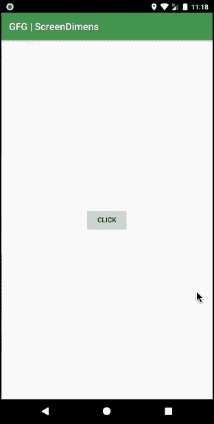

# 如何在安卓中通过编程找到设备的屏幕分辨率？

> 原文:[https://www . geesforgeks . org/如何在安卓中以编程方式找到设备的屏幕分辨率/](https://www.geeksforgeeks.org/how-to-find-the-screen-resolution-of-a-device-programmatically-in-android/)

屏幕分辨率是指显示的像素数量。更高的分辨率意味着更多的像素，更多的像素提供了显示更多视觉信息的能力。该实体广泛用于与实时视频广播相关的应用中，例如用于优化和帧转换的实时视频、游戏等。同样的信息也可以用于检测屏幕上的任何像素是否损坏。实际上，检索这些信息是可能的。下面给出了一个 GIF 示例，来了解一下在这篇文章中我们要做什么。注意我们要用 **Kotlin** 语言来实现这个项目。



### 方法

**第一步:创建新项目**

要在安卓工作室创建新项目，请参考[如何在安卓工作室创建/启动新项目](https://www.geeksforgeeks.org/android-how-to-create-start-a-new-project-in-android-studio/)。注意选择**科特林**作为编程语言。

**步骤 2:使用 activity_main.xml 文件**

转到代表应用程序用户界面的 **activity_main.xml** 文件，创建一个按钮，点击该按钮将生成一个[吐司](https://www.geeksforgeeks.org/android-what-is-toast-and-how-to-use-it-with-examples/)，显示宽度和长度上可用的像素数。下面是**activity _ main . XML**文件的代码。

## 可扩展标记语言

```kt
<?xml version="1.0" encoding="utf-8"?>
<RelativeLayout 
    xmlns:android="http://schemas.android.com/apk/res/android"
    xmlns:tools="http://schemas.android.com/tools"
    android:layout_width="match_parent"
    android:layout_height="match_parent"
    tools:context=".MainActivity">

    <!--Button which onclick creates a Toast Message-->
    <Button
        android:id="@+id/btn"
        android:layout_width="wrap_content"
        android:layout_height="wrap_content"
        android:layout_centerInParent="true"
        android:text="click" />

</RelativeLayout>
```

**第三步:使用 MainActivity.kt 文件**

转到 **MainActivity.kt** 文件，参考以下代码。下面是 **MainActivity.kt** 文件的代码。代码中添加了注释，以更详细地理解代码。

## 我的锅

```kt
import android.graphics.Point
import android.os.Bundle
import android.widget.Button
import android.widget.Toast
import androidx.appcompat.app.AppCompatActivity

class MainActivity : AppCompatActivity() {
    override fun onCreate(savedInstanceState: Bundle?) {
        super.onCreate(savedInstanceState)
        setContentView(R.layout.activity_main)

        // Declare the button from the layout file
        val btn = findViewById<Button>(R.id.btn)

        // Action when the button is clicked
        btn.setOnClickListener {

            // get default display from the windows manager
            val display = windowManager.defaultDisplay

            // declare and initialize a point
            val size = Point()

            // store the points related details from the 
            // display variable in the size variable
            display.getSize(size)

            // store the point information in integer 
            // variables width and height
            // where .x extracts width pixels and 
            // .y extracts height pixels
            val width = size.x
            val height = size.y

            // Toast will display the width and height values
            Toast.makeText(
                applicationContext,
                "Width: $width Pixels , Height: $height Pixels",
                Toast.LENGTH_LONG
            ).show()
        }
    }
}
```

### **输出:在仿真器上运行**

<video class="wp-video-shortcode" id="video-498008-1" width="640" height="360" preload="metadata" controls=""><source type="video/mp4" src="https://media.geeksforgeeks.org/wp-content/uploads/20201006230931/Screen-Recording-2020-10-02-at-23.18.32.mp4?_=1">[https://media.geeksforgeeks.org/wp-content/uploads/20201006230931/Screen-Recording-2020-10-02-at-23.18.32.mp4](https://media.geeksforgeeks.org/wp-content/uploads/20201006230931/Screen-Recording-2020-10-02-at-23.18.32.mp4)</video>