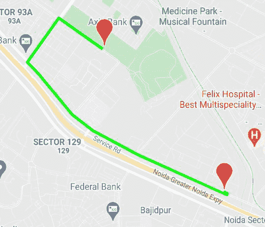

# 如何在安卓中生成谷歌地图中两个地点之间的路线？

> 原文:[https://www . geeksforgeeks . org/如何在两个地点之间生成路线-谷歌地图-安卓/](https://www.geeksforgeeks.org/how-to-generate-route-between-two-locations-in-google-map-in-android/)

谷歌地图或任何其他此类应用程序都有方法来生成两个位置之间的路线。一般来说，有很多参数，如最近距离、最快距离、替代路线等来满足需求。这些应用确实很吸引人，但开发人员知道开发如此漂亮的应用背后的痛苦。



通过这篇文章，我们将向您展示如何在安卓系统的谷歌地图中生成两个位置之间的路线。按照以下步骤开始。

### **分步实施**

**第一步:在安卓工作室新建项目**

要在安卓工作室创建新项目，请参考[如何在安卓工作室创建/启动新项目](https://www.geeksforgeeks.org/android-how-to-create-start-a-new-project-in-android-studio/)。我们在**科特林**中演示了该应用程序，因此在创建新项目时，请确保选择**科特林**作为主要语言。

**第二步:添加这些依赖项并同步项目**

> //对于地图片段
> 
> 实现' com . Google . Android . libraries . places:places:2 . 4 . 0 '
> 
> //调用从网址获取坐标响应
> 
> implementation ' com . squareup . ok http 3:ok http:4 . 9 . 0 '

**第三步:在 AndroidManifest.xml 文件**中添加该权限

> <manifest></manifest>

**第四步:在 activity_main.xml 文件**中添加这个谷歌地图片段

## 可扩展标记语言

```
<!--Give it an ID as we will call this in the Main code-->
<fragment
  android:layout_width="match_parent"
  android:layout_height="match_parent"
  android:id="@+id/map"
  tools:context=".MapsActivity"
  android:name="com.google.android.gms.maps.SupportMapFragment"/>
```

**第五步:获取并存储您的地点应用编程接口密钥**

1.  我们的应用程序利用谷歌的地点应用编程接口，所以我们需要从谷歌获得地点应用编程接口密钥。要获取应用编程接口密钥，请参考[为使用任何谷歌应用编程接口生成应用编程接口密钥](https://www.geeksforgeeks.org/generating-api-keys-for-using-any-google-apis/)。
2.  隐藏应用编程接口密钥是必不可少的，要做到这一点，请参考[如何在安卓工作室隐藏应用编程接口和密钥？](https://www.geeksforgeeks.org/how-to-hide-api-and-secret-keys-in-android-studio/)

**第 6 步:取回&在主活动**中验证您的密钥

在参考了上面两篇文章之后，您将在 Main 中调用您的 API 键。要验证使用映射片段的密钥，请添加以下代码。

## 我的锅

```
if (!Places.isInitialized()) {
            Places.initialize(applicationContext, apiKey)
        }
```