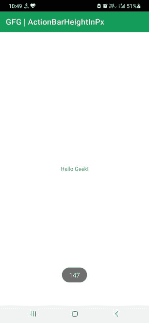

# 如何在安卓中获取以像素为单位的 ActionBar 高度？

> 原文:[https://www . geesforgeks . org/how-get-action bar-Android 像素高度/](https://www.geeksforgeeks.org/how-to-get-actionbar-height-in-pixels-in-android/)

ActionBar 是一个 UI 元素，通常是空的，但是可以由菜单组成，并在活动的顶部运行。ActionBar 的意义在于它显示了应用程序名称，并且可以提供一个菜单来导航给用户。可编程活动的其余部分完全独立于动作栏。因此，在将元素创建到可编程空间之前，了解 ActionBar 属性是很重要的。在本文中，我们将向您展示如何在安卓中以编程方式获得 ActionBar 高度。一旦集成开发环境准备就绪，请遵循以下步骤。

### 逐步实施

**第一步:在安卓工作室新建项目**

要在安卓工作室创建新项目，请参考[如何在安卓工作室创建/启动新项目](https://www.geeksforgeeks.org/android-how-to-create-start-a-new-project-in-android-studio/)。我们在 **Kotlin** 中演示了该应用程序，因此在创建新项目时，请确保选择 Kotlin 作为主要语言。

**步骤 2:使用 activity_main.xml 文件**

导航到**应用程序> res >布局> activity_main.xml** 并将下面的代码添加到该文件中。下面是 **activity_main.xml** 文件的代码。布局(activity_main.xml)文件中不需要额外的代码。

## 可扩展标记语言

```
<?xml version="1.0" encoding="utf-8"?>
<androidx.constraintlayout.widget.ConstraintLayout 
    xmlns:android="http://schemas.android.com/apk/res/android"
    xmlns:app="http://schemas.android.com/apk/res-auto"
    xmlns:tools="http://schemas.android.com/tools"
    android:layout_width="match_parent"
    android:layout_height="match_parent"
    tools:context=".MainActivity">

    <TextView
        android:layout_width="wrap_content"
        android:layout_height="wrap_content"
        android:text="Hello Geek!"
        app:layout_constraintBottom_toBottomOf="parent"
        app:layout_constraintLeft_toLeftOf="parent"
        app:layout_constraintRight_toRightOf="parent"
        app:layout_constraintTop_toTopOf="parent" />

</androidx.constraintlayout.widget.ConstraintLayout>
```

**第 3 步:使用** **MainActivity.kt 文件(在主代码中使用 TypedValue 获取动作栏)**

转到 **MainActivity.kt** 文件，参考以下代码。下面是 **MainActivity.kt** 文件的代码。在这段代码中，我们尝试解析 ActionBar 的高度，并将其显示在 Toast 消息中。显示的值以像素为单位。代码中添加了注释，以更详细地理解代码。

## 我的锅

```
import androidx.appcompat.app.AppCompatActivity
import android.os.Bundle
import android.util.TypedValue
import android.widget.Toast

class MainActivity : AppCompatActivity() {
    override fun onCreate(savedInstanceState: Bundle?) {
        super.onCreate(savedInstanceState)
        setContentView(R.layout.activity_main)

        val tv = TypedValue()
        if (this.theme.resolveAttribute(R.attr.actionBarSize, tv, true)) {
            val actionBarHeight = TypedValue.complexToDimensionPixelSize(tv.data, resources.displayMetrics)
            Toast.makeText(applicationContext, actionBarHeight.toString(), Toast.LENGTH_SHORT).show()
        }
    }
}
```

**输出:**

我们可以看到，我们能够获取动作栏的高度，它等于 147 像素。

