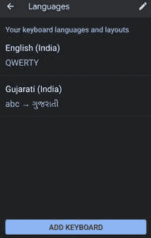

# 如何编程获取安卓设备当前默认语言？

> 原文:[https://www . geesforgeks . org/如何以编程方式获取当前默认安卓设备语言/](https://www.geeksforgeeks.org/how-to-get-current-default-language-of-android-device-programmatically/)

智能手机似乎在预测并向我们展示我们头脑中所想的结果。如果你想去旅行，你很快就会在你的设备中看到一些相关的东西。这是技术的下一个层次，数据有助于发展业务。该软件收集个人数据，如最近的搜索、设备位置等。，以生成提要。影响个人数据的一个重要因素是设备的默认语言，它有助于更好地理解设备的位置。因此，业务以多种方式向用户提供在该位置可用的各种服务和信息。



在本文中，我们将着重于获取设备的默认语言。

### 逐步实施

**第一步:在安卓工作室新建项目**

要在安卓工作室创建新项目，请参考[如何在安卓工作室创建/启动新项目](https://www.geeksforgeeks.org/android-how-to-create-start-a-new-project-in-android-studio/)。我们在**科特林**中演示了该应用程序，因此在创建新项目时，请确保选择科特林作为主要语言。

**步骤 2:使用 activity_main.xml 文件**

导航到**应用程序> res >布局> activity_main.xml** ，并将下面的代码添加到该文件中。下面是 **activity_main.xml** 文件的代码。在布局文件中添加一个[按钮](https://www.geeksforgeeks.org/button-in-kotlin/)。

## 可扩展标记语言

```
<?xml version="1.0" encoding="utf-8"?>
<RelativeLayout xmlns:android="http://schemas.android.com/apk/res/android"
    xmlns:app="http://schemas.android.com/apk/res-auto"
    xmlns:tools="http://schemas.android.com/tools"
    android:layout_width="match_parent"
    android:layout_height="match_parent"
    tools:context=".MainActivity">

  <!--This button on click will
      generate a Toast message
       displaying default language-->
    <Button
        android:id="@+id/btn"
        android:layout_width="wrap_content"
        android:layout_height="wrap_content"
        android:layout_centerInParent="true"
        android:text="click"/>

</RelativeLayout>
```

**第三步:使用** **主活动文件**

转到 **MainActivity.kt** 文件，参考以下代码。下面是 **MainActivity.kt** 文件的代码。代码中添加了注释，以更详细地理解代码。

## 我的锅

```
import androidx.appcompat.app.AppCompatActivity
import android.os.Bundle
import android.widget.Button
import android.widget.Toast
import java.util.*

class MainActivity : AppCompatActivity() {
    override fun onCreate(savedInstanceState: Bundle?) {
        super.onCreate(savedInstanceState)
        setContentView(R.layout.activity_main)

        // Declaring button from the layout
        val mButton = findViewById<Button>(R.id.btn)

        // When button is clicked, a Toast message is
        // displayed showing the current default language
        mButton.setOnClickListener {
            Toast.makeText(applicationContext, Locale.getDefault().language.toString(), Toast.LENGTH_SHORT).show()
        }
    }
}
```

**输出:**

<video class="wp-video-shortcode" id="video-684161-1" width="640" height="360" preload="metadata" controls=""><source type="video/mp4" src="https://media.geeksforgeeks.org/wp-content/uploads/20210816220543/o105.mp4?_=1">[https://media.geeksforgeeks.org/wp-content/uploads/20210816220543/o105.mp4](https://media.geeksforgeeks.org/wp-content/uploads/20210816220543/o105.mp4)</video>