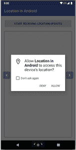

# 如何在安卓中获取当前位置？

> 原文:[https://www . geeksforgeeks . org/如何在安卓中获取当前位置/](https://www.geeksforgeeks.org/how-to-get-current-location-in-android/)

作为一名开发人员，当你在安卓系统中处理位置时，你总是会对选择最适合你需求的高效方法有所怀疑。因此，在本文中，我们将讨论如何在安卓系统中获取用户的当前位置。获取任何安卓设备的当前位置有两种**方式:**

1.  ****安卓的位置管理器 API****
2.  ****融合位置提供商:谷歌游戏服务位置 API****

> ****问题:**哪个高效，为什么？**
> 
> ****回答:**融合定位提供商，因为它优化了设备对电池电量的使用。**

**在移动任何上述方法之前，我们必须获得位置许可。**

### **获取位置许可**

****步骤 1:** 定义使用[清单](https://www.geeksforgeeks.org/application-manifest-file-android/)文件中的位置访问权限**

> ****注:****
> 
> ***为了从 NETWORK_PROVIDER 或 GPS_PROVIDER 接收位置更新，您必须通过在您的 Android 清单文件中分别声明 ACCESS _ rough _ LOCATION 或 ACCESS_FINE_LOCATION 权限来请求用户的许可。如果没有这些权限，您的应用程序将在运行时请求位置更新时失败。***
> 
> ***如果您同时使用了 NETWORK_PROVIDER 和 GPS_PROVIDER，那么您只需要请求 ACCESS_FINE_LOCATION 权限，因为它包含两个提供程序的权限。对 ACCESS _ ROUGH _ LOCATION 的权限只允许访问 NETWORK_PROVIDER。***

****步骤 2:** 定义互联网访问的使用权限，因为我们将使用互联网提供商。**

****步骤 3:** 编写一个函数，用于检查位置权限是否被授予。如果未授予权限，则在运行时请求权限。**

## **我的锅**

```
private fun isLocationPermissionGranted(): Boolean {
    return if (ActivityCompat.checkSelfPermission(
            this,
            android.Manifest.permission.ACCESS_COARSE_LOCATION
        ) != PackageManager.PERMISSION_GRANTED && ActivityCompat.checkSelfPermission(
            this,
            android.Manifest.permission.ACCESS_FINE_LOCATION
        ) != PackageManager.PERMISSION_GRANTED
    ) {
        ActivityCompat.requestPermissions(
            this,
            arrayOf(
                android.Manifest.permission.ACCESS_FINE_LOCATION,
                android.Manifest.permission.ACCESS_COARSE_LOCATION
            ),
            requestcode
        )
        false
    } else {
        true
    }
}
```

****

**现在在处理位置权限之后，我们将学习如何在 android 中获取位置。**

### **第一种方法:通过安卓的位置管理器应用编程接口**

**我们假设用户已被授予位置权限。如果没有，那就先问问。**

****步骤 1:** 在 LOCATION_SERVICE 的上下文中创建 LocationManager 的实例。**

## **我的锅**

```
private var currentLocation: Location? = null
lateinit var locationManager: LocationManager
locationManager = getSystemService(Context.LOCATION_SERVICE) as LocationManager
```

****步骤 2:** 检查全球定位系统和网络是否可用，如果两者都可用，那么我们使用一个更准确的。**

## **我的锅**

```
val hasGps = locationManager.isProviderEnabled(LocationManager.GPS_PROVIDER)
//------------------------------------------------------//
val hasNetwork = locationManager.isProviderEnabled(LocationManager.NETWORK_PROVIDER)
```