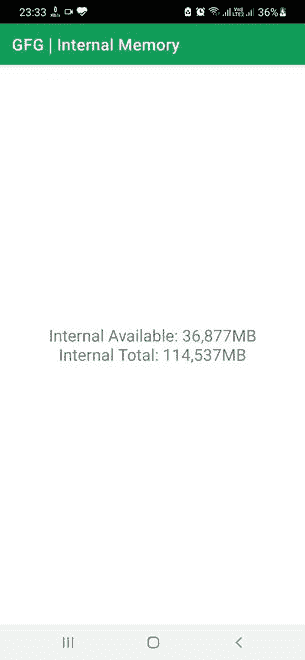

# 如何编程获取安卓系统内存存储空间？

> 原文:[https://www . geesforgeks . org/如何以编程方式获取内部内存存储空间安卓/](https://www.geeksforgeeks.org/how-to-get-internal-memory-storage-space-in-android-programmatically/)

每个设备都有内部存储器，可以存储文件和应用程序。设备的内部内存可以在 4 GB 到 512GB 之间变化。当内存被一堆文件和应用程序填满时，可用空间就会减少。为了节省内存，开发人员设计了很少的应用程序，以便它们在不运行时保持压缩状态，并在被触发时进行扩展。现在，如果可用空间小于触发应用程序的扩展版本，设备可能会挂起，或者应用程序可能永远不会在设备中打开。


因此，为了高效地运行这样的应用程序，有必要跟踪内部内存。在本文中，我们将向您展示如何获得关于内存的实时信息。

### 逐步实施

**第一步:在安卓工作室新建项目**

要在安卓工作室创建新项目，请参考[如何在安卓工作室创建/启动新项目](https://www.geeksforgeeks.org/android-how-to-create-start-a-new-project-in-android-studio/)。我们在 **Kotlin** 中演示了该应用程序，因此在创建新项目时，请确保选择 Kotlin 作为主要语言。

**步骤 2:使用 activity_main.xml 文件**

导航到**应用程序> res >布局> activity_main.xml** ，并将下面的代码添加到该文件中。下面是 **activity_main.xml** 文件的代码。在布局中添加一个[文本视图](https://www.geeksforgeeks.org/textview-in-kotlin/)来显示信息。

## 可扩展标记语言

```
<?xml version="1.0" encoding="utf-8"?>
<RelativeLayout 
    xmlns:android="http://schemas.android.com/apk/res/android"
    xmlns:app="http://schemas.android.com/apk/res-auto"
    xmlns:tools="http://schemas.android.com/tools"
    android:layout_width="match_parent"
    android:layout_height="match_parent"
    tools:context=".MainActivity">

    <TextView
        android:id="@+id/text_view"
        android:layout_width="wrap_content"
        android:layout_height="wrap_content"
        android:textSize="20sp"
        android:layout_centerInParent="true"
        android:gravity="center"/>

</RelativeLayout>
```

**第三步:使用**T2【主活动. kt】文件

转到 **MainActivity.kt** 文件，参考以下代码。下面是 **MainActivity.kt** 文件的代码。代码中添加了注释，以更详细地理解代码。

## 我的锅

```
import android.os.Build
import android.os.Bundle
import android.os.Environment
import android.os.StatFs
import android.widget.TextView
import androidx.annotation.RequiresApi
import androidx.appcompat.app.AppCompatActivity
import java.io.File

class MainActivity : AppCompatActivity() {
    @RequiresApi(Build.VERSION_CODES.JELLY_BEAN_MR2)
    override fun onCreate(savedInstanceState: Bundle?) {
        super.onCreate(savedInstanceState)
        setContentView(R.layout.activity_main)

        // TextView to show information
        val mTextView= findViewById<TextView>(R.id.text_view)

        // Fetching internal memory information
        val iPath: File = Environment.getDataDirectory()
        val iStat = StatFs(iPath.path)
        val iBlockSize = iStat.blockSizeLong
        val iAvailableBlocks = iStat.availableBlocksLong
        val iTotalBlocks = iStat.blockCountLong
        val iAvailableSpace = formatSize(iAvailableBlocks * iBlockSize)
        val iTotalSpace = formatSize(iTotalBlocks * iBlockSize)

        // Displaying the fetched info
        mTextView.text = "Internal Available: $iAvailableSpace\nInternal Total: $iTotalSpace"

    }

    // Function to convert byter to KB and MB
    private fun formatSize(size: Long): String? {
        var size = size
        var suffix: String? = null
        if (size >= 1024) {
            suffix = "KB"
            size /= 1024
            if (size >= 1024) {
                suffix = "MB"
                size /= 1024
            }
        }
        val resultBuffer = StringBuilder(java.lang.Long.toString(size))
        var commaOffset = resultBuffer.length - 3
        while (commaOffset > 0) {
            resultBuffer.insert(commaOffset, ',')
            commaOffset -= 3
        }
        if (suffix != null) resultBuffer.append(suffix)
        return resultBuffer.toString()
    }
}
```

**输出:**

您可以看到，当应用程序打开时，会显示关于内部内存的信息。

