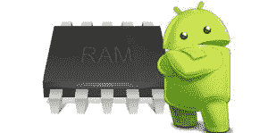
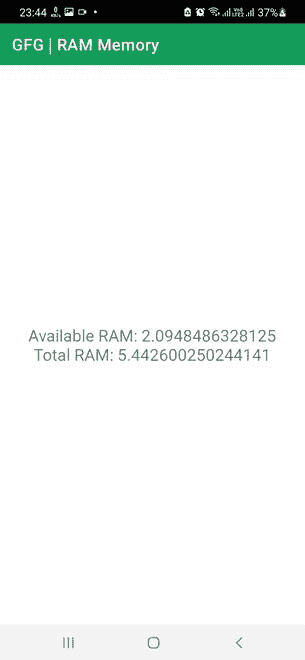

# 如何通过编程获取安卓系统中的 RAM 内存？

> 原文:[https://www . geesforgeks . org/如何以编程方式获取安卓内存/](https://www.geeksforgeeks.org/how-to-get-ram-memory-in-android-programmatically/)

**设备的 RAM(随机存取存储器)**是用于存储数据或信息以供设备上运行的任何应用程序立即使用的系统。每个运行程序作为其应用程序一部分的电子设备都有一定数量的内存与之相关联。现在的移动设备根据型号配备 4 到 16 GB 的内存。内存越多，手机可以运行的应用程序就越大。更多的内存也有助于设备更快更好的性能，但并不仅仅是为了更好的性能。因此，对于一个理想的应用程序来说，跟踪可用内存并根据它最小化或最大化应用程序进程是很重要的。



通过这篇文章，我们将向您展示如何在安卓系统中以编程方式获取与设备内存相关的信息。

### 逐步实施

**第一步:在安卓工作室新建项目**

要在安卓工作室创建新项目，请参考[如何在安卓工作室创建/启动新项目](https://www.geeksforgeeks.org/android-how-to-create-start-a-new-project-in-android-studio/)。我们在 **Kotlin** 中演示了该应用程序，因此在创建新项目时，请确保选择 Kotlin 作为主要语言。

**步骤 2:使用 activity_main.xml 文件**

导航到**应用程序> res >布局> activity_main.xml** ，并将下面的代码添加到该文件中。下面是 **activity_main.xml** 文件的代码。创建[文本视图](https://www.geeksforgeeks.org/textview-in-kotlin/)以显示内存相关信息。

## 可扩展标记语言

```kt
<?xml version="1.0" encoding="utf-8"?>
<RelativeLayout
    xmlns:android="http://schemas.android.com/apk/res/android"
    xmlns:app="http://schemas.android.com/apk/res-auto"
    xmlns:tools="http://schemas.android.com/tools"
    android:layout_width="match_parent"
    android:layout_height="match_parent"
    tools:context=".MainActivity">

    <TextView
        android:id="@+id/text_view"
        android:layout_width="wrap_content"
        android:layout_height="wrap_content"
        android:layout_centerInParent="true"
        android:gravity="center"
        android:textSize="20sp"/>

</RelativeLayout>
```

**第三步:使用**T2【主活动. kt】文件

转到 **MainActivity.kt** 文件，参考以下代码。下面是 **MainActivity.kt** 文件的代码。代码中添加了注释，以更详细地理解代码。

## 我的锅

```kt
import android.app.ActivityManager
import android.os.Bundle
import android.widget.TextView
import androidx.appcompat.app.AppCompatActivity

class MainActivity : AppCompatActivity() {
    override fun onCreate(savedInstanceState: Bundle?) {
        super.onCreate(savedInstanceState)
        setContentView(R.layout.activity_main)

        // Declare and initialize TextView from the layout file
        val mTextView = findViewById<TextView>(R.id.text_view)

        // Declaring and Initializing the ActivityManager
        val actManager = getSystemService(ACTIVITY_SERVICE) as ActivityManager

          // Declaring MemoryInfo object
        val memInfo = ActivityManager.MemoryInfo()

        // Fetching the data from the ActivityManager
        actManager.getMemoryInfo(memInfo)

        // Fetching the available and total memory and converting into Giga Bytes
        val availMemory = memInfo.availMem.toDouble()/(1024*1024*1024)
        val totalMemory= memInfo.totalMem.toDouble()/(1024*1024*1024)

        // Displaying the memory info into the TextView
        mTextView.text = "Available RAM: $availMemory\nTotal RAM: $totalMemory"
    }
}
```

**输出:**

应用程序打开后，您将看到设备上的可用内存和总内存可供使用。



拍摄上面截图的设备有 6GB 内存。差异(6–5.44 = 0.56)GB 已经被安卓操作系统和制造商的管理应用程序锁定，无法从设备中删除。