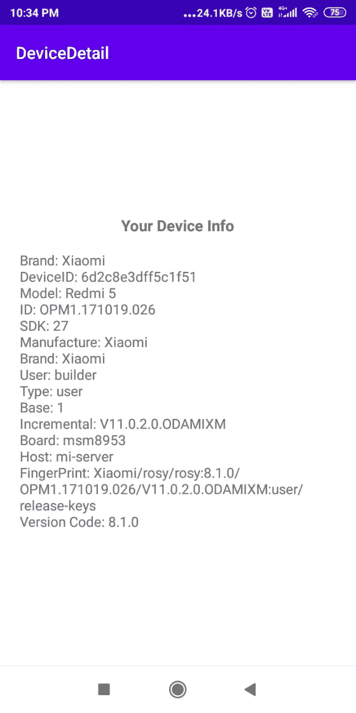

# 如何在安卓系统中获取设备信息？

> 原文:[https://www . geesforgeks . org/如何在安卓中获取设备信息/](https://www.geeksforgeeks.org/how-to-get-the-device-information-in-android/)

在当今世界，有时我们希望访问用户的设备信息来扩展我们的业务，例如，电子商务公司可能希望访问用户的移动品牌来提供(更具体地说，针对用户的高/低价商品)推荐。我们可以在安卓中使用构建包找到设备(硬件和软件)信息。

### **分步实施**

要获取设备信息，请按照下列步骤操作。我们将使用 **Kotlin** 语言来实现它。

**第一步:创建新项目**

要在安卓工作室创建新项目，请参考[如何在安卓工作室创建/启动新项目](https://www.geeksforgeeks.org/android-how-to-create-start-a-new-project-in-android-studio/)。注意选择**科特林**作为编程语言。

**步骤 2:使用 activity_main.xml 文件**

导航到**应用程序> res >布局> activity_main.xml** 并将下面的代码添加到该文件中。下面是 **activity_main.xml** 文件的代码。

## 可扩展标记语言

```kt
<?xml version="1.0" encoding="utf-8"?>
<LinearLayout
    xmlns:android="http://schemas.android.com/apk/res/android"
    xmlns:tools="http://schemas.android.com/tools"
    android:layout_width="match_parent"
    android:layout_height="match_parent"
    android:gravity="center"
    android:orientation="vertical"
    android:padding="20dp"
    tools:context=".MainActivity">

    <TextView
        android:layout_width="wrap_content"
        android:layout_height="wrap_content"
        android:text="Your Device Info"
        android:textSize="18sp"
        android:textStyle="bold" />

    <TextView
        android:id="@+id/tv_displayInfo"
        android:layout_width="wrap_content"
        android:layout_height="wrap_content"
        android:layout_marginTop="15dp"
        android:textSize="16sp" />

</LinearLayout>
```

**第三步:使用****MainActivity.java 文件**

转到 **MainActivity.kt** 文件，参考以下代码。下面是 **MainActivity.kt** 文件的代码。代码中添加了注释，以更详细地理解代码。

## 我的锅

```kt
import android.annotation.SuppressLint
import android.os.Build
import android.os.Bundle
import android.provider.Settings
import android.widget.TextView
import androidx.appcompat.app.AppCompatActivity

class MainActivity : AppCompatActivity() {

    override fun onCreate(savedInstanceState: Bundle?) {
        super.onCreate(savedInstanceState)
        setContentView(R.layout.activity_main)

        val tvDisplay: TextView = findViewById(R.id.tv_displayInfo)
        tvDisplay.text = getSystemDetail()
    }

    @SuppressLint("HardwareIds")
    private fun getSystemDetail(): String {
        return "Brand: ${Build.BRAND} \n" +
                "DeviceID: ${
                    Settings.Secure.getString(
                        contentResolver,
                        Settings.Secure.ANDROID_ID
                    )
                } \n" +
                "Model: ${Build.MODEL} \n" +
                "ID: ${Build.ID} \n" +
                "SDK: ${Build.VERSION.SDK_INT} \n" +
                "Manufacture: ${Build.MANUFACTURER} \n" +
                "Brand: ${Build.BRAND} \n" +
                "User: ${Build.USER} \n" +
                "Type: ${Build.TYPE} \n" +
                "Base: ${Build.VERSION_CODES.BASE} \n" +
                "Incremental: ${Build.VERSION.INCREMENTAL} \n" +
                "Board: ${Build.BOARD} \n" +
                "Host: ${Build.HOST} \n" +
                "FingerPrint: ${Build.FINGERPRINT} \n" +
                "Version Code: ${Build.VERSION.RELEASE}"
    }

}
```

**输出:**

