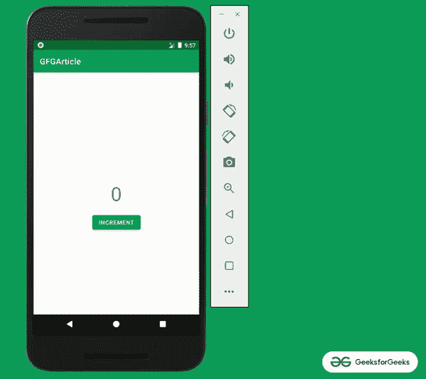
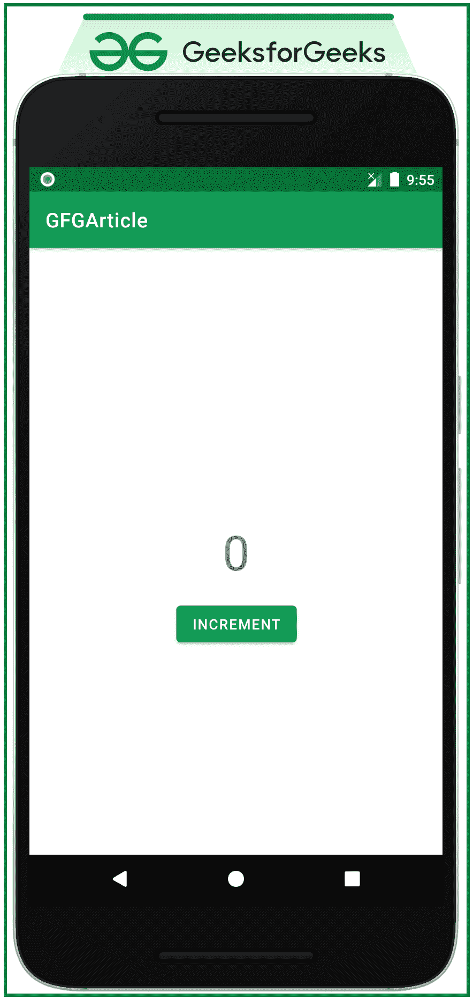
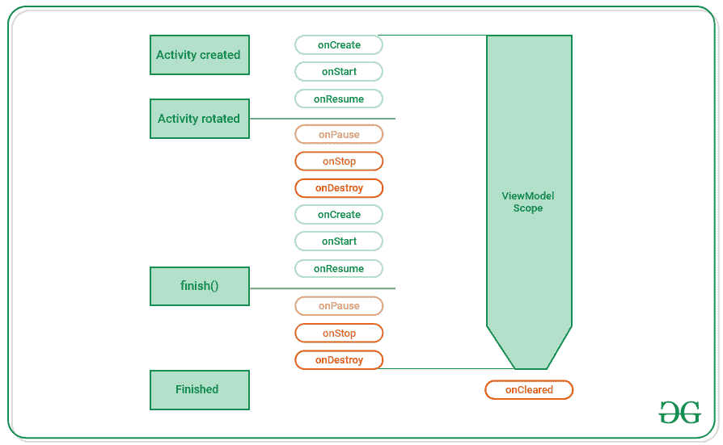

# 如何处理安卓系统中的配置变化？

> 原文:[https://www . geesforgeks . org/如何处理安卓系统中的配置更改/](https://www.geeksforgeeks.org/how-to-handle-configuration-changes-in-android/)

在应用程序运行时，安卓设备有时会发生配置变化。当设备经历配置改变时，所有的活动和片段都被重新创建。这种在配置改变时重新启动应用程序的做法，通过自动重新加载与新设备配置相匹配的应用替代资源，帮助应用程序适应新配置。当发生这种活动和片段的重新创建时，需要恢复数据和用户界面。传统的方法是使用[包](https://www.geeksforgeeks.org/bundle-in-android-with-example/)并处理**在 SavedInstanceStae()** 上的回调。参见[如何使用捆绑包恢复安卓系统中更改配置的数据？](https://www.geeksforgeeks.org/how-to-restore-data-on-configuration-changed-in-android-using-bundles/)。现在看看下面这张图片，如果处理不当，数据会在配置更改过程中丢失。因此，在本次讨论中，我们演示了如何在配置更改后恢复数据和更新用户界面。

> **注意:**这个讨论是用 **Kotlin** 编程语言实现的。



### **处理安卓系统配置变化的步骤**

**第一步:创建空活动安卓工作室项目**

创建一个空的活动 Android Studio 项目，并选择 Kotlin 作为编程语言。参考[安卓|如何在安卓工作室创建/启动新项目？](https://www.geeksforgeeks.org/android-how-to-create-start-a-new-project-in-android-studio/)。

**步骤 2:添加所需的依赖关系**

这个项目需要生命周期扩展的依赖性，[视图模型](https://www.geeksforgeeks.org/viewmodel-in-android-architecture-components/)和[实时数据](https://www.geeksforgeeks.org/livedata-in-android-architecture-components/)。因此，将以下依赖项添加到应用程序级别的 Gradle 文件中。

> // lifecycle_version 和架构版本可能有所不同
> def life cycle _ version = " 2 . 3 . 1 "
> def arch _ version = " 2 . 1 . 0 "
> 
> // ViewModel
> 
> 实现“androidx . life cycle:life cycle-view model-ktx:$ life cycle _ version”
> 
> 实时数据
> 
> 实现“androidx . life cycle:life cycle-live data-ktx:$ life cycle _ version”
> 
> //仅生命周期(无视图模型或实时数据)
> 
> 实现“androidx . life cycle:life cycle-runtime-ktx:$ life cycle _ version”
> 
> //架构生命周期扩展
> 
> 实现“androidx . life cycle:life cycle-extensions:$ arch _ version”

**第三步:使用 activity_main.xml 文件**

应用程序的主布局包含一个按钮和一个[文本视图](https://www.geeksforgeeks.org/textview-in-kotlin/)。为了实现相同的功能，在 **activity_main.xml** 文件中调用以下代码。

## 可扩展标记语言

```kt
<?xml version="1.0" encoding="utf-8"?>
<androidx.constraintlayout.widget.ConstraintLayout
    xmlns:android="http://schemas.android.com/apk/res/android"
    xmlns:app="http://schemas.android.com/apk/res-auto"
    xmlns:tools="http://schemas.android.com/tools"
    android:layout_width="match_parent"
    android:layout_height="match_parent"
    android:orientation="vertical"
    tools:context=".MainActivity"
    tools:ignore="HardcodedText">

    <TextView
        android:id="@+id/textView"
        style="@style/TextAppearance.MaterialComponents.Headline3"
        android:layout_width="wrap_content"
        android:layout_height="wrap_content"
        android:text="0"
        app:layout_constraintBottom_toBottomOf="parent"
        app:layout_constraintEnd_toEndOf="parent"
        app:layout_constraintStart_toStartOf="parent"
        app:layout_constraintTop_toTopOf="parent" />

    <Button
        android:id="@+id/button"
        android:layout_width="wrap_content"
        android:layout_height="wrap_content"
        android:layout_marginTop="16dp"
        android:text="INCREMENT"
        app:layout_constraintEnd_toEndOf="@+id/textView"
        app:layout_constraintStart_toStartOf="@+id/textView"
        app:layout_constraintTop_toBottomOf="@+id/textView" />

</androidx.constraintlayout.widget.ConstraintLayout>
```

**输出 UI:**



**第四步:在整个活动中了解视图模型的范围**

*   通过参考下面的图像，可以观察到视图模型的对象的范围是生命周期所有者在获取视图模型时传递给视图模型提供者的。在生命周期所有者的整个生命周期中，视图模型对象都保留在内存中。这里的生命周期所有者是 MainActivity.kt，它有自己的生命周期。
*   在活动的情况下，当活动完成时，视图模型对象的范围被销毁。在[碎片](https://www.geeksforgeeks.org/introduction-fragments-android/)的情况下，当它分离时。
*   系统调用 **onCreate()** 方法时创建的视图模型对象。在整个活动过程中，它可能会被调用几次。例如当设备旋转时。第一次请求视图模型对象时，该对象仍然存在，直到活动完成并被销毁。



**第 5 步:为活动创建视图模型**

视图模型类继承视图模型作为超类。并且所需的数据成员和成员函数在其中创建，其中所有数据成员和函数的范围在活动的整个生命周期中保持不变。为了实现视图模型，创建一个名为 MyViewModel.kt 的类，并调用下面的代码。

## 我的锅

```kt
import androidx.lifecycle.ViewModel

class MyViewModel : ViewModel() {

    // number to increment and show on UI
    var number = 0

    // function when called increments the value of number
    fun addNumber(): Int = number++

}
```

**第 6 步:使用 MainActivity.kt**

在 **MainActivity.kt** 文件中，视图模型的对象是使用生命周期所有者的视图模型提供程序创建的。这里的生命周期所有者是 MainAactivity.kt 文件。要实现相同的功能，请在 **MainActivity.kt** 文件中调用以下代码。

## 我的锅

```kt
import androidx.appcompat.app.AppCompatActivity
import android.os.Bundle
import android.widget.Button
import android.widget.TextView
import androidx.lifecycle.ViewModelProvider

class MainActivity : AppCompatActivity() {

    override fun onCreate(savedInstanceState: Bundle?) {
        super.onCreate(savedInstanceState)
        setContentView(R.layout.activity_main)

        // create instance of the viewModel of the Custom MyViewModel for the activity MainActivity.kt
        val myViewModel: MyViewModel = ViewModelProvider(this).get(MyViewModel::class.java)

        // create instances of the UI elements
        val button: Button = findViewById(R.id.button)
        val textView: TextView = findViewById(R.id.textView)

        textView.text = myViewModel.number.toString()
        button.setOnClickListener {
            // trigger the increment
            // function to increment the value
            myViewModel.incrementNumber()

            // set the updated value of number to the TextView
            textView.text = myViewModel.number.toString()
        }
    }
}
```

**输出:**

<video class="wp-video-shortcode" id="video-608985-1" width="640" height="360" preload="metadata" controls=""><source type="video/mp4" src="https://media.geeksforgeeks.org/wp-content/uploads/20210521113630/Untitled.mp4?_=1">[https://media.geeksforgeeks.org/wp-content/uploads/20210521113630/Untitled.mp4](https://media.geeksforgeeks.org/wp-content/uploads/20210521113630/Untitled.mp4)</video>