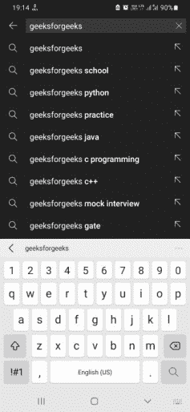

# 如何在安卓中处理动作按钮点击的 IME 选项？

> 原文:[https://www . geesforgeks . org/how-handle-ime-options-on-action-button-click-in-Android/](https://www.geeksforgeeks.org/how-to-handle-ime-options-on-action-button-click-in-android/)

我们经常观察到，当我们尝试在可编辑字段中输入时，会弹出一个键盘。这些输入通常被应用程序接受，用于执行特定功能和显示所需结果。我们在日常使用的大多数应用程序中可以看到的最常见的可编辑字段之一是**搜索栏**。



YouTube 搜索查询结果

当调用键盘时，您会看到底部带有放大镜图标的按钮。这让用户假设点击这个按钮将帮助他们搜索他们的查询。但是，这个应用程序的开发人员已经明确设置了放大镜图标，默认情况下，放大镜图标可以是其他的东西。这可以通过使用 **IME 选项**明确指定所需的图标类型来完成。要了解可用图标的列表以及如何更改它们，请参考下面的文章。[在安卓](https://www.geeksforgeeks.org/invoking-search-button-in-keyboard-while-typing-in-edittext-in-android/)中输入编辑文本时调用键盘中的搜索按钮。在本文中，我们将向您展示如何处理这些按钮上的点击事件。

### 逐步实施

**第一步:创建新项目**

要在安卓工作室创建新项目，请参考[如何在安卓工作室创建/启动新项目](https://www.geeksforgeeks.org/android-how-to-create-start-a-new-project-in-android-studio/)。我们在 **Kotlin** 中演示了该应用程序，因此在创建新项目时，请确保选择 Kotlin 作为主要语言。

**步骤 2:使用 activity_main.xml 文件**

导航到**应用程序> res >布局> activity_main.xml** 并将下面的代码添加到该文件中。下面是 **activity_main.xml** 文件的代码。

## 可扩展标记语言

```
<?xml version="1.0" encoding="utf-8"?>
<RelativeLayout 
    xmlns:android="http://schemas.android.com/apk/res/android"
    xmlns:app="http://schemas.android.com/apk/res-auto"
    xmlns:tools="http://schemas.android.com/tools"
    android:layout_width="match_parent"
    android:layout_height="match_parent"
    tools:context=".MainActivity">

    <EditText
        android:id="@+id/et1"
        android:layout_width="match_parent"
        android:layout_height="50sp"
        android:layout_centerHorizontal="true"
        android:inputType="text"
        android:autofillHints="Type something"
        tools:ignore="LabelFor" />

</RelativeLayout>
```

**第三步:使用**T2【主活动. kt】文件

转到 **MainActivity.kt** 文件，参考以下代码。下面是 **MainActivity.kt** 文件的代码。代码中添加了注释，以更详细地理解代码。

## 我的锅

```
import androidx.appcompat.app.AppCompatActivity
import android.os.Bundle
import android.view.inputmethod.EditorInfo
import android.widget.EditText
import android.widget.TextView
import android.widget.Toast

class MainActivity : AppCompatActivity() {
    override fun onCreate(savedInstanceState: Bundle?) {
        super.onCreate(savedInstanceState)
        setContentView(R.layout.activity_main)

        // Declaring the EditText from the layout file
        val myEditText = findViewById<EditText>(R.id.et1)

        // Calling the doSomething function
        doSomething(myEditText)
    }

    private fun doSomething(search: EditText){
        search.setOnEditorActionListener(TextView.OnEditorActionListener{ _, actionId, _ ->

            if (actionId == EditorInfo.IME_ACTION_DONE) {

                // Do something of your interest.
                // We in this examples created the following Toasts
                if(search.text.toString() == "geeksforgeeks"){
                    Toast.makeText(applicationContext, "Welcome to GFG", Toast.LENGTH_SHORT).show()
                } else {
                    Toast.makeText(applicationContext, "Invalid Input", Toast.LENGTH_SHORT).show()
                }

                return@OnEditorActionListener true
            }
            false
        })
    }
}
```

所以基本上，在函数 doSomething 中，可以观察到 ***IME_ACTION_DONE*** 处于外 if 条件。这是因为当我们通过按下编辑文本来调用键盘时，我们看到了完成按钮。这是在布局中的编辑文本的属性中未设置 IME 选项或这是默认条件时。但是如果你把它设置为搜索、转到等，那么你可能会喜欢参考下面的内容来使应用程序工作。替换为:

> *   ***Edit information. IME _ action _ completion*** **= When IME option is not specified (default)**
> *   ***Edit information. IME _ action _ search*** **= Search** when the IME option is action.
> *   ***编辑信息 IME _ 行动 _GO*** **=当 IME 选项是行动开始**
> *   ***Edit information. IME _ action _ next step*** **= when the ime option is action next step**
> *   ***编辑信息 IME _ 行动 _ 先前*** **=当 IME 选项为行动前**
> *   ***Edit information. IME _ action _ send*** **= when the IME option is action send**

**输入:**

点击编辑文本并输入内容。现在按下底部的完成按钮，观察是否出现[吐司](https://www.geeksforgeeks.org/android-what-is-toast-and-how-to-use-it-with-examples/)。同样，输入“geeksforgeeks”并观察吐司。

**输出:**

你可以看到，对于不同的输入，我们观察到不同的祝酒词。这表明我们的功能以祝酒词的形式正确地响应了键盘操作按钮(完成按钮)。

<video class="wp-video-shortcode" id="video-651384-1" width="640" height="360" preload="metadata" controls=""><source type="video/mp4" src="https://media.geeksforgeeks.org/wp-content/uploads/20210722195255/22222.mp4?_=1">[https://media.geeksforgeeks.org/wp-content/uploads/20210722195255/22222.mp4](https://media.geeksforgeeks.org/wp-content/uploads/20210722195255/22222.mp4)</video>