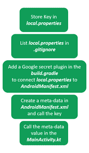
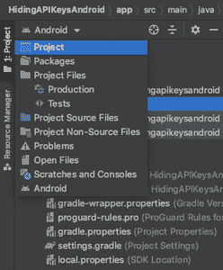
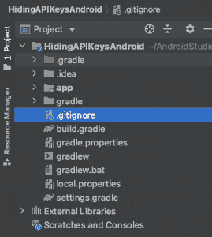
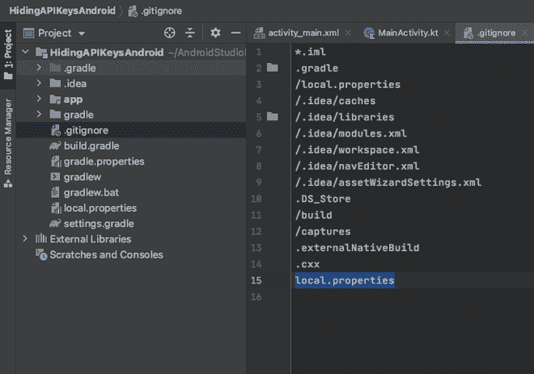
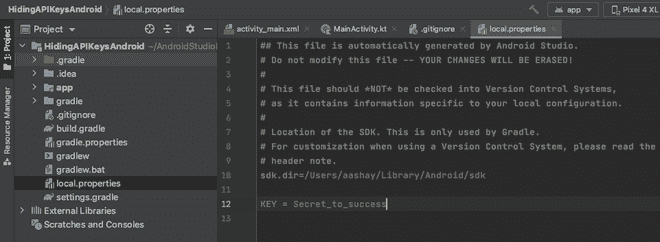
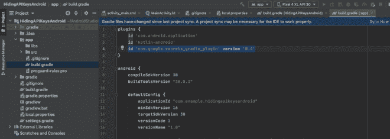
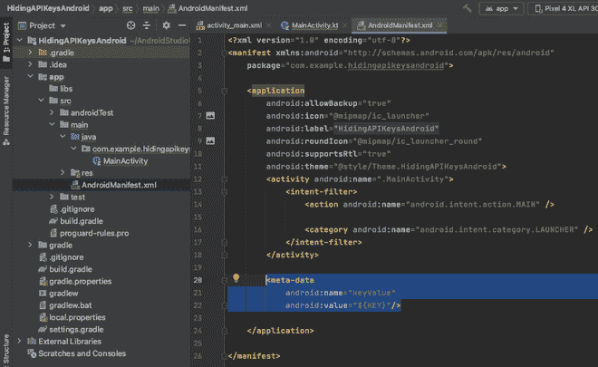
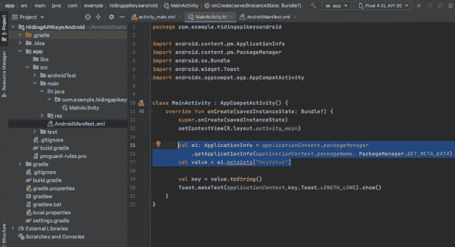
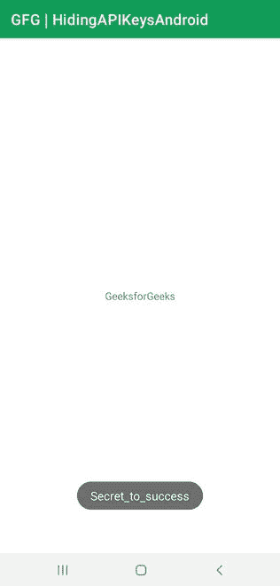

# 安卓工作室如何隐藏 API 和秘钥？

> 原文:[https://www . geesforgeks . org/how-hide-API-and-secret-key-in-Android-studio/](https://www.geeksforgeeks.org/how-to-hide-api-and-secret-keys-in-android-studio/)

[API(应用程序编程接口)](https://www.geeksforgeeks.org/what-is-api-how-it-is-useful-in-web-development/)是一组代码，有助于将信息从一个软件或应用程序传播到另一个软件或应用程序。科技公司创建他们的软件和应用编程接口，这些软件和应用编程接口可以被他们的员工用来构建新的应用程序和功能，使它们私有使用。然而，一些公司将他们的 API 出租给第三方(可以是其他公司、开发人员、贡献者)，以在他们的项目中实现他们软件的特性，以一些最小的成本和有限的使用。因此，如果您从一家公司购买或租赁一个应用编程接口，该公司将为您提供一个应用编程接口密钥，您必须在项目中声明该密钥，以验证应用编程接口权限并访问功能。

### 为什么要藏起来？我们如何隐藏它们？

因此，当您购买或租用应用程序时，在使用它们构建应用程序时隐藏应用程序接口密钥变得至关重要。在应用程序中有几种包装它们的方法。通过本文，我们想与您分享一种在**安卓工作室**中构建应用程序时保护您的应用编程接口密钥的道德方式。参考下面的流程图，尝试理解这种方法。



方法

要隐藏密钥，请按照以下步骤操作:

**第一步:在安卓工作室新建项目**

要在安卓工作室创建新项目，请参考[如何在安卓工作室创建/启动新项目](https://www.geeksforgeeks.org/android-how-to-create-start-a-new-project-in-android-studio/)。我们在**科特林**中演示了该应用程序，因此在创建新项目时，请确保选择科特林作为主要语言。

**第二步:前往。gitignore 文件中的项目菜单**

在安卓工作室 IDE 的左上角，你会发现一个菜单，你可以在不同的视图中查看同一个项目。单击它并选择项目选项。



在菜单中选择项目选项

在项目选项中，你会发现需要打开**的 Gradle 文件夹。gitignore** 文件。



点击。gitignore 文件打开它

**步骤 3:检查 local.properties 是否列在。gitignore 文件**

在。gitignore 文件，检查是否列出了 local.properties。。gitignore 将在构建过程中忽略其中列出的每个文件。



**第四步:转到 gradle 文件夹中的 local.properties 文件，声明 API/Secret 密钥**

在同一个 gradle 文件夹中，您将找到 local.properties 文件。打开它并声明密钥，如图所示。



**第五步:转到应用> src 文件夹中的 build.gradle，并添加以下谷歌插件**

现在转到 build.gradle 文件，在插件中添加下面的插件，如图所示。

```kt
plugins {
    id 'com.google.secrets_gradle_plugin' version '0.4'
}
```

添加插件后，点击立即同步选项。



**第 6 步:转到 AndroidManifest.xml 并创建一个元数据**

现在转到 AndroidManifest.xml 文件并声明一个元数据。元数据必须在活动和应用程序结束标记之间声明。

## 可扩展标记语言

```kt
<application>
        .
        .
        .
        .        
        <activity>
            .
            .
            .
            .
        </activity>

    <meta-data
        android:name = "keyValue"
        android:value = "${KEY}"/>

</application>
```



**第 7 步:转到 MainActivity.kt，输入下面的代码，从 AndroidManifest.xml** 中的元数据中获取 KEY 值

在主程序中添加以下代码来调用键。为了检查是否获取了密钥，我们将生成一个显示密钥值的吐司。

## 我的锅

```kt
package com.geeksforgeeks.hidingapikeysandroid

import android.content.pm.ApplicationInfo
import android.content.pm.PackageManager
import android.os.Bundle
import android.widget.Toast
import androidx.appcompat.app.AppCompatActivity

class MainActivity : AppCompatActivity() {
    override fun onCreate(savedInstanceState: Bundle?) {
        super.onCreate(savedInstanceState)
        setContentView(R.layout.activity_main)

        val ai: ApplicationInfo = applicationContext.packageManager
            .getApplicationInfo(applicationContext.packageName, PackageManager.GET_META_DATA)
        val value = ai.metaData["keyValue"]

        val key = value.toString()
        Toast.makeText(applicationContext,key,Toast.LENGTH_LONG).show()
    }
}
```

## 可扩展标记语言

```kt
<!--There's nothing to change in the front-end-->
<?xml version="1.0" encoding="utf-8"?>
<androidx.constraintlayout.widget.ConstraintLayout 
    xmlns:android="http://schemas.android.com/apk/res/android"
    xmlns:app="http://schemas.android.com/apk/res-auto"
    xmlns:tools="http://schemas.android.com/tools"
    android:layout_width="match_parent"
    android:layout_height="match_parent"
    tools:context=".MainActivity">

    <TextView
        android:layout_width="wrap_content"
        android:layout_height="wrap_content"
        android:text="GeeksforGeeks"
        app:layout_constraintBottom_toBottomOf="parent"
        app:layout_constraintLeft_toLeftOf="parent"
        app:layout_constraintRight_toRightOf="parent"
        app:layout_constraintTop_toTopOf="parent" />

</androidx.constraintlayout.widget.ConstraintLayout>
```



**输出:**



程序运行时的截图

我们能够看到具有相同键值的吐司。这意味着一切都很顺利，我们可以**成功拿到钥匙**。现在，我们可以使用密钥验证应用编程接口并实现其功能。