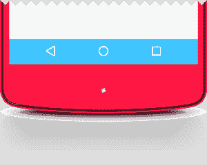
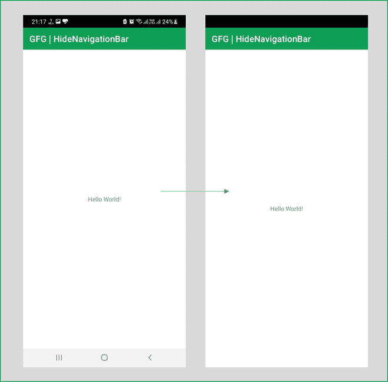

# 如何在安卓中隐藏导航条？

> 原文:[https://www . geesforgeks . org/how-hide-navigation bar-in-Android/](https://www.geeksforgeeks.org/how-to-hide-navigationbar-in-android/)

**Android 中的 NavigationBar** 是一行，包括位于应用程序底部的后退按钮、主页按钮和最近按钮。大多数安卓 5.0 棒棒糖及以上设备都没有物理导航按钮，因此在整个屏幕生命周期内都以按钮的形式出现在屏幕上。



然而，对于涉及游戏和视频的应用程序，这些按钮变得没有必要。此外，意外触摸这些按钮可能会导致数据丢失，尤其是在服务器上实时运行的应用程序上。因此，在本文中，我们将向您展示如何在安卓上隐藏导航栏。

### 逐步实施

**第一步:在安卓工作室新建项目**

要在安卓工作室创建新项目，请参考[如何在安卓工作室创建/启动新项目](https://www.geeksforgeeks.org/android-how-to-create-start-a-new-project-in-android-studio/)。我们在 **Kotlin** 中演示了该应用程序，因此在创建新项目时，请确保选择 Kotlin 作为主要语言。

**步骤 2:使用**T2【主活动. kt】文件

转到 **MainActivity.kt** 文件，参考以下代码。下面是 **MainActivity.kt** 文件的代码。代码中添加了注释，以更详细地理解代码。

## 我的锅

```kt
import android.os.Build
import androidx.appcompat.app.AppCompatActivity
import android.os.Bundle
import android.view.View
import androidx.annotation.RequiresApi
import androidx.core.view.WindowCompat
import androidx.core.view.WindowInsetsCompat
import androidx.core.view.WindowInsetsControllerCompat

class MainActivity : AppCompatActivity() {

    @RequiresApi(Build.VERSION_CODES.R)
    override fun onCreate(savedInstanceState: Bundle?) {
        super.onCreate(savedInstanceState)
        setContentView(R.layout.activity_main)

        // A function to hide NavigationBar
        hideSystemUI()
    }

    // Function to hide NavigationBar
    @RequiresApi(Build.VERSION_CODES.R)
    private fun hideSystemUI() {
        WindowCompat.setDecorFitsSystemWindows(window, false)
        WindowInsetsControllerCompat(window,
            window.decorView.findViewById(android.R.id.content)).let { controller ->
            controller.hide(WindowInsetsCompat.Type.systemBars())

            // When the screen is swiped up at the bottom 
            // of the application, the navigationBar shall
            // appear for some time
            controller.systemBarsBehavior = WindowInsetsControllerCompat.BEHAVIOR_SHOW_TRANSIENT_BARS_BY_SWIPE
        }
    }
}
```

**输出:**

您可以看到导航栏现已隐藏。然而，我们对它进行了编程，当在屏幕底部向上滑动时，导航栏将会出现几秒钟。



隐藏导航栏前后

<video class="wp-video-shortcode" id="video-684173-1" width="640" height="360" preload="metadata" controls=""><source type="video/mp4" src="https://media.geeksforgeeks.org/wp-content/uploads/20210826111427/oo3.mp4?_=1">[https://media.geeksforgeeks.org/wp-content/uploads/20210826111427/oo3.mp4](https://media.geeksforgeeks.org/wp-content/uploads/20210826111427/oo3.mp4)</video>