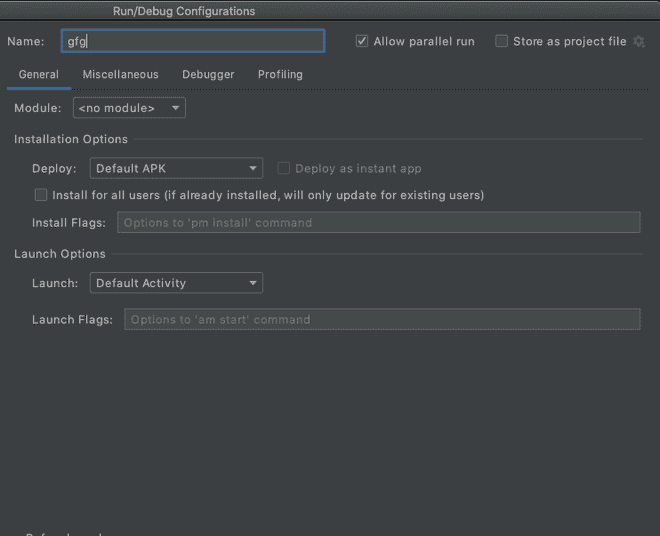

# 安卓切片如何实现？

> 原文:[https://www . geeksforgeeks . org/如何实现-android-slice/](https://www.geeksforgeeks.org/how-to-implement-android-slice/)

谷歌在安卓派推出了一个名为**切片**的新 API。切片是安卓喷气背包支持库的一个组成部分。切片是一个较小的用户界面模板，用于在谷歌搜索应用程序中呈现应用程序的内容。它使用户能够在应用程序之外更快地完成任务。在本文中，我们将介绍如何在您的应用程序中使用 Slices。切片支持各种实时数据、深度链接、可滚动布局等。让我们开始这篇文章。

> **GeekTip:** 在构建自己的切片之前，你需要 Android Studio 3.1 及以上版本，以及 Kotlin 1 . 2 . 30 及以上版本。

### 从你的第一片开始

**在你的应用程序构建中加入依赖项:**

```kt
dependencies {
    implementation "androidx.slice:slice-builders-ktx:(latest version)"
}
```

我们现在必须构建一个扩展 SliceProvider 的文件。这类似于给应用分一杯羹。切片是应用程序信息和活动的一部分，可以显示在安卓系统表面的应用程序之外或另一个应用程序中。一个 uri 标识一个切片，一个 SliceProvider 使您的应用程序能够基于一个 Uri 提供一个切片。要添加新的提供者，请转到 **NEW** - > **【其他】** - > **SLICEPROVIDER** ，它将在生成时被添加到清单中。

```kt
<manifest xmlns:android="http://schemas.android.com/apk/res/android"
    package="com.geeksforgeeks.android.sampleapp">
    ...
    <application>
        ...
        <provider android:name="GfGProviderSlice"
            android:authorities="com.geeksforgeeks.android.sampleapp"
            android:exported="true" >
            <intent-filter>
                <action android:name="android.intent.action.VIEW" />
                <category android:name="android.app.slice.category.SLICE" />
            </intent-filter>
        </provider>
        ...
    </application>
</manifest>
```

每个切片都分配了一个 URI。因此，当应用程序想要显示切片时，它会向应用程序发送带有关联 URI 的绑定请求。然后，程序使用 onBindSlice 构造切片。sliceAttached 方法似乎是，

## 我的锅

```kt
override fun sliceAttached(sliceUri: Uri): Slice? {
    val gfgAction = doSomething()
    return if (sliceUri.path == "/gfg") {
        list(context, sliceUri, ListBuilder.INFINITY) {
            row {
                primaryAction = activityAction
                title = "Hello Geeks for Geeks."
            }
        }
    } else {
        list(context, sliceUri, ListBuilder.INFINITY) {
            row {
                primaryAction = activityAction
                title = "Not a valid URI"
            }
        }
    }
}
```

首先，单击本页顶部或底部的下载材料按钮，下载教程材料。启动安卓工作室，添加基础项目。你将在很大程度上设计自己的课程。要添加代码，您需要找到 AndroidManifest.xml，因此请确保您可以找到它。如果您还没有下载安卓应用编程接口级别 28 的软件开发工具包，您需要下载才能启动该应用程序。如果您已经安装了 Android API 28，您可以跳过接下来的四个阶段，直接继续开发和启动应用程序。

### 切片查看器

为了展示它的素材，切片需要一个观众或演示者。谷歌搜索应用程序是显示您的切片模板的合适演示者之一。当用户将一个术语放入搜索栏时，您开发的切片可能会显示与用户的搜索短语相关的信息。

例如，如果用户输入“乘坐”或“乘坐车辆”等术语，可能会出现 Careem 或优步等已安装应用程序的切片，允许用户在无需打开相关应用程序的情况下订购汽车；这种完整的体验可以使用应用程序操作和切片来提供。

### 使用切片查看器显示切片

请注意，演示者可能会对您的切片进行一些小的更改，以满足他们的设计需求，例如字体样式、字体大小和/或颜色。例如，切片中的图标将使用演示者应用程序的强调色进行着色。

要显示文章应用程序中的切片，您需要一个切片查看器应用程序。切片查看器应用程序利用您的切片 Uri 来查看它的表面，并且在您的切片的第一次请求时，用户将被提示允许查看器访问。

### 使用切片提供程序类

SliceProvider 类是向其他应用程序公开您的切片的唯一方法，它决定向查看者显示哪个切片。SliceProvider 类扩展了 ContentProvider 类。安卓应用的基本构建元素之一是内容提供商。他们封装数据，并通过 ContentResolver 接口将其传递给应用程序。如果你需要在应用程序之间传递数据，你可以利用内容提供商。例如，联系人数据被许多应用程序使用，并保存在内容提供商中。点击此处了解更多关于内容供应商的信息。

*在这种情况下，我们:*

1.  启动时，使用 onCreateSliceProvider()初始化您的切片提供程序。
2.  如果您将长时间运行的进程放在这里，您的应用程序的启动将会延迟，与查看器绑定的第一个切片也会延迟。
3.  如果提供程序已成功加载，则返回 true 否则，返回 false。
4.  在 onBindSlice()的主体中制作切片。
5.  你应该尽可能快地生产并退回你的切片。
6.  为了保持切片用户界面的响应性，请在后台进行网络查询或输入/输出活动。当您的后台活动完成时，请联系内容解析器，用新数据更新您的切片。
7.  有了 notifyChange(uri)中的 Slice URI，安卓会为你调用 onBindSlice()。
8.  路线可以从 URI 获得。
9.  如果该路径与切片的路径匹配，则返回文章切片。

## 我的锅

```kt
private fun postSomething(sliceUri: Uri): Slice {
  return ListBuilder(context, postUri, ListBuilder.INFINITY)

      .setHeader {
        it.apply {

          articleTitle = "GeeksforGeeks"

          titleOfTheArticle = "geeksforgeeks.org"
          summaryOfTheArticle = "A great Android article"

          primaryAction = postArticle()
        }
      }
      .build()
}
```

在撰写本文时，安卓有五个不同的切片构建器，用于创建具有不同风格和功能的各种行:HeaderBuilder、RowBuilder、GridRowBuilder、RangeBuilder 和 InputRangeBuilder。

1.  您将使用以下工具来构建您的“文章切片”设计:
2.  **列表构建器**将是切片的主要构建器。
3.  **HeaderBuilder** 用于创建带有标题和副标题的标题。
4.  **gridrowlbuilder**用于创建一行单元格。
5.  若要添加单元格，请使用单元格生成器；每个单元格包含图像、标题和文本

## 我的锅

```kt
override fun postOnGeeksforGeeks(): Boolean {
 return true
}
override fun onPostShared(sometShot: Uri): Slice? {
 val path = sometShot.path
 when (path) {

   "/$ARTICLE_PATH" -> return createAPost(sometShot)
 }
 return null
}
```

### 启动切片查看器

*   从菜单中选择运行->编辑配置。
*   点击左上角的+,然后选择安卓应用。
*   在名称字段中输入切片，并在模块中输入应用程序。
*   在“启动”下，提供一个网址，如 slice-content:/com.app 的-package name/gfg。



图像#1。切片器

### 结论

也可以插入切片，类似于点击等交互，以显示吐司、日志或移动到新活动。现在，通过选择切片模块从右上角启动应用程序，您将看到应用程序的模块。