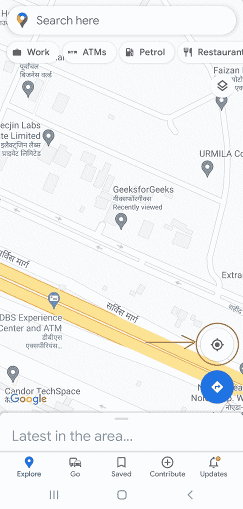

# 如何在安卓系统的谷歌地图中实现当前位置按钮功能？

> 原文:[https://www . geesforgeks . org/如何实现-当前位置-按钮-功能-谷歌地图-安卓版/](https://www.geeksforgeeks.org/how-to-implement-current-location-button-feature-in-google-maps-in-android/)

当前位置是谷歌地图上的一个功能，可以帮助我们在地图上定位设备的位置。通过这篇文章，当我们实现谷歌地图时，我们也将实现一个按钮，它将获取我们当前的位置并在地图上导航。注意，我们将使用 **Kotlin** 语言来实现这个项目。



安卓设备上实际的谷歌地图应用截图

### 按照以下步骤实现地图和按钮，以导航到设备的当前位置

**第一步:在安卓工作室新建项目**

要在安卓工作室创建新项目，请参考[如何在安卓工作室创建/启动新项目](https://www.geeksforgeeks.org/android-how-to-create-start-a-new-project-in-android-studio/)。我们在 Kotlin 中演示了该应用程序，因此在创建新项目时，请确保选择 **Kotlin** 作为主要语言。

**第二步:获取并隐藏 API 密钥**

我们的应用程序利用谷歌的地点应用编程接口来实现谷歌地图，所以我们需要从谷歌获得地点应用编程接口密钥。要获取应用编程接口密钥，请参考[为使用任何谷歌应用编程接口生成应用编程接口密钥](https://www.geeksforgeeks.org/generating-api-keys-for-using-any-google-apis/)。隐藏应用编程接口密钥是必不可少的，要做到这一点，请参考[如何在安卓工作室隐藏应用编程接口和密钥？](https://www.geeksforgeeks.org/how-to-hide-api-and-secret-keys-in-android-studio/)。

**第 3 步:在 build.gradle 文件**中添加依赖项

我们需要为导入库添加以下依赖项，以支持谷歌地图的实现。

> 实现' com . Google . Android . libraries . places:places:2 . 4 . 0 '

**第 4 步:在 Manifest.xml 文件**中为应用程序添加权限

由于应用程序主要处理当前位置，我们授予应用程序访问该位置的权限。要授予应用程序这样的权限，请以下列方式声明清单和应用程序打开标记之间的权限。

## 可扩展标记语言

```kt
<manifest...>

    <uses-permission android:name="android.permission.ACCESS_COARSE_LOCATION"/>
    <uses-permission android:name="android.permission.ACCESS_FINE_LOCATION"/>

    <application ...>
```

**步骤 5:在 activity_main.xml 文件(前端)**中实现一个简单的按钮&谷歌地图片段

导航到 **app > res >布局> activity_main.xml** 并将下面的代码添加到该文件中。下面是**activity _ main . XML**文件的代码。

## 可扩展标记语言

```kt
<?xml version="1.0" encoding="utf-8"?>
<RelativeLayout 
    xmlns:android="http://schemas.android.com/apk/res/android"
    android:layout_width="match_parent"
    android:layout_height="match_parent"
    android:gravity="center"
    android:orientation="vertical">

    <fragment xmlns:android="http://schemas.android.com/apk/res/android"
        xmlns:tools="http://schemas.android.com/tools"
        android:layout_width="match_parent"
        android:layout_height="match_parent"
        android:id="@+id/map"
        tools:context=".MapsActivity"
        android:name="com.google.android.gms.maps.SupportMapFragment" />

    <Button
        android:id="@+id/currentLoc"
        android:layout_width="30sp"
        android:layout_height="40sp"
        android:layout_alignBottom="@id/map"
        android:layout_alignEnd="@id/map"
        android:layout_alignRight="@id/map"
        android:layout_marginRight="30sp"
        android:layout_marginBottom="30sp"
        />

</RelativeLayout>
```

**第 6 步:使用 MainActivity.kt(后端)**

简而言之，我们做的是:

1.  获取我们在**步骤 2** 中存储的 API 密钥。
2.  使用应用编程接口键初始化位置应用编程接口。
3.  已初始化布局中的地图片段。
4.  已初始化融合位置客户端。
5.  布局中已初始化的按钮(activity_main.xml)。
6.  创建了一个函数来获取最后一个位置。
7.  创建了一个请求新位置的函数。
8.  创建了一个位置回调函数。
9.  创建了一个功能来检查设备的全球定位系统是否打开。
10.  创建了一个函数来检查是否授予了访问该位置的权限。
11.  创建了一个函数来授予访问该位置的权限请求。
12.  创建了一个函数，用于在授予权限时调用 getLastLocation()。

转到 **MainActivity.kt** 文件，参考以下代码。下面是 **MainActivity.kt** 文件的代码。代码中添加了注释，以更详细地理解代码。

## 我的锅

```kt
import android.Manifest
import android.annotation.SuppressLint
import android.content.Context
import android.content.Intent
import android.content.pm.ApplicationInfo
import android.content.pm.PackageManager
import android.location.Location
import android.location.LocationManager
import androidx.appcompat.app.AppCompatActivity
import android.os.Bundle
import android.os.Looper
import android.provider.Settings
import android.widget.Button
import android.widget.Toast
import androidx.core.app.ActivityCompat
import com.google.android.gms.location.*
import com.google.android.gms.maps.CameraUpdateFactory
import com.google.android.gms.maps.GoogleMap
import com.google.android.gms.maps.OnMapReadyCallback
import com.google.android.gms.maps.SupportMapFragment
import com.google.android.gms.maps.model.LatLng
import com.google.android.gms.maps.model.MarkerOptions
import com.google.android.libraries.places.api.Places

class MainActivity : AppCompatActivity(), OnMapReadyCallback {

    private val pERMISSION_ID = 42
    lateinit var mFusedLocationClient: FusedLocationProviderClient
    lateinit var mMap: GoogleMap

      // Current location is set to India, this will be of no use
    var currentLocation: LatLng = LatLng(20.5, 78.9)

    override fun onCreate(savedInstanceState: Bundle?) {
        super.onCreate(savedInstanceState)
        setContentView(R.layout.activity_main)

        // Fetching API_KEY which we wrapped
        val ai: ApplicationInfo = applicationContext.packageManager
            .getApplicationInfo(applicationContext.packageName, PackageManager.GET_META_DATA)
        val value = ai.metaData["com.google.android.geo.API_KEY"]
        val apiKey = value.toString()

        // Initializing the Places API with the help of our API_KEY
        if (!Places.isInitialized()) {
            Places.initialize(applicationContext, apiKey)
        }

        // Initializing Map
        val mapFragment = supportFragmentManager.findFragmentById(R.id.map) as SupportMapFragment
        mapFragment.getMapAsync(this)

        // Initializing fused location client
        mFusedLocationClient = LocationServices.getFusedLocationProviderClient(this)

        // Adding functionality to the button
        val btn = findViewById<Button>(R.id.currentLoc)
        btn.setOnClickListener {
            getLastLocation()
        }
    }

    // Services such as getLastLocation()
      // will only run once map is ready
    override fun onMapReady(p0: GoogleMap) {
        mMap = p0
        getLastLocation()
    }

    // Get current location
    @SuppressLint("MissingPermission")
    private fun getLastLocation() {
        if (checkPermissions()) {
            if (isLocationEnabled()) {

                mFusedLocationClient.lastLocation.addOnCompleteListener(this) { task ->
                    val location: Location? = task.result
                    if (location == null) {
                        requestNewLocationData()
                    } else {
                        currentLocation = LatLng(location.latitude, location.longitude)
                        mMap.clear()
                        mMap.addMarker(MarkerOptions().position(currentLocation))
                        mMap.animateCamera(CameraUpdateFactory.newLatLngZoom(currentLocation, 16F))
                    }
                }
            } else {
                Toast.makeText(this, "Turn on location", Toast.LENGTH_LONG).show()
                val intent = Intent(Settings.ACTION_LOCATION_SOURCE_SETTINGS)
                startActivity(intent)
            }
        } else {
            requestPermissions()
        }
    }

    // Get current location, if shifted
      // from previous location
    @SuppressLint("MissingPermission")
    private fun requestNewLocationData() {
        val mLocationRequest = LocationRequest()
        mLocationRequest.priority = LocationRequest.PRIORITY_HIGH_ACCURACY
        mLocationRequest.interval = 0
        mLocationRequest.fastestInterval = 0
        mLocationRequest.numUpdates = 1

        mFusedLocationClient = LocationServices.getFusedLocationProviderClient(this)
        mFusedLocationClient.requestLocationUpdates(
            mLocationRequest, mLocationCallback,
            Looper.myLooper()
        )
    }

    // If current location could not be located, use last location
    private val mLocationCallback = object : LocationCallback() {
        override fun onLocationResult(locationResult: LocationResult) {
            val mLastLocation: Location = locationResult.lastLocation
            currentLocation = LatLng(mLastLocation.latitude, mLastLocation.longitude)
        }
    }

    // function to check if GPS is on
    private fun isLocationEnabled(): Boolean {
        val locationManager: LocationManager = getSystemService(Context.LOCATION_SERVICE) as LocationManager
        return locationManager.isProviderEnabled(LocationManager.GPS_PROVIDER) || locationManager.isProviderEnabled(
            LocationManager.NETWORK_PROVIDER
        )
    }

    // Check if location permissions are
      // granted to the application
    private fun checkPermissions(): Boolean {
        if (ActivityCompat.checkSelfPermission(this, Manifest.permission.ACCESS_COARSE_LOCATION) == PackageManager.PERMISSION_GRANTED &&
            ActivityCompat.checkSelfPermission(this, Manifest.permission.ACCESS_FINE_LOCATION) == PackageManager.PERMISSION_GRANTED
        ) {
            return true
        }
        return false
    }

    // Request permissions if not granted before
    private fun requestPermissions() {
        ActivityCompat.requestPermissions(
            this,
            arrayOf(Manifest.permission.ACCESS_COARSE_LOCATION, Manifest.permission.ACCESS_FINE_LOCATION),
            pERMISSION_ID
        )
    }

    // What must happen when permission is granted
    override fun onRequestPermissionsResult(requestCode: Int, permissions: Array<String>, grantResults: IntArray) {
        if (requestCode == pERMISSION_ID) {
            if ((grantResults.isNotEmpty() && grantResults[0] == PackageManager.PERMISSION_GRANTED)) {
                getLastLocation()
            }
        }
    }
}
```

**输出:**

> **注意**:应用会提示权限请求，请允许一次。此外，保持设备连接到互联网。

<video class="wp-video-shortcode" id="video-609071-1" width="640" height="360" preload="metadata" controls=""><source type="video/mp4" src="https://media.geeksforgeeks.org/wp-content/uploads/20210519184807/CLGM.mp4?_=1">[https://media.geeksforgeeks.org/wp-content/uploads/20210519184807/CLGM.mp4](https://media.geeksforgeeks.org/wp-content/uploads/20210519184807/CLGM.mp4)</video>