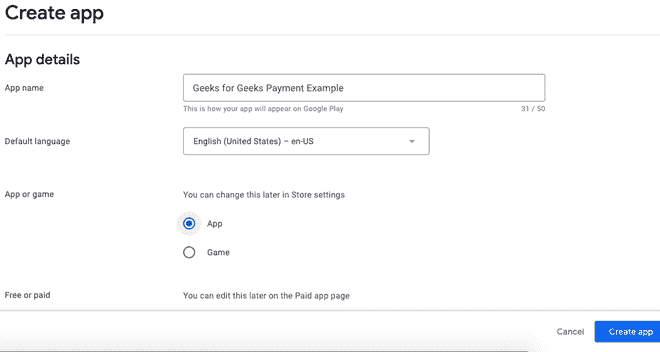
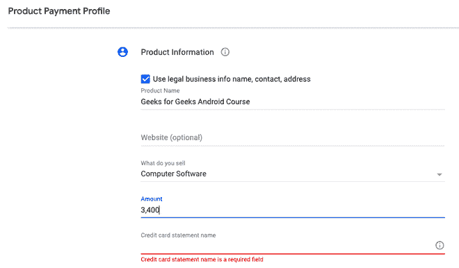

# 如何在安卓系统中实现应用内购买？

> 原文:[https://www . geeksforgeeks . org/如何在安卓中实现应用内购买/](https://www.geeksforgeeks.org/how-to-implement-in-app-purchases-in-android/)

在本文中，我们将了解如何使用计费库在安卓智能手机上进行应用内购买。作为流程的一部分，我们将创建一个应用程序来帮助我们了解应用程序内购买是如何工作的。所以，不再多说，让我们开始吧。我们将从创建一个以空活动作为第一个活动的应用程序开始，将其命名为主活动，并将 XML 文件命名为活动 main.xml

### **分步实施**

**第一步**

在应用程序的 [build.gradle](https://www.geeksforgeeks.org/android-build-gradle/) 文件中，将以下行添加到依赖项部分:

```
dependencies {
    ...
    implementation 'com.android.billingclient:billing:2.0.1'
}
```

**第 2 步**

您还必须在安卓清单中提供计费权限:

```
<uses-permission android:name="com.android.vending.BILLING" />
```

现在我们已经完成了权限和依赖关系的设置，我们必须通过与谷歌 Play 建立连接来开始实现过程。

**第三步**

在主活动中将创建两个变量。

## 我的锅

```
class MainActivity : AppCompatActivity() {
    private lateinit var myBilled: BillingClient
    private val courseList = listOf("geeks_for_geeks_android_course", "geeks_for_geeks_dsa_course")
```

我们生成的第一个变量是 BillingClient 类型，它为库和用户应用程序代码之间的通信提供了主界面，我们还建立了一个 courseList 列表，该列表定义了我们需要购买的产品 id 列表。

**第 4 步**

我们现在将使用 onCreate()方法设置计费客户端。

## 我的锅

```
class MainActivity : AppCompatActivity(), PurchasesUpdatedListener {
    override fun onCreate(savedInstanceState: Bundle?) {
        ..........
        doMyBiller()
    }

    private fun doMyBiller() {
        myBiller = MyBiller.newBuilder(this)
            .enablePendingPurchases()
            .setListener(this)
            .build()
        myBiller.startConnection(object : MyBillerStateListener {
            override fun onBillingSetupFinished(billingResult: BillingResult) {
                if (billingResult.responseCode == MyBiller.BillingResponseCode.OK) {
                    // The MyBiller is setup successfully                 
                }
            }

            override fun onBillingServiceDisconnected() {
              // Do something, like restarting the billing service

            }
        })

}
```

**第 5 步**

现在，让我们在游戏控制台中设置我们的购买产品。首先，登录游戏控制台，从菜单中选择**创建应用程序**。像设置任何其他应用程序一样设置您的应用程序，包括提供诸如应用程序名称、应用程序描述等信息。



图片#1:在 play developer 控制台中创建新的应用程序

收集所有必要的信息，如商店列表和评级，并继续到你只需要提交 APK 或 AAB 的文件。在您完成上述程序后，我们需要开发我们可以购买的产品。为此，当我们填写完上述信息后，我们需要向下滚动以激活它并输入产品的价格。



图 2:设置应用内购买

**按保存！**

**第 6 步**

完成金额和付款后，下一步是加载产品，方法是:

## 我的锅

```
private fun loadBillers() = if (myBiller.isReady) {
    val params = Billers
        .newBuilder()
        .setSkusList(skuList)
        .setType(MyBiller.SkuType.INAPP)
        .build()
    myBiller.queryLoadBillersAsync(params) { billingResult, loadBillersList ->
        // Process the result.
        if (billingResult.responseCode == MyBiller.BillingResponseCode.OK && loadBillersList.isNotEmpty()) {
            for (loadBillers in loadBillersList) {
                // this will return both the billers
                  // from Google Play Console
            }
        }
    }

} else {
    println("Something Wrong")
}
```

**第 7 步**

为了完成购买，我们将使用点击监听器。我们将在步骤 06 的成功回调中为 SKU 提取添加一个成功回调。

## 我的锅

```
if (myBiller.responseCode == BillingClient.BillingResponseCode.OK && myBiller.isNotEmpty()) {
    for (myBillers in myBillers) {
        if (myBiller.sku == "gfg_product_one")
            buyCourseBtn.setOnClickListener {
                val billingFlowParams = BillingFlowParams
                    .newBuilder()
                    .setSkuDetails(skuDetails)
                    .build()
                myBiller.launchBillingFlow(this, billingFlowParams)
            }
    }
}
```

当“我的账单”点击时，账单流量参数以精确的 SKU 数据开始购买流程，账单客户端启动账单流程开始购买指定的 SKU。

**第 8 步**

现在，我们创建一个可变列表，以获取应用程序上所有可购买项目的列表，然后执行应用程序内购买

## 我的锅

```
override fun onPurchasesUpdated(
    myBiller: MyBiller?,
    purchases: MutableList<Purchase>?
) {
    if (myBiller?.replyCode == BillingClient.BillingReplyCode.OK && purchases != null) {
        for (purchase in purchases) {
            acknowledgePurchase(purchase.purchaseToken)

        }
    } else if (myBiller?.replyCode == BillingClient.BillingReplyCode.USER_CANCELED) {
        // User cancelled purchase
    } else {
        // Some other error handling
    }
}
private fun acknowledgePurchase(purchaseToken: String) {
    val params = AcknowledgePurchaseParams.newBuilder()
        .setPurchaseToken(purchaseToken)
        .build()
    billingClient.acknowledgePurchase(params) { myBiller ->
        val replyCode = myBiller.replyCode
        val debugMessage = myBiller.debugMessage
    }
}
```

我们已经完成了任务。只需创建一个签名的 APK 并将其发布到游戏商店，然后等待它被接受。之后，我们要做的就是设置卡片并购买。这篇文章就到这里，希望你对如何在你的应用中实现应用内购买有确切的想法，并开始赚钱！