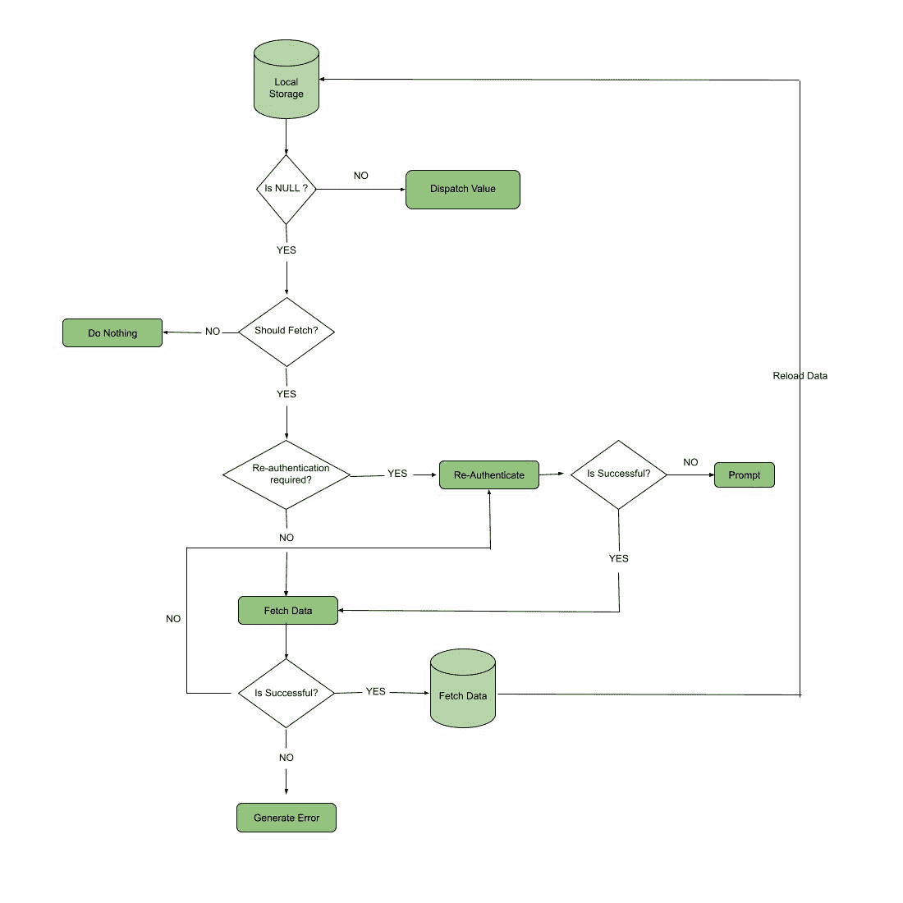
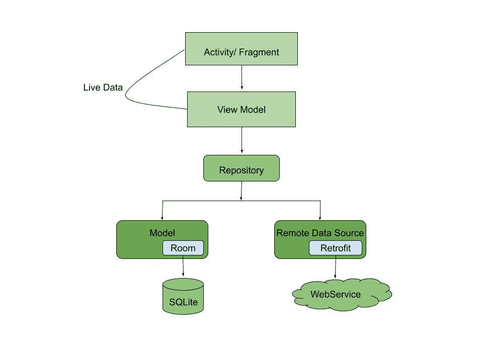

# 如何在安卓系统中使用 NetworkBoundResource 实现离线缓存？

> 原文:[https://www . geesforgeks . org/如何实现-离线-缓存-使用-networkboundresource-in-Android/](https://www.geeksforgeeks.org/how-to-implement-offline-caching-using-networkboundresource-in-android/)

几乎每个需要通过网络获取数据的安卓应用都需要**缓存**。首先，让我们理解**缓存是什么意思？**我们大多数人都使用过需要从网络上获取数据的应用程序。这种采用离线优先架构的应用程序总是试图从本地存储中获取数据。另一方面，如果出现一些故障，它会请求从网络中提取数据，然后将其存储在本地，以备将来检索。数据将存储在 [SQLite 数据库](https://www.geeksforgeeks.org/introduction-to-sqlite/)中。这种架构的优势在于，即使应用程序离线，我们也能够使用它。此外，由于数据被缓存，应用程序的响应速度会更快。为了处理缓存，我们将使用**网络绑定资源。**它是一个辅助类，决定什么时候使用缓存数据，什么时候从 web 获取数据并更新 View。它在两者之间协调。



上面的决策树显示了网络绑定资源算法的算法。

### 算法

让我们看看这个算法的流程:

*   每当用户以离线模式访问应用程序时，数据都会被分派到视图中，它可以是一个片段，也可以是一个活动。
*   如果磁盘中没有数据或数据不足以作为缓存，则它应该通过网络获取数据。
*   它检查是否需要登录(如果用户注销，则需要重新登录)。它会重新进行身份验证，如果成功，它会获取数据，但如果失败，它会提示用户重新进行身份验证。
*   一旦凭据匹配，它就会通过网络获取数据。
*   如果提取阶段失败，它会提示用户。
*   否则，如果成功，则数据会自动存储到本地存储中。然后刷新视图。

这里的要求是，当用户进入在线模式时，用户体验应该有最小的变化。因此，像重新认证、通过网络获取数据和刷新视图这样的过程应该在后台完成。这里需要注意的一点是，如果用户凭据发生了一些变化，如密码或用户名，用户只需要重新登录。

### 履行

为了更好地理解这一点，让我们构建一个应用程序。这是一个简单的新闻应用程序，它使用一个假的应用编程接口从网络上获取数据。让我们看看应用程序的高级设计:

1.  它将使用 [MVVM 建筑](https://www.geeksforgeeks.org/mvvm-model-view-viewmodel-architecture-pattern-in-android/)。
2.  用于缓存数据的 SQLite 数据库。
3.  用科特林流动。(科特林 cor routine
4.  [匕首柄](https://www.geeksforgeeks.org/dependency-injection-with-dagger-2-in-android/)用于依存注射。



上图是将在我们的应用程序中实现的架构的概述。这个架构是安卓推荐开发的一个现代架构良好的安卓应用。让我们开始建设这个项目。

### **分步实施**

**第一步:创建新项目**

要在安卓工作室创建新项目，请参考[如何在安卓工作室创建/启动新项目](https://www.geeksforgeeks.org/android-how-to-create-start-a-new-project-in-android-studio/)。注意选择**科特林**作为编程语言。

**第二步:设置布局**

总是建议首先设置布局，然后实现逻辑。所以我们将首先创建布局。如上所述，我们将从 web 服务中获取数据。由于这是一个示例项目，我们将只从随机数据生成器中获取数据。现在数据是一个汽车列表，其中包括以下属性:

1.  汽车的品牌和型号
2.  汽车变速器
3.  汽车的颜色
4.  汽车的驾驶类型。
5.  汽车的燃料类型。
6.  汽车的车型。

我们将使用[回收视图](https://www.geeksforgeeks.org/android-recyclerview-in-kotlin/)来显示列表。因此，首先需要设计列表中每个元素的外观。接下来是名单。

## 可扩展标记语言

```kt
<?xml version="1.0" encoding="utf-8"?>
<RelativeLayout
    xmlns:android="http://schemas.android.com/apk/res/android"
    xmlns:tools="http://schemas.android.com/tools"
    android:layout_width="match_parent"
    android:layout_height="wrap_content"
    android:layout_margin="4dp">

      <!-- This will display the make and model of the car-->
    <TextView
        android:id="@+id/car_name"
        android:layout_width="wrap_content"
        android:layout_height="wrap_content"
        android:layout_marginStart="8dp"
        android:textColor="@color/black"
        android:textSize="15sp"
        tools:text="Car Name" />

    <!-- This will display the transmission type of the car-->
    <TextView
        android:id="@+id/car_transmission"
        android:layout_width="wrap_content"
        android:layout_height="wrap_content"
        android:layout_alignParentEnd="true"
        android:layout_marginStart="16dp"
        android:layout_marginEnd="16dp"
        android:layout_toEndOf="@id/car_name"
        tools:text="Transmission type" />

      <!-- This will display the colour of the car-->
    <TextView
        android:id="@+id/car_color"
        android:layout_width="wrap_content"
        android:layout_height="wrap_content"
        android:layout_below="@id/car_name"
        android:layout_marginStart="8dp"
        android:layout_marginEnd="8dp"
        tools:text="Car colour" />

   <!-- This will display the drive type of the car-->
    <TextView
        android:id="@+id/car_drive_type"
        android:layout_width="wrap_content"
        android:layout_height="wrap_content"
        android:layout_below="@id/car_name"
        android:layout_marginStart="8dp"
        android:layout_marginEnd="8dp"
        android:layout_toEndOf="@id/car_color"
        tools:text="Car Drive Type" />

    <!-- This will display the fuel type of the car-->
    <TextView
        android:id="@+id/car_fuel_type"
        android:layout_width="wrap_content"
        android:layout_height="wrap_content"
        android:layout_below="@id/car_transmission"
        android:layout_marginStart="8dp"
        android:layout_marginEnd="8dp"
        android:layout_toEndOf="@id/car_drive_type"
        tools:text="Car fuel_type" />

      <!-- This will display the car type of the car-->
    <TextView
        android:id="@+id/car_car_type"
        android:layout_width="wrap_content"
        android:layout_height="wrap_content"
        android:layout_below="@id/car_transmission"
        android:layout_marginStart="8dp"
        android:layout_marginEnd="8dp"
        android:layout_toEndOf="@id/car_fuel_type"
        tools:text="Car Type" />

</RelativeLayout>
```

现在，让我们对列表布局进行编码:

## 可扩展标记语言

```kt
<?xml version="1.0" encoding="utf-8"?>
<RelativeLayout 
    xmlns:android="http://schemas.android.com/apk/res/android"
    xmlns:tools="http://schemas.android.com/tools"
    android:layout_width="match_parent"
    android:layout_height="match_parent"
    tools:context=".CarActivity">

      <!-- The recycler view-->
    <androidx.recyclerview.widget.RecyclerView
        android:id="@+id/recycler_viewer"
        android:layout_width="match_parent"
        android:layout_height="match_parent"
        android:clipToPadding="false"
        android:padding="4dp"
        tools:listitem="@layout/carlist_item" />

      <!--Initially the app will fetch data from the
         web, hence a progress bar for that-->
    <ProgressBar
        android:id="@+id/progress_bar"
        android:layout_width="wrap_content"
        android:layout_height="wrap_content"
        android:layout_centerInParent="true"
        android:visibility="invisible"
        tools:visibility="visible" />

    <!--If the application is not able to 
        fetch/ expose the data to the view-->
    <TextView
        android:id="@+id/text_view_error"
        android:layout_width="wrap_content"
        android:layout_height="wrap_content"
        android:layout_centerInParent="true"
        android:layout_margin="8dp"
        android:gravity="center_horizontal"
        android:visibility="invisible"
        tools:text="Error Message"
        tools:visibility="visible" />

</RelativeLayout>
```

**第三步:现在我们来创建 API 包**

**carlispi . kt**

## 我的锅

```kt
package com.gfg.carlist.api

import com.gfg.carlist.data.CarList
import retrofit2.http.GET

interface CarListAPI {
    // Companion object to hold the base URL
    companion object{
        const val BASE_URL = "https://random-data-api.com/api/"
    }
    // The number of cars can be varied using the size.
    // By default it is kept at 20, but can be tweaked.
    // @GET annotation to make a GET request.
    @GET("vehicle/random_vehicle?size=20")
    // Store the data in a list.
    suspend fun getCarList() : List<CarList>
}
```

**第四步:实现 app 模块**

模块只不过是一个对象类，它为应用程序的源代码提供了一个容器。它封装了与任务相关的数据模型。android 架构建议在视图模型中尽量少使用业务逻辑，因此业务应用程序任务在 app 模块中表示。它将包括三种方法:

*   一种通过改装调用应用编程接口的方法
*   提供列表的方法
*   一种提供数据库或者建立数据库的方法。

**AppModule.kt**

## 我的锅

```kt
package com.gfg.carlist.di

import android.app.Application
import androidx.room.Room
import com.gfg.carlist.api.CarListAPI
import com.gfg.carlist.data.CarListDatabase
import dagger.Module
import dagger.Provides
import dagger.hilt.InstallIn
import dagger.hilt.components.SingletonComponent
import retrofit2.Retrofit
import retrofit2.converter.gson.GsonConverterFactory
import javax.inject.Singleton

@Module
@InstallIn(SingletonComponent::class)
object AppModule {

    @Provides
    @Singleton
    fun provideRetrofit(): Retrofit =
        Retrofit.Builder()
            .baseUrl(CarListAPI.BASE_URL)
            .addConverterFactory(GsonConverterFactory.create())
            .build()

    @Provides
    @Singleton
    fun provideCarListAPI(retrofit: Retrofit): CarListAPI =
        retrofit.create(CarListAPI::class.java)

    @Provides
    @Singleton
    fun provideDatabase(app: Application): CarListDatabase =
        Room.databaseBuilder(app, CarListDatabase::class.java, "carlist_database")
            .build()
}
```

**步骤 5:创建数据类**

我们已经处理完了 API，从 web 服务中获取数据，但是数据存储在哪里呢？让我们创建一个类来存储数据。我们必须创建一个数据类。如果应用程序只是获取和公开数据，那么它将只有一个数据类文件。但是在这里，我们必须获取、公开以及缓存数据。因此，房间在这里开始发挥作用。所以在数据类中，我们必须创建一个实体。

**CarList.kt**

## 我的锅

```kt
package com.gfg.carlist.data

import androidx.room.Entity
import androidx.room.PrimaryKey

// Data Class to store the data
// Here the name of the table is "cars"
@Entity(tableName = "cars")
data class CarList(
    @PrimaryKey val make_and_model: String,
    val color: String,
    val transmission: String,
    val drive_type: String,
    val fuel_type: String,
    val car_type: String
)
```

由于我们将在本地缓存数据，因此需要创建一个数据库。

**carlstd database . kt**

## 我的锅

```kt
package com.gfg.carlist.data

import androidx.room.Database
import androidx.room.RoomDatabase

@Database(entities = [CarList::class], version = 1)
abstract class CarListDatabase : RoomDatabase() {
    abstract fun carsDao(): CarsDao
}
```

因为我们已经创建了一个表，所以我们需要一些查询来从表中检索数据。这是使用 [DAO 或 **D** ata **A** 访问 **O** 对象](https://www.geeksforgeeks.org/data-access-object-pattern/)实现的。

**carsdata . kt**

## 我的锅

```kt
package com.gfg.carlist.data

import androidx.room.Dao
import androidx.room.Insert
import androidx.room.OnConflictStrategy
import androidx.room.Query
import kotlinx.coroutines.flow.Flow

@Dao
interface CarsDao {

    // Query to fetch all the data from the
    // SQLite database
    // No need of suspend method here
    @Query("SELECT * FROM cars")

    // Kotlin flow is an asynchronous stream of values
    fun getAllCars(): Flow<List<CarList>>

    // If a new data is inserted with same primary key
    // It will get replaced by the previous one
    // This ensures that there is always a latest
    // data in the database
    @Insert(onConflict = OnConflictStrategy.REPLACE)

    // The fetching of data should NOT be done on the
    // Main thread. Hence coroutine is used
    // If it is executing on one one thread, it may suspend
    // its execution there, and resume in another one
    suspend fun insertCars(cars: List<CarList>)

    // Once the device comes online, the cached data
    // need to be replaced, i.e. delete it
    // Again it will use coroutine to achieve this task
    @Query("DELETE FROM cars")
    suspend fun deleteAllCars()
}
```

处理 web 服务数据和本地数据的存储库类。

**CarListRepository.kt**

## 我的锅

```kt
package com.gfg.carlist.data

import androidx.room.withTransaction
import com.gfg.carlist.api.CarListAPI
import com.gfg.carlist.util.networkBoundResource
import kotlinx.coroutines.delay
import javax.inject.Inject

class CarListRepository @Inject constructor(
    private val api: CarListAPI,
    private val db: CarListDatabase
) {
    private val carsDao = db.carsDao()

    fun getCars() = networkBoundResource(

        // Query to return the list of all cars
        query = {
            carsDao.getAllCars()
        },

        // Just for testing purpose, 
          // a delay of 2 second is set.
        fetch = {
            delay(2000)
            api.getCarList()
        },

        // Save the results in the table.
        // If data exists, then delete it 
        // and then store.
        saveFetchResult = { CarList ->
            db.withTransaction {
                carsDao.deleteAllCars()
                carsDao.insertCars(CarList)
            }
        }
    )
}
```

**第六步:操作界面**

记得在**第 1 步，**我们创建了一个 RecyclerView 来展示汽车列表。但是这项工作到现在还没有完成。我们需要制作一个适配器和一个视图模型。这两个类共同定义了数据的显示方式。

cara adapter . kt

## 我的锅

```kt
package com.gfg.carlist.features.carlist

import android.view.LayoutInflater
import android.view.ViewGroup
import androidx.recyclerview.widget.DiffUtil
import androidx.recyclerview.widget.ListAdapter
import androidx.recyclerview.widget.RecyclerView
import com.gfg.carlist.data.CarList
import com.gfg.carlist.databinding.CarlistItemBinding

class CarAdapter : ListAdapter<CarList, CarAdapter.CarViewHolder>(CarListComparator()) {
    override fun onCreateViewHolder(parent: ViewGroup, viewType: Int): CarViewHolder {
        val binding =
            CarlistItemBinding.inflate(LayoutInflater.from(parent.context), parent, false)
        return CarViewHolder(binding)
    }

    override fun onBindViewHolder(holder: CarViewHolder, position: Int) {
        val currentItem = getItem(position)
        if (currentItem != null) {
            holder.bind(currentItem)
        }
    }

    // View Holder class to hold the view
    class CarViewHolder(private val binding: CarlistItemBinding) :
        RecyclerView.ViewHolder(binding.root) {
        fun bind(carlist: CarList) {
            binding.apply {
                carName.text = carlist.make_and_model
                carTransmission.text = carlist.transmission
                carColor.text = carlist.color
                carDriveType.text = carlist.drive_type
                carFuelType.text = carlist.fuel_type
                carCarType.text = carlist.car_type
            }
        }
    }

    // Comparator class to check for the changes made.
    // If there are no changes then no need to do anything.
    class CarListComparator : DiffUtil.ItemCallback<CarList>() {
        override fun areItemsTheSame(oldItem: CarList, newItem: CarList) =
            oldItem.make_and_model == newItem.make_and_model

        override fun areContentsTheSame(oldItem: CarList, newItem: CarList) =
            oldItem == newItem
    }
}
```

**carlistisviewmodel . kt】的缩写**

## 我的锅

```kt
package com.gfg.carlist.features.carlist

import androidx.lifecycle.ViewModel
import androidx.lifecycle.asLiveData
import com.gfg.carlist.data.CarListRepository
import dagger.hilt.android.lifecycle.HiltViewModel
import javax.inject.Inject

// Using Dagger Hilt library to 
// inject the data into the view model
@HiltViewModel
class CarListViewModel @Inject constructor(
    repository: CarListRepository
) : ViewModel() {
    val cars = repository.getCars().asLiveData()
}
```