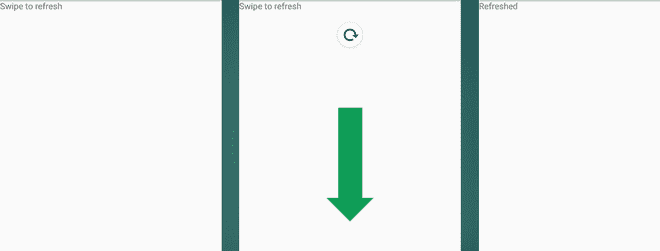

# 如何在安卓系统中实现向下滑动刷新

> 原文:[https://www . geeksforgeeks . org/如何在 android 中实施-向下滑动-刷新-使用 android-studio/](https://www.geeksforgeeks.org/how-to-implement-swipe-down-to-refresh-in-android-using-android-studio/)

某些应用程序向用户显示实时数据，如股票价格、在线商店产品的可用性等。显示实时数据需要应用程序的持续同步，这可以通过实现一个程序(如线程)来实现。线程可以由应用程序启动，并隐式或显式地更新实时信息。这里的交易是以设备的额外内存、缓存和电池为代价不断更新数据(可能来自服务器)，导致低性能，因为永远运行的线程会占用一些空间并需要电力。为了避免使用这样的程序，开发人员显式地开发了一个用于刷新应用程序的功能，以便用户可以在任何需要的时候执行它。这让我们得出结论，手动刷新具有以下优势:

1.  内存优化
2.  高速缓冲存储器优化
3.  电池寿命优化
4.  避免不必要的回调。

例如，在下图中，当用户向下滑动屏幕时，字符串“滑动以刷新”将更改为“刷新”。



### 方法:

**步骤 1:** 在开始编写代码之前，有必要在[构建中添加一个**滑动刷新布局依赖项**。应用程序的渐变](https://www.geeksforgeeks.org/android-build-gradle/)以启用滑动布局。这种依赖性是:

> *实现“androidx . swiperefershlayout:swiperefershlayout:1 . 1 . 0”*

**第二步:**重要的是从前端*“***activity _ main . XML***开始。C* 创建一个 swipereffreshlayout**刷新布局并添加一个 [TextView](https://www.geeksforgeeks.org/textview-in-kotlin/) 在屏幕上显示字符串并为其提供一定的 id。**

## **可扩展标记语言**

```kt
<?xml version="1.0" encoding="utf-8"?>
<RelativeLayout 
    xmlns:android="http://schemas.android.com/apk/res/android"
    xmlns:app="http://schemas.android.com/apk/res-auto"
    xmlns:tools="http://schemas.android.com/tools"
    android:layout_width="match_parent"
    android:layout_height="match_parent"
    tools:context=".MainActivity">

    <!--Swipe Refresh Layout -->
    <androidx.swiperefreshlayout.widget.SwipeRefreshLayout
    android:id="@+id/refreshLayout"
    android:layout_width="match_parent"
    android:layout_height="match_parent">

    <!--TextView -->
    <TextView
        android:id="@+id/tv1"
        android:layout_width="wrap_content"
        android:layout_height="wrap_content"
        android:text="Swipe to refresh"
        />
    </androidx.swiperefreshlayout.widget.SwipeRefreshLayout>

</RelativeLayout>
```

 ****第三步:**来到***主活动**文件，下面提供了同样的预览。在这个文件中，通过使用 **findViewById()** 方法将 swipeRefreshLayout 和 textView 连接到它的 XML 文件。并且还调用**setonrefreslistener()**在用户向下滑动屏幕后更改文本。用户也可以根据需要在这个方法中编写所需的代码。***

## ***我的锅***

```kt
*import android.annotation.SuppressLint
import androidx.appcompat.app.AppCompatActivity
import android.os.Bundle
import android.widget.TextView
import androidx.swiperefreshlayout.widget.SwipeRefreshLayout
import org.w3c.dom.Text

class MainActivity : AppCompatActivity() {
    @SuppressLint("SetTextI18n")
    override fun onCreate(savedInstanceState: Bundle?) {
        super.onCreate(savedInstanceState)
        setContentView(R.layout.activity_main)       

    // Declaring a layout (changes are to be made to this)
    // Declaring a textview (which is inside the layout)
    val swipeRefreshLayout = findViewById<SwipeRefreshLayout>(R.id.refreshLayout)
    val textView = findViewById<TextView>(R.id.tv1)

    // Refresh function for the layout
    swipeRefreshLayout.setOnRefreshListener{

      // Your code goes here
      // In this code, we are just changing the text in the 
      // textbox
      textView.text = "Refreshed"

      // This line is important as it explicitly refreshes only once
      // If "true" it implicitly refreshes forever
      swipeRefreshLayout.isRefreshing = false
        }
    }
}*
```

## ***Java 语言(一种计算机语言，尤用于创建网站)***

```kt
*import android.annotation.SuppressLint
import androidx.appcompat.app.AppCompatActivity
import android.os.Bundle
import android.widget.TextView
import androidx.swiperefreshlayout.widget.SwipeRefreshLayout
import org.w3c.dom.Text

public class MainActivity extends AppCompatActivity {

 @Override
    protected void onCreate(Bundle savedInstanceState) {
        super.onCreate(savedInstanceState);
        setContentView(R.layout.activity_main);

    // Declaring a layout (changes are to be made to this)
    // Declaring a textview (which is inside the layout)
    SwipeRefreshLayout swipeRefreshLayout = (SwipeRefreshLayout)findViewById(R.id.refreshLayout);   
    TextView textView = (TextView)findViewById(R.id.tv1);

    // Refresh  the layout
    swipeRefreshLayout.setOnRefreshListener(
    new SwipeRefreshLayout.OnRefreshListener() {
        @Override
        public void onRefresh() {

          // Your code goes here
          // In this code, we are just 
          // changing the text in the textbox
          textView.text = "Refreshed"

          // This line is important as it explicitly 
          // refreshes only once
          // If "true" it implicitly refreshes forever
          swipeRefreshLayout.setRefreshing(false);
            }
        }
    );
 }
}*
```

### ***输出:在模拟器上运行***

***<video class="wp-video-shortcode" id="video-467021-1" width="640" height="360" preload="metadata" controls=""><source type="video/mp4" src="https://media.geeksforgeeks.org/wp-content/uploads/20200810124256/InShot_20200810_124053014.mp4?_=1">[https://media.geeksforgeeks.org/wp-content/uploads/20200810124256/InShot_20200810_124053014.mp4](https://media.geeksforgeeks.org/wp-content/uploads/20200810124256/InShot_20200810_124053014.mp4)</video>***

### *****优势*****

***当然，受益的不仅仅是用户。假设有一个应用程序，信息直接从云存储库中获取。对于每个回调请求(向云)，拥有这样一个存储库的开发人员向服务支付最低金额，可能是[谷歌云平台(GCP)](https://www.geeksforgeeks.org/what-is-google-cloud-platform-gcp/) 、[亚马逊网络服务(AWS)](https://www.geeksforgeeks.org/introduction-to-amazon-web-services/) ，或任何其他东西。***