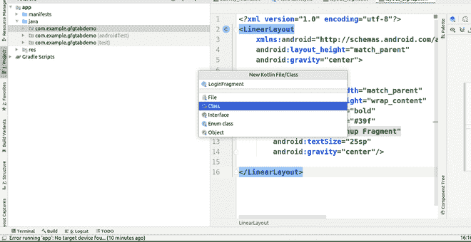

# 如何用 Kotlin 在安卓中实现标签页、视图页和片段？

> 原文:[https://www . geeksforgeeks . org/如何实现-tab-view pager-和-fragment-in-Android-using-kot Lin/](https://www.geeksforgeeks.org/how-to-implement-tabs-viewpager-and-fragment-in-android-using-kotlin/)

在一些安卓应用中，使用**标签**，开发者可以在一个活动中组合多个任务(操作)。另一方面，它为该应用提供了不同的外观。还可以通过使用 [**【查看寻呼机】**](https://www.geeksforgeeks.org/how-to-implement-a-tablayout-in-android-using-viewpager-and-fragments/) 提供不同的感觉，如左右滑动。而要实现这个主题，需要的术语很少，比如**视图页面**、[片段](https://www.geeksforgeeks.org/introduction-fragments-android/)、**表格布局**。出于练习的目的，本文使用了 **Kotlin** 编程语言。

### **是什么 **TabLayout、ViewPager** 、**和 Fragment？****

*   **[**TabLayout**](https://www.geeksforgeeks.org/how-to-implement-a-tablayout-in-android-using-viewpager-and-fragments/)**:**这个视图可以让我们利用安卓 app 中的多个标签页。该**布局**保存不同的选项卡。在本文中，选项卡用于从一个片段导航到另一个片段。**
*   **[**视图寻呼机**](https://www.geeksforgeeks.org/how-to-implement-a-tablayout-in-android-using-viewpager-and-fragments/) **:** 该视图允许我们利用左右滑动功能显示另一个片段。**
*   **[**碎片**](https://www.geeksforgeeks.org/introduction-fragments-android/) **:** 这是**活动**的一部分。这个视图对于在一个活动中完成多个任务是必要的。**片段**还根据需要使用包含视图的布局文件。**

**下面给出了一个 GIF 示例，来了解一下在这篇文章中要做什么。**

****

### **逐步实施**

****第一步:创建新项目****

**要在安卓工作室创建新项目，请参考[如何在安卓工作室创建/启动新项目](https://www.geeksforgeeks.org/android-how-to-create-start-a-new-project-in-android-studio/)。注意选择**科特林**作为编程语言。**

****第二步:创建片段****

*   **转到应用>资源>布局>右键单击>新建>布局资源文件，然后询问文件名，然后给出“**布局 _ 登录**”作为该布局文件的名称。**
*   **用同样的方法创建另一个布局文件“**layout _ signature**”。**
*   **之后，对“ **layout_login.xml** ”文件使用以下代码。这里显示了一个[文本视图](https://www.geeksforgeeks.org/textview-in-kotlin/)。**

## **可扩展标记语言**

```kt
<?xml version="1.0" encoding="utf-8"?>
<!-- This linear layout is used to show elements
     in vertical or in horizontal linear manner -->
<LinearLayout
    xmlns:android="http://schemas.android.com/apk/res/android"
    android:layout_width="match_parent"
    android:layout_height="match_parent"
    android:gravity="center">

    <!-- This TextView indicates new fragment is open -->
    <TextView
        android:layout_width="match_parent"
        android:layout_height="wrap_content"
        android:gravity="center"
        android:text="Login Fragment"
        android:textColor="#0F9D58"
        android:textSize="25sp"
        android:textStyle="bold" />

</LinearLayout>
```

*   **下面是**layout _ signature . XML**文件的代码。**

## **可扩展标记语言**

```kt
<?xml version="1.0" encoding="utf-8"?>
<!-- This linear layout is used to show elements
     in vertical or in horizontal linear manner -->
<LinearLayout
    xmlns:android="http://schemas.android.com/apk/res/android"
    android:layout_width="match_parent"
    android:layout_height="match_parent"
    android:gravity="center">

    <!-- This TextView indicates new fragment is open -->
    <TextView
        android:layout_width="match_parent"
        android:layout_height="wrap_content"
        android:gravity="center"
        android:text="Signup Fragment"
        android:textColor="#0F9D58"
        android:textSize="25sp"
        android:textStyle="bold" />

</LinearLayout>
```

*   **要创建 Fragment 类，右键单击位于**app>java>“com . example . gfgtabdemo”**的 Java 目录的第一个包，其中“gfgtabdemo”是一个小案例中的项目名称。将光标移到“**新**上，选择“**科特林文件/类**”。**

****

*   **将“ **LoginFragment** ”作为该文件的名称，并选择“**类**”选项，如下图所示。**

****

*   **要创建一个**片段**，需要使用“:”符号使这个类成为片段类的子类。并覆盖“ **onCreateView** ”方法，将布局资源文件设置为该片段文件，如下面的代码片段所示。**
*   **使用以上步骤创建“**签名文件**”文件。**
*   **之后，在“ **LoginFragment.kt** ”文件中使用以下代码。**

## **我的锅**

```kt
import android.os.Bundle
import android.view.LayoutInflater
import android.view.View
import android.view.ViewGroup
import androidx.fragment.app.Fragment

// Here ":" symbol is indicate that LoginFragment
// is child class of Fragment Class
class LoginFragment : Fragment() {
    override fun onCreateView(
        inflater: LayoutInflater, container: ViewGroup?, savedInstanceState: Bundle?
    ): View? {
        return inflater.inflate(
            R.layout.layout_login, container, false
        )
    }
    // Here "layout_login" is a name of layout file
    // created for LoginFragment
}
```

*   **在“**SignupAgment . kt**”文件中使用以下代码。**

## **我的锅**

```kt
import android.os.Bundle
import android.view.LayoutInflater
import android.view.View
import android.view.ViewGroup
import androidx.fragment.app.Fragment

// Here ":" symbol is indicate that SignupFragment
// is child class of Fragment Class
class SignupFragment : Fragment() {
    override fun onCreateView(
        inflater: LayoutInflater, container: ViewGroup?, savedInstanceState: Bundle?
    ): View? {
        return inflater.inflate(
            R.layout.layout_signup, container, false
        )
    }
    // Here "layout_signup" is a name of layout file
    // created for SignFragment
}
```

****第三步:主题配置****

*   **打开位于文件夹 **app > res >值>style . XML**内的**style . XML**，如下图所示。**

****

*   **在**style . XML**中的<resources>标签内添加以下代码。</resources>**

## **可扩展标记语言**

```kt
<style name="AppTheme.NoActionBar">
        <item name="windowActionBar">false</item>
        <item name="windowNoTitle">true</item>
</style>

<style name="AppTheme.AppBarOverlay"
       parent="ThemeOverlay.AppCompat.Dark.ActionBar" />

<style name="AppTheme.PopupOverlay"
       parent="ThemeOverlay.AppCompat.Light" />
```