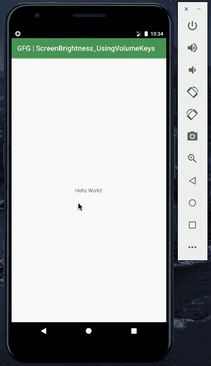

# 如何在安卓系统中编程使用音量键增加/减少屏幕亮度？

> 原文:[https://www . geesforgeks . org/如何增加-减少-屏幕亮度-使用-音量-按键-在安卓中以编程方式/](https://www.geeksforgeeks.org/how-to-increase-decrease-screen-brightness-using-volume-keys-programmatically-in-android/)

屏幕亮度是直接影响用户和设备电池的因素之一。安卓设备是智能系统，内置自动亮度系统。但大多数情况下，用户不会检查或默认设置该功能。无论此功能是存在、开启或关闭，还是在任何设备中缺失，开发人员都必须考虑到这一点，并开发一个优化的应用程序。在应用程序内部声明的任何内容都可能对外部空间产生影响，也就是说，如果屏幕亮度是从应用程序以编程方式更改的，即使退出应用程序后，亮度值也可能保持不变。因此，在用户退出之前，必须尝试追溯原件并设置它们。

### **我们在哪里可以使用这个功能？**

1.  **非媒体:**非媒体(音乐或视频)应用程序可以使用音量按钮逐步增加或降低屏幕亮度。
2.  **图书阅读器应用程序:**阅读图书有时可能是一个喜怒无常的选择，人们可以直接从应用程序中逐步增加或减少亮度。
3.  **新闻纸应用:**可以直接从应用中分步增加或减少亮度。

通过这篇文章，我们想让你知道音量按钮可以用来增加和降低屏幕亮度。下面给出一个 GIF 示例，来了解一下在本文 中我们要做什么。 注意，我们要用 **Kotlin** 语言来实现这个项目。



### **接近**

**第一步:创建新项目**

要在安卓工作室创建新项目，请参考[如何在安卓工作室创建/启动新项目](https://www.geeksforgeeks.org/android-how-to-create-start-a-new-project-in-android-studio/)。注意选择**科特林**作为编程语言。

**步骤 2:使用 AndroidManifest.xml 文件**

控制设备屏幕亮度需要更改根设置，为此在[**androidmanifest . XML**](https://www.geeksforgeeks.org/application-manifest-file-android/)文件中声明 **WRITE_SETTINGS** 的**use-permission**。

> *<使用-权限安卓:name=“安卓. permission . write _ SETTINGS”*
> 
> *工具:忽略=“受保护的权限”/>T1】*

下面是 **和** 文件的代码。

## 可扩展标记语言

```
<?xml version="1.0" encoding="utf-8"?>
<manifest 
    xmlns:android="http://schemas.android.com/apk/res/android"
    xmlns:tools="http://schemas.android.com/tools"
    package="org.geeksforgeeks.screenbrightness_usingvolumekeys">

      <!--Add this permission-->
    <uses-permission android:name="android.permission.WRITE_SETTINGS"
        tools:ignore="ProtectedPermissions" />

    <application
        android:allowBackup="true"
        android:icon="@mipmap/ic_launcher"
        android:label="@string/app_name"
        android:roundIcon="@mipmap/ic_launcher_round"
        android:supportsRtl="true"
        android:theme="@style/AppTheme">
        <activity android:name=".MainActivity">
            <intent-filter>
                <action android:name="android.intent.action.MAIN" />

                <category android:name="android.intent.category.LAUNCHER" />
            </intent-filter>
        </activity>
    </application>

</manifest>
```

**步骤 3:使用 activity_main.xml 文件**

与 **activity_main.xml** 文件无关。所以保持文件原样。

## 可扩展标记语言

```
<?xml version="1.0" encoding="utf-8"?>
<androidx.constraintlayout.widget.ConstraintLayout 
    xmlns:android="http://schemas.android.com/apk/res/android"
    xmlns:app="http://schemas.android.com/apk/res-auto"
    xmlns:tools="http://schemas.android.com/tools"
    android:layout_width="match_parent"
    android:layout_height="match_parent"
    tools:context=".MainActivity">

    <TextView
        android:layout_width="wrap_content"
        android:layout_height="wrap_content"
        android:text="Hello World!"
        app:layout_constraintBottom_toBottomOf="parent"
        app:layout_constraintLeft_toLeftOf="parent"
        app:layout_constraintRight_toRightOf="parent"
        app:layout_constraintTop_toTopOf="parent" />

</androidx.constraintlayout.widget.ConstraintLayout>
```

**第 4 步:使用 MainActivity.kt 文件**

最后转到 **MainActivity.kt** 文件，参考下面的代码。下面是 **MainActivity.kt** 文件的代码。代码中添加了注释，以更详细地理解代码。

## 我的锅

```
import android.content.Context
import android.content.Intent
import android.os.Build
import android.os.Bundle
import android.provider.Settings
import android.view.KeyEvent
import android.widget.Toast
import androidx.annotation.RequiresApi
import androidx.appcompat.app.AppCompatActivity
import kotlin.math.round

class MainActivity : AppCompatActivity() {

    var brightnessValue = 255

    @RequiresApi(Build.VERSION_CODES.M)
    override fun onCreate(savedInstanceState: Bundle?) {
        super.onCreate(savedInstanceState)
        setContentView(R.layout.activity_main)
    }

    // Function to decrease the brightness
    @RequiresApi(Build.VERSION_CODES.M)
    fun decrease() { // Get app context object.

        val context = applicationContext

        // Check whether has the write settings permission or not.
        val settingsCanWrite = hasWriteSettingsPermission(context)

        // If do not have then open the Can modify system settings panel.
        if (!settingsCanWrite) {
            changeWriteSettingsPermission(context)
        } else {
            if (brightnessValue >= 11) {
                brightnessValue -= 10
                changeScreenBrightness(context, brightnessValue)
                val k = brightnessValue.toDouble() / 255
                Toast.makeText(
                    applicationContext, "Brightness : ${round(k * 100)}%",
                    Toast.LENGTH_SHORT
                ).show()
            }
        }
    }

    // Function to increase the brightness
    @RequiresApi(Build.VERSION_CODES.M)
    fun increase() {
        val context = applicationContext

        // Check whether has the write settings permission or not.
        val settingsCanWrite = hasWriteSettingsPermission(context)

        // If do not have then open the Can modify system settings panel.
        if (!settingsCanWrite) {
            changeWriteSettingsPermission(context)
        } else {
            if (brightnessValue <= 245) {
                brightnessValue += 10
                changeScreenBrightness(context, brightnessValue)
                val k = brightnessValue.toDouble() / 255
                Toast.makeText(
                    applicationContext, "Brightness : ${round(k * 100)}%",
                    Toast.LENGTH_SHORT
                ).show()
            }
        }
    }

    // Listen to the volume keys
    @RequiresApi(Build.VERSION_CODES.M)
    override fun onKeyDown(keyCode: Int, event: KeyEvent?): Boolean {

        // What happens when volume down key is pressed
        if (keyCode == KeyEvent.KEYCODE_VOLUME_DOWN) {
            decrease()
        }

        // What happens when volume up key is pressed
        if (keyCode == KeyEvent.KEYCODE_VOLUME_UP) {
            increase()
        }
        return true
    }

    // Check whether this app has android write settings permission.
    @RequiresApi(Build.VERSION_CODES.M)
    private fun hasWriteSettingsPermission(context: Context): Boolean {
        var ret = true
        // Get the result from below code.
        ret = Settings.System.canWrite(context)
        return ret
    }

    // Start can modify system settings panel to let 
    // user change the write settings permission.
    private fun changeWriteSettingsPermission(context: Context) {
        val intent = Intent(Settings.ACTION_MANAGE_WRITE_SETTINGS)
        context.startActivity(intent)
    }

    // This function only take effect in real physical android device,
    // it can not take effect in android emulator.
    private fun changeScreenBrightness(context: Context, screenBrightnessValue: Int) {
        // Change the screen brightness change mode to manual.
        Settings.System.putInt(
            context.contentResolver,
            Settings.System.SCREEN_BRIGHTNESS_MODE,
            Settings.System.SCREEN_BRIGHTNESS_MODE_MANUAL
        )
        // Apply the screen brightness value to the system, this will change 
        // the value in Settings ---> Display ---> Brightness level.
        // It will also change the screen brightness for the device.
        Settings.System.putInt(
            context.contentResolver, Settings.System.SCREEN_BRIGHTNESS,
            screenBrightnessValue
        )
    }
}
```

### **输出:在仿真器上运行**

请注意，在运行应用程序之前，请确保您已经**被授予了所需的权限**，否则应用程序将会崩溃。

<video class="wp-video-shortcode" id="video-497123-1" width="640" height="360" preload="metadata" controls=""><source type="video/mp4" src="https://media.geeksforgeeks.org/wp-content/uploads/20201001103725/Screen-Recording-2020-09-22-at-22.34.28.mp4?_=1">[https://media.geeksforgeeks.org/wp-content/uploads/20201001103725/Screen-Recording-2020-09-22-at-22.34.28.mp4](https://media.geeksforgeeks.org/wp-content/uploads/20201001103725/Screen-Recording-2020-09-22-at-22.34.28.mp4)</video>