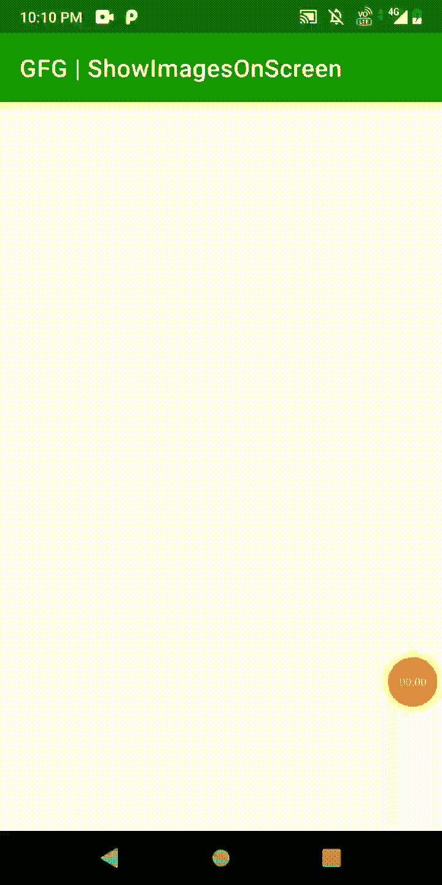

# 如何在安卓中的触摸坐标处将图像插入屏幕？

> 原文:[https://www . geesforgeks . org/如何在安卓触摸坐标屏幕上插入图像/](https://www.geeksforgeeks.org/how-to-insert-image-to-screen-at-the-touched-coordinates-in-android/)

在本文中，我们将学习在屏幕上的触摸坐标上放置图像。我们可以在屏幕上插入多个图像。[**【onTouchListener】**](https://developer.android.com/reference/android/view/View.OnTouchListener)将用于获取屏幕上触摸位置的坐标，以便可以在该位置插入图像。下面给出了一个示例 GIF，以了解我们将在本文中做什么。注意，我们将使用**柯特林**语言来实现这个项目。



### **分步实施**

**第一步:创建新项目**

要在安卓工作室创建新项目，请参考[如何在安卓工作室创建/启动新项目](https://www.geeksforgeeks.org/android-how-to-create-start-a-new-project-in-android-studio/)。注意选择**科特林**作为编程语言。

**第二步:在布局中设置相对布局**

导航到**应用程序> res >布局> activity_main.xml** 并将下面的代码添加到该文件中。下面是 **activity_main.xml** 文件的代码。

## 可扩展标记语言

```
<?xml version="1.0" encoding="utf-8"?>
<RelativeLayout 
    xmlns:android="http://schemas.android.com/apk/res/android"
    xmlns:tools="http://schemas.android.com/tools"
    android:id="@+id/layout"
    android:layout_width="match_parent"
    android:layout_height="match_parent"
    tools:context=".MainActivity">
</RelativeLayout>
```

**第三步:使用 MainActivity.kt 文件**

转到 **MainActivity.kt** 文件，参考以下代码。下面是 **MainActivity.kt** 文件的代码。代码中添加了注释，以更详细地理解代码。

## 我的锅

```
import android.annotation.SuppressLint
import android.os.Bundle
import android.view.MotionEvent
import android.view.ViewGroup
import android.widget.ImageView
import android.widget.RelativeLayout
import androidx.appcompat.app.AppCompatActivity

class MainActivity : AppCompatActivity() {

    lateinit var areaLayout: RelativeLayout

    @SuppressLint("ClickableViewAccessibility")
    override fun onCreate(savedInstanceState: Bundle?) {
        super.onCreate(savedInstanceState)
        setContentView(R.layout.activity_main)
        areaLayout = findViewById(R.id.layout)

        areaLayout.setOnTouchListener { view, event ->
            if (event.action == MotionEvent.ACTION_DOWN) {
                val x = event.x.toInt()  // get x-Coordinate
                val y = event.y.toInt()  // get y-Coordinate
                val lp = RelativeLayout.LayoutParams(RelativeLayout.LayoutParams.WRAP_CONTENT,
                        RelativeLayout.LayoutParams.WRAP_CONTENT) // Assuming you use a RelativeLayout
                val iv = ImageView(applicationContext)
                lp.setMargins(x, y, 0, 0) // set margins
                iv.layoutParams = lp
                iv.setImageDrawable(resources.getDrawable(R.drawable.flower)) // set the image from drawable
                (view as ViewGroup).addView(iv) // add a View programmatically to the ViewGroup
            }
            true
        }
    }
}
```

现在，运行应用程序

**输出:**

<video class="wp-video-shortcode" id="video-668036-1" width="640" height="360" preload="metadata" controls=""><source type="video/mp4" src="https://media.geeksforgeeks.org/wp-content/uploads/20210808223350/insertImage.mp4?_=1">[https://media.geeksforgeeks.org/wp-content/uploads/20210808223350/insertImage.mp4](https://media.geeksforgeeks.org/wp-content/uploads/20210808223350/insertImage.mp4)</video>

**源代码:** [点击此处](https://media.geeksforgeeks.org/wp-content/cdn-uploads/20210823161649/insertImageTouchedPoasition-GFGarticle-main.zip)