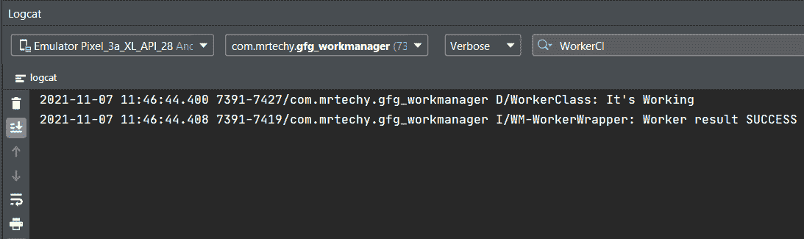
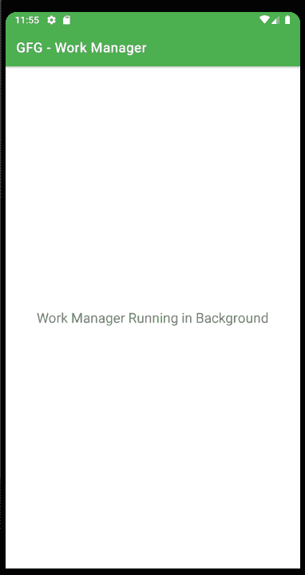

# 如何在安卓系统中集成工作管理器？

> 原文:[https://www . geesforgeks . org/如何在安卓系统中集成工作管理器/](https://www.geeksforgeeks.org/how-to-integrate-work-manager-in-android/)

在我们的日常生活中，我们在手机上使用闹钟、任务提醒等应用程序。早期运行后台任务在安卓系统中是一项非常艰巨的任务，但现在在**工作管理器**的帮助下，我们可以轻松安排任务。工作管理器是安卓 Jetpack 的一个库。它允许应用程序在后台做事情，即使当应用程序退出或设备重启时。在这篇文章中，我们将学习如何将工作管理器集成到你的安卓应用程序中，这使得我们的工作在安排任务&提醒时变得容易。

### **分步实施**

**第一步:创建新项目**

要在安卓工作室创建新项目，请参考[如何在安卓工作室创建/启动新项目。](https://www.geeksforgeeks.org/android-how-to-create-start-a-new-project-in-android-studio/)注意选择**科特林**作为编程语言。

**第二步:在你的等级文件中添加依赖关系。**

导航到**梯度脚本>构建.梯度(模块:应用)**并添加以下代码。

```kt
implementation("androidx.work:work-runtime-ktx:2.7.0")
```

**第三步:创建工人类**

创建一个类，然后在该类上扩展 Worker Class，并覆盖其 **doWork()** 方法。无论您想在后台执行什么任务，都要在 doWork()方法上编写。它负责执行这项任务。

## 我的锅

```kt
import android.content.Context
import android.util.Log
import androidx.work.Worker
import androidx.work.WorkerParameters

class WorkerClass(appContext: Context, workerParams: WorkerParameters): Worker(appContext, workerParams) {

    override fun doWork(): Result {

        // Enter work details to perform on background
          // Log.d is used to for debugging purposes
        Log.d("WorkerClass","It's Working")

        // Task result
        return Result.success()
    }
}
```

从 doWork()返回的结果通知工作管理器工作是否成功，如果失败，是否应该重试工作。这些是**结果.成功()，结果.失败()，结果.重试()。**

**第 4 步:使用 MainActivity.kt 文件**

在我们的主活动文件中，我们将创建一个工作请求。通过替换类和活动的名称，将以下代码添加到您的文件中。

## 我的锅

```kt
package com.mrtechy.gfg_workmanager

import WorkerClass
import androidx.appcompat.app.AppCompatActivity
import android.os.Bundle
import androidx.work.OneTimeWorkRequestBuilder
import androidx.work.WorkManager
import androidx.work.WorkRequest

class MainActivity : AppCompatActivity() {
    override fun onCreate(savedInstanceState: Bundle?) {
        super.onCreate(savedInstanceState)
        setContentView(R.layout.activity_main)

        // Created a Work Request
        val uploadWorkRequest: WorkRequest = OneTimeWorkRequestBuilder<WorkerClass>().build()

        // Submit the WorkRequest to the system
        WorkManager.getInstance(this).enqueue(uploadWorkRequest)

    }
}
```

**输出:**我们使用了 **Log.d** 在 logcat 窗口中显示输出。

**对数猫输出：**



日志猫

**App 输出:**



输出