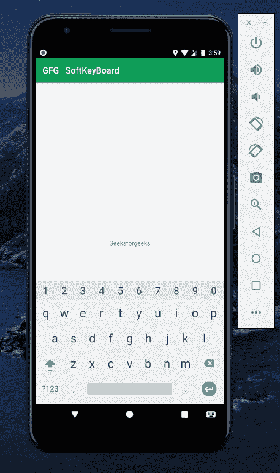

# 如何在安卓中编程调用键盘？

> 原文:[https://www . geesforgeks . org/如何在安卓中以编程方式调用键盘/](https://www.geeksforgeeks.org/how-to-invoke-keyboard-programmatically-in-android/)

默认情况下，当任何用户界面元素(如输入文本元素)获得焦点时，安卓系统都会显示一个屏幕键盘。为了获得更好的体验，开发人员可以明确指定所需的特性或任何要调用的方法。期望的特征可以是字符，例如只允许数字、只允许字母或任何其他类似的东西。期望的方法可以是提供自动校正功能或提供表情符号。输入文本字段可能出现在布局中，除非被调用，否则开发人员不希望它获得焦点，反之亦然。因为如果它获得焦点，软键盘就会被调用，并且与实际的上下文完全不同。类似地，如果在显示任何上下文之前需要输入，则相反的情况会被说服。通过这篇文章，我们想与您分享我们如何调用软键盘，这可以应用于任何所需的应用程序。注意 我们将使用 **科特林** 语言实施本项目。

### 履行

键盘通常由输入法调用，如[编辑文本](https://www.geeksforgeeks.org/android-edittext-in-kotlin/)，然而我们可以在没有这些输入法的情况下调用它们。有两种**方法**我们可以完成这个任务，通过对以下方面进行相当大的改变:

1.  [AndroidManifest.xml](https://www.geeksforgeeks.org/application-manifest-file-android/) 文件(或)
2.  MainActivity.kt 文件

### 方法

**第一步:创建新项目**

要在安卓工作室创建新项目，请参考[如何在安卓工作室创建/启动新项目](https://www.geeksforgeeks.org/android-how-to-create-start-a-new-project-in-android-studio/)。注意选择**科特林**作为编程语言。

**第二步:转到 AndroidManifest.xml 文件或 MainActivity.kt 文件**

转到 **AndroidManifest.xml 文件或 MainActivity.kt 文件**并参考以下代码。请注意，这两种方法都可以一次实现。

**方法 1:使用 AndroidManifest.xml 文件**

## 可扩展标记语言

```kt
<?xml version="1.0" encoding="utf-8"?>
<manifest xmlns:android="http://schemas.android.com/apk/res/android"
    package="com.example.ao1">

    <application
        android:allowBackup="true"
        android:icon="@mipmap/ic_launcher"
        android:label="@string/app_name"
        android:roundIcon="@mipmap/ic_launcher_round"
        android:supportsRtl="true"
        android:theme="@style/AppTheme">
        <activity android:name=".MainActivity"
        android:windowSoftInputMode="stateVisible"> <!--This entitity was
                                    explicitly added for desired result-->
            <intent-filter>
                <action android:name="android.intent.action.MAIN" />

                <category android:name="android.intent.category.LAUNCHER" />
            </intent-filter>
        </activity>
    </application>

</manifest>

<!--Refer here Again
android:windowSoftInputMode="stateVisible"
-->
```

**方法 2:使用 MainActivity.kt 文件**

## 我的锅

```kt
import android.os.Bundle
import android.view.WindowManager
import androidx.appcompat.app.AppCompatActivity

class MainActivity : AppCompatActivity() {
    override fun onCreate(savedInstanceState: Bundle?) {
        super.onCreate(savedInstanceState)
        setContentView(R.layout.activity_main)

        // Calls Soft Input Mode to make it Visible
        window.setSoftInputMode(WindowManager.LayoutParams.SOFT_INPUT_STATE_VISIBLE)
    }
}
```

### 仿真器中观察到的两种方法的输出:

