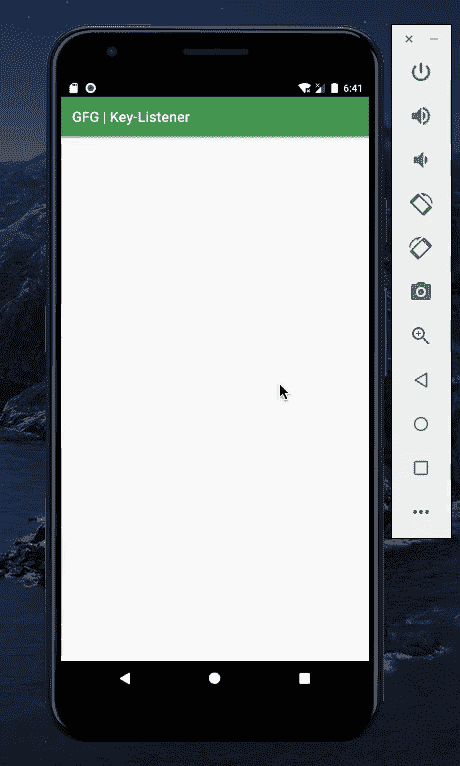

# 如何在安卓中编程监听音量按钮和后退键事件？

> 原文:[https://www . geeksforgeeks . org/如何在安卓中以编程方式收听音量按钮和后退键事件/](https://www.geeksforgeeks.org/how-to-listen-for-volume-button-and-back-key-events-programmatically-in-android/)

通过生产，安卓设备配备了特定的物理按键，如音量键、电源键、后退键、主页键和活动键。这些键对按下有反应。相同的按键根据按键的性质有特定的功能。单次按下音量键可增加或减少音量。类似地，一次按下电源键即可锁定设备，但长时间按下电源键可打开或关闭设备。本文将创建一个响应按键的应用程序，并生成一条确认相同内容的消息。这个想法可以进一步实现，以创建有用的应用程序:

1.  **游戏应用程序:**物理按键可用于游戏中所需的动作。
2.  **氛围:**音量键可以用来增加或降低屏幕亮度，而不是用传统方式。
3.  **其他应用快捷方式:**长按 home 键会弹出 Google Assistant，可以做类似的快捷方式。

本文旨在突破这一过程的代码，并使用相同的密钥来创建任何所需的应用程序或功能。本文后面部分解释的代码范围仅限于我们将要创建的应用程序。创建的特性或功能将仅在应用程序内部工作。下面给出一个 GIF 示例，来了解一下在本文 中我们要做什么。 注意，我们将使用 **Kotlin** 语言来实现这个项目。



### 以编程方式收听音量按钮和后退键事件的步骤

**第一步:创建新项目**

要在安卓工作室创建新项目，请参考[如何在安卓工作室创建/启动新项目](https://www.geeksforgeeks.org/android-how-to-create-start-a-new-project-in-android-studio/)。注意选择**科特林**作为编程语言。

**步骤 2:使用 MainActivity.kt 文件**

在 **MainActivity.kt** 文件中，声明一个覆盖函数***onKeyDown*****，并添加如下代码，如下图所示。我们会响应按键生成一个[吐司](https://www.geeksforgeeks.org/android-what-is-toast-and-how-to-use-it-with-examples/)。下面是**main activity . kt**文件的代码。代码中添加了注释，以更详细地理解代码。**

## **我的锅**

```kt
import androidx.appcompat.app.AppCompatActivity
import android.os.Bundle
import android.view.KeyEvent
import android.widget.TextView
import android.widget.Toast

class MainActivity : AppCompatActivity() {
    override fun onCreate(savedInstanceState: Bundle?) {
        super.onCreate(savedInstanceState)
        setContentView(R.layout.activity_main)

    }

    // 1\. onKeyDown is a boolean function, which returns the state of the KeyEvent.
    // 2\. This function is an internal function, that functions outside the actual application.
    // 3\. When the any Key is pressed, a Toast appears with the following message.
    // 4\. This code can be used to check if the device responds to any Key.
    override fun onKeyDown(keyCode: Int, event: KeyEvent?): Boolean {

        when (keyCode) {
            KeyEvent.KEYCODE_VOLUME_DOWN -> Toast.makeText(applicationContext, "Volume Down Key Pressed", Toast.LENGTH_SHORT).show()
            KeyEvent.KEYCODE_VOLUME_UP -> Toast.makeText(applicationContext, "Volume Up Key Pressed", Toast.LENGTH_SHORT).show()
            KeyEvent.KEYCODE_BACK -> Toast.makeText(applicationContext, "Back Key Pressed", Toast.LENGTH_SHORT).show()
        }
        return true
    }
}
```

### ****输出:在仿真器上运行****

**<video class="wp-video-shortcode" id="video-495678-1" width="640" height="360" preload="metadata" controls=""><source type="video/mp4" src="https://media.geeksforgeeks.org/wp-content/uploads/20201005184817/Screen-Recording-2020-10-05-at-18.41.25.mp4?_=1">[https://media.geeksforgeeks.org/wp-content/uploads/20201005184817/Screen-Recording-2020-10-05-at-18.41.25.mp4](https://media.geeksforgeeks.org/wp-content/uploads/20201005184817/Screen-Recording-2020-10-05-at-18.41.25.mp4)</video>**