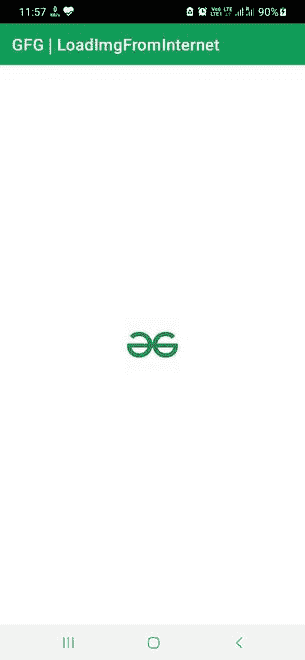

# 在安卓系统中，如何在不使用任何依赖的情况下从网址加载任何图像？

> 原文:[https://www . geeksforgeeks . org/如何在不使用任何依赖关系的情况下从 url 加载任何图像/](https://www.geeksforgeeks.org/how-to-load-any-image-from-url-without-using-any-dependency-in-android/)

许多应用程序使用第三方 API(如 Glide 和 Picasso)来加载图像，从而显示来自互联网的图像。这意味着这些应用程序部分依赖于这些服务来保持正常工作。为了使应用程序更好，人们应该编写自己的代码，而不是依赖这样的服务。在本文中，我们将向您展示如何在应用程序中轻松加载图像，而无需使用任何外部服务。

### 逐步实施

**第一步:在安卓工作室新建项目**

要在安卓工作室创建新项目，请参考[如何在安卓工作室创建/启动新项目](https://www.geeksforgeeks.org/android-how-to-create-start-a-new-project-in-android-studio/)。我们在 **Kotlin** 中演示了该应用程序，因此在创建新项目时，请确保选择 Kotlin 作为主要语言。

**第二步:在 AndroidManifest.xml** 中添加互联网权限

由于图像是 URL 的形式，应用程序将需要互联网权限来解析信息。

## 可扩展标记语言

```
<uses-permission android:name="android.permission.INTERNET"/>
```

**第三步:在布局中创建一个 ImageView**

导航到 **app > res >布局> activity_main.xml** 并将下面的代码添加到该文件中。下面是**activity _ main . XML**文件的代码。

## 可扩展标记语言

```
<?xml version="1.0" encoding="utf-8"?>
<RelativeLayout 
    xmlns:android="http://schemas.android.com/apk/res/android"
    xmlns:tools="http://schemas.android.com/tools"
    android:layout_width="match_parent"
    android:layout_height="match_parent"
    tools:context=".MainActivity">

      <!-- The image will load in this ImageView -->
    <ImageView
        android:id="@+id/imageView"
        android:layout_width="wrap_content"
        android:layout_height="wrap_content"
        android:layout_centerInParent="true"/>

</RelativeLayout>
```

**第四步:从网址加载图像并显示在图像视图**中的程序

转到 **MainActivity.kt** 文件，参考以下代码。下面是 **MainActivity.kt** 文件的代码。代码中添加了注释，以更详细地理解代码。

## 我的锅

```
import android.graphics.Bitmap
import android.graphics.BitmapFactory
import android.os.Bundle
import android.os.Handler
import android.os.Looper
import android.widget.ImageView
import android.widget.Toast
import androidx.appcompat.app.AppCompatActivity
import java.util.concurrent.Executors

class MainActivity : AppCompatActivity(){
    override fun onCreate(savedInstanceState: Bundle?) {
        super.onCreate(savedInstanceState)
        setContentView(R.layout.activity_main)

        // Declaring and initializing the ImageView
        val imageView = findViewById<ImageView>(R.id.imageView)

        // Declaring executor to parse the URL
        val executor = Executors.newSingleThreadExecutor()

        // Once the executor parses the URL 
        // and receives the image, handler will load it
        // in the ImageView
        val handler = Handler(Looper.getMainLooper())

        // Initializing the image
        var image: Bitmap? = null

        // Only for Background process (can take time depending on the Internet speed)
        executor.execute {

             // Image URL
            val imageURL = "https://media.geeksforgeeks.org/wp-content/cdn-uploads/gfg_200x200-min.png"

              // Tries to get the image and post it in the ImageView
              // with the help of Handler
              try {
                val `in` = java.net.URL(imageURL).openStream()
                image = BitmapFactory.decodeStream(`in`)

                // Only for making changes in UI
                handler.post {
                    imageView.setImageBitmap(image)
                }
            }

            // If the URL doesnot point to 
              // image or any other kind of failure
            catch (e: Exception) {
                e.printStackTrace()
            }
        }
    }
}
```

**输出:**

我们可以看到图像加载成功。这意味着应用程序可以按照预期完美运行。

